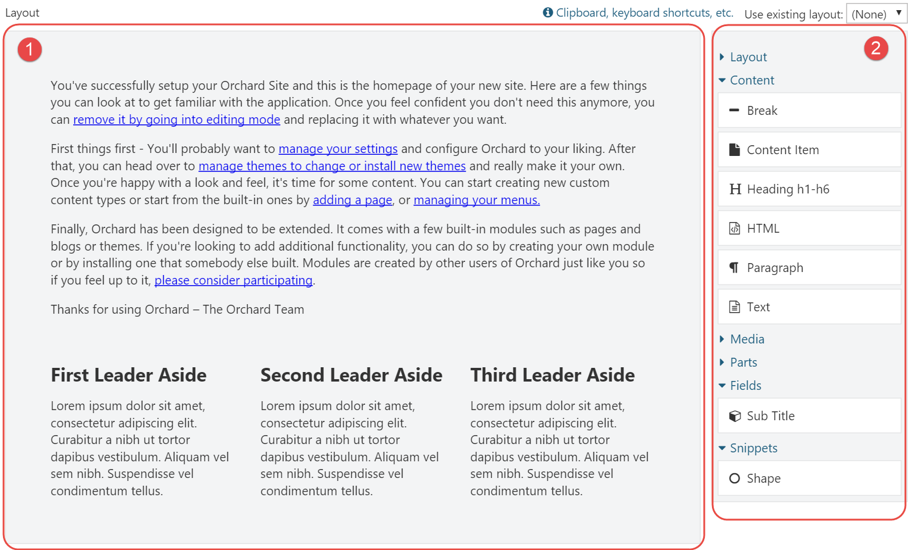
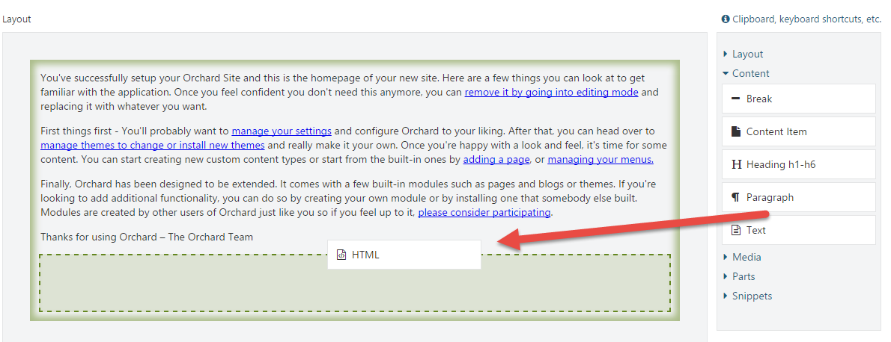
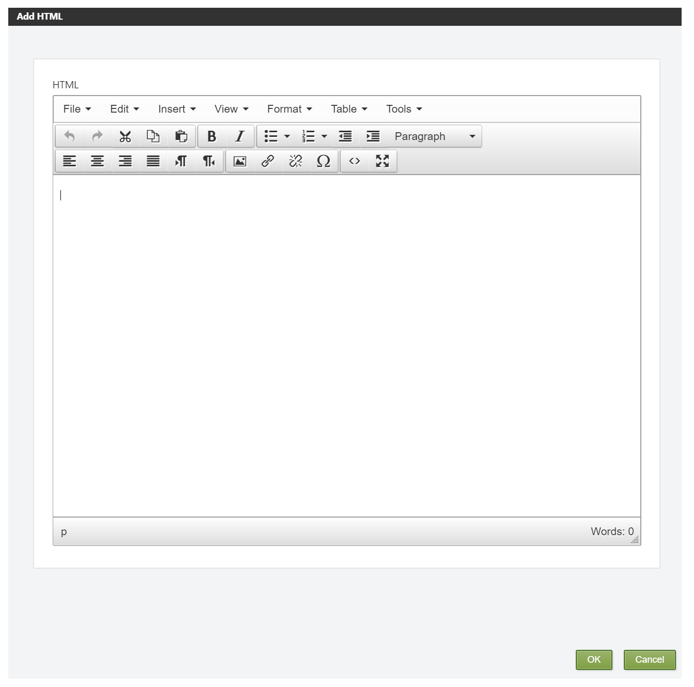
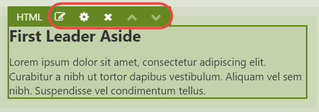

# First Look

## The Main Players

Let’s go over some of the main concepts that are provided by the Layouts module and what their role is.

### The Layouts Feature

When you set up a new Orchard 1.9 or later installation with the Default recipe, the Layouts feature will be enabled by default. Enabling this feature will cause a new part called Layout Part to be made available.

As mentioned before, one notable difference between Orchard 1.9 and previous versions is that the Page content type will have the Layout Part attached instead of the Body Part.

### The Layout Part

It is this Layout Part that we are interested in. It provides a layout editor consisting of a canvas and a toolbar with available elements that the user can add to the canvas.

### Elements

Elements are visual components that can be placed onto a canvas. Elements can contain other elements, which is how you can create layouts, as we'll see shortly.

Out of the box, there are currently seven categories of elements:

* Layout
* Content
* Media
* Parts
* Fields
* Snippets
* UI

It's all lovely stuff, and we'll get to know all the available elements in the next chapter.

## The Layout Editor

The Layout Editor is the component that enables the user to add elements to a canvas, using the Grid, Row and Column elements to create layouts.

The editor consists of two main sections: the canvas \(1\) and the toolbox \(2\).

The canvas is the area onto which you place elements that are available from the toolbox.


The canvas itself is an element of type **Canvas**, and is the root of the tree of elements.


The toolbox is a repository of all available elements in the system, grouped by category. Elements are bound to Orchard features, which means that other modules can provide additional element types.

The user places elements from the toolbox onto the surface by using drag & drop. If the selected element has an editor associated with it, a dialog window presenting the element's properties will appear immediately when it's dropped onto the canvas.

### Working with the Layout Editor

Let’s have a look at the various ways we can interact with the layout editor and the elements.

#### Element Editor Controls

Depending on the element being selected, the user can perform certain operations on that element. These operations are represented as little icons as part of a mini toolbar that becomes visible when an element is selected. Common operations are **Edit**, **Edit Properties**, **Delete**, **Move up** and **Move down**. More specific operations are **Distribute columns evenly** and **Split column**, which apply to **Row** and **Column** elements, respectively.

The button with the pencil icon is probably the most-commonly used one. It opens a dialog window that enables the user to configure the element. The icon right next to it \( the gear icon\) provides a drop down menu with a list of configurable properties common to all elements. These properties are:

* Html ID
* CSS Classes
* CSS Styles
* Visibility Rule

The first three properties are rendered onto the Html tags when an element is rendered. The Visibility Rule determines whether or not the element should be displayed at all. I will have more to say about Visibility Rules in chapter 8.

The following table on the next page lists the complete set of icons and keyboard shortcuts when applicable.

| Icon | Shortcut | Description |
| --- | --- | --- | --- | --- | --- | --- | --- | --- | --- |
|  | Enter | Launches the element specific editor dialog. |
|  | Space | Displays an inline popup window with properties common to all elements. |
|  | Del | Deletes the selected element. |
|  | Ctrl + Up | Moves the element up. Alternatively, use drag & drop to change the position within the current container. |
|  | Ctrl + Down | Moves the element down. Alternatively, use drag & drop to change the position within the current container. |
|  |  | Distributes the columns of the selected row evenly. |
|  |  | Splits the selected column into two. \(Notice that this is the same icon as used by the Row element for distributing the columns evenly. The developer probably ran out of icons\) |
|  | Alt + Left | Decreases the column offset by one. |
|  | Alt + Right | Increases the column offset by one. |

#### Keyboard Support

In addition to the keyboard shortcuts listed in the table above, there is also keyboard support for doing things like copy, cut, paste, and navigating around the hierarchy of elements on the canvas.

Although the layout editor provides a link to a small pop-up window listing all of the available keyboard shortcuts, I included a complete reference here:

#### Clipboard

| Ctrl + X / ⌘ + X | Cuts the selected element. |
| --- | --- | --- |
| Ctrl + C / ⌘ + C | Copies the selected element. |
| Ctrl + V / ⌘ + V | Pastes the copied element into the selected container element. |

#### Resizing Columns

| Alt + Left | Moves the left edge of the focused column left. |
| --- | --- | --- | --- |
| Alt + Right | Moves the left edge of the focused column right. |
| Shift + left | Moves the right edge of the focused column left. |
| Shift + Right | Moves the right edge of the focused column right. |


The Alt and Shift keys can also be combined to move both edges simultaneously.


#### Focus

| Up | Moves focus to the previous element \(above\) |
| --- | --- | --- | --- | --- | --- |
| Down | Moves focus to the next element \(below\). |
| Left | Moves focus to the previous column \(left\). |
| Right | Moves focus to the next column \(right\). |
| Alt + Up | Moves focus to the parent element. |
| Alt + Down | Moves focus to the first child element. |

#### Editing

| Enter | Opens the content editor of the selected element. |
| --- | --- | --- | --- |
| Space | Opens the properties popup of the selected element. |
| Esc | Closes the properties popup of the selected element. |
| Del | Deletes the selected element. |

#### Moving

| Ctrl + Up / ⌘ + Up | Moves the selected element up. |
| --- | --- | --- | --- |
| Ctrl + Down / ⌘ + Down | Moves the selected element down. |
| Ctrl + Left / ⌘ | Moves the selected element left. |
| Ctrl + Right / ⌘ + Right | Moves the selected element right. |

#### Moving Elements within its Container

Once an element is placed on the canvas, its position can be changed within its container using drag & drop or using the Ctrl + arrow keys.

#### Moving Elements across Containers

At the time of this writing, it is not possible to move an element to another container using drag & drop. Instead, you will have to use the Cut/Paste keyboard shortcuts \(Ctrl + X and Ctrl + V\) to move an element from its current container to another one.

#### Resizing Columns

Column elements can be resized by dragging their left and right edges. When you re-size a column, its adjacent column will be re-sized as well. If you want to re-size a column and introduce an offset \(basically "detaching" the column from its neighbor\), press the Alt key while dragging the edges. It works pretty slick, try it out.

## Layouts on the Front-end

Enabling the user to create and manage layouts from the back-end is only one half of the story of course. The other half is getting that layout out on the screen on the front-end. To accomplish this, the Layout Part driver simply invokes the driver of each element to build a shape. The resulting shape is a hierarchy of element shapes, ready for display on the front-end.

Each element is responsible for providing its own shape template. Container elements’ shape templates render each of their child elements.

We’ll learn how to take over the default rendering of elements in chapter 10.

## Summary

In this chapter, I provided a high level overview of what the Layouts module is all about. At its core, it is about the user being able to add elements to a canvas.

Although that may sound pretty mundane, it is actually a very powerful feature that unlocks a host of new possibilities to the user. We will explore this in the rest of this book.

