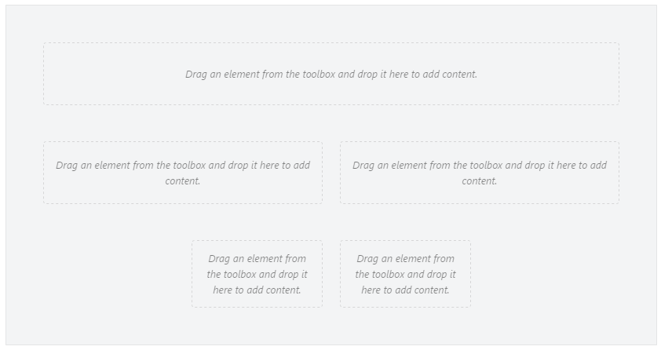
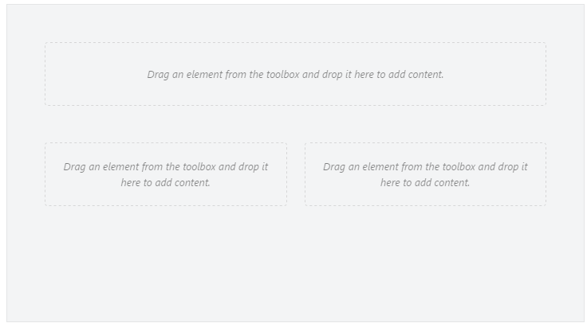
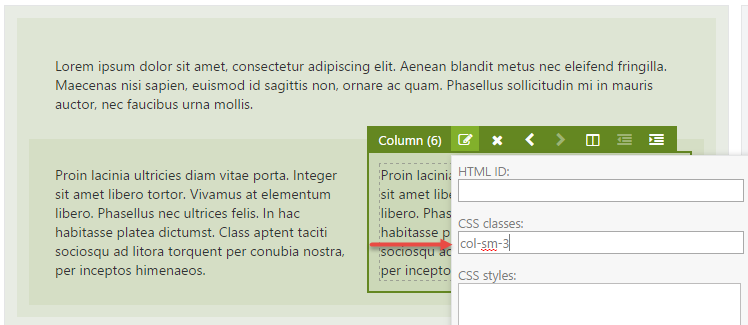

# Bootstrap

Many websites these days are built with CSS grid frameworks such as [Bootstrap](https://getbootstrap.com/). Such frameworks make it easy to create grid-based layouts using `<div>` tags and certain CSS classes to define rows and columns. The Layouts module’s Row and Column elements render markup containing CSS that is targeted by the **TheThemeMachine** theme, but when your own theme is based on Bootstrap, you will definitely want to take advantage of the Bootstrap CSS classes instead.

In this chapter we'll learn what shape templates to override and how to customize these templates to make them work with Bootstrap. Although I'm using Bootstrap as an example, the same principles apply to any other CSS grid frameworks such as Foundation for example. The main differences will be the CSS class names used by each framework.

## Overriding Element Shape Templates

In order to understand what templates to override, let’s analyze the HTML output as generated by the Grid, Row and Column elements, since we use those to created grids. For example, take the following layout:



When rendered on the front-end using the default shape templates, the following HTML output is generated for this grid:

```text
<div class="table">
   <div class="row">
      <div class=" span-12 cell"></div>
   </div>
   <div class="row">
      <div class=" span-6 cell"></div>
      <div class=" span-6 cell"></div></div>
   <div class="row">
      <div class="offset-3 span-3 cell"></div>
      <div class=" span-3 cell"></div>
   </div>
</div>
```

Now, when we want the same grid structure implemented using Bootstrap, we would need something like the following Html output:

```text
<div class="container-fluid">
   <div class="row">
      <div class="col-xs-12"></div>
   </div>
   <div class="row">
      <div class="col-xs-6"></div>
      <div class="col-xs-6"></div></div>
   <div class="row">
      <div class="col-xs-offset-3 col-md-3"></div>
      <div class="col-xs-3"></div>
   </div>
</div>
```

Notice that the HTML structure itself can remain exactly the same. The only changes needed are the CSS classes being applied.

To change the CSS classes being used, you need to override the following two shape templates from Orchard.Layouts:

* Elements/Grid.cshtml
* Elements/Column.cshtml

Since the Row.cshtml shape template renders the `row` CSS class already, there's no need to override that one.


 If you're using Orchard 1.9, you'll also need to override the Parts.Layout.cshtml shape template. This is the root shape that renders the layout and includes a default CSS grid stylesheet called default-grid.css. If you're relying on Bootstrap CSS on the front-end, you need to override that template to prevent the default grid stylesheet from being included. This has been changed in Orchard 1.10, where it's TheThemeMachine that includes default-grid.css. This way, theme developers no longer need to override Parts.Layout.cshtml just to get rid of the default grid.


To achieve the desired Html output, copy over the listed shape templates from the **Orchard.Layouts/Views **folder to the Views folder of your current theme, and update each template to use the Bootstrap specific class names:

_
Views/Elements/Grid.cshtml
_

```text
…
tagBuilder.AddCssClass("container"); // <-- Notice the use of the "container" class.
…
```

_Views/Elements/Column.cshtml:_

```text
…   
 var columnOffsetCss = columnOffset > 0 ? "col-xs-offset-" + columnOffset : default(string); // <-- Notice the use of the "col-xs-offset-{n}" class.
…
tagBuilder.AddCssClass(String.Concat("col-xs-", columnSpan)); // <-- Notice the use of the "col-xs-{n}" class.
…
```

In case you're using Orchard 1.9, also override **Parts.Layout.cshtml** and remove the inclusion of the **default-grid.css** stylesheet.

## Responsive Layouts

CSS grid frameworks such as Bootstrap typically have support for responsive design. Responsive design in this context means handling various viewport sizes so that the layout looks good on any of them using so called breakpoints. A breakpoint is a certain viewport width in pixels. CSS has support for implementing breakpoints using media queries. Bootstrap implements a number of breakpoints using media queries. To target these breakpoints, it makes available the following family of column CSS class prefixes:

* col-xs- \(Extra small viewports, e.g. smartphone devices\)
* col-sm- \(Small viewports, e.g. tablets\)
* col-md- \(Medium viewports, e.g. desktop computers and laptops\)
* col-lg- \(Large viewports, e.g. wide screens\)

The idea behind these classes is that for example on larger viewports you may want to show columns horizontally, but stacked vertically on smaller viewports. Such HTML could look like this:

```text
<div class="row">
   <div class="col-xs-12 col-sm-8 col-md-6"></div>
</div>
```

Now, the layout editor does not know anything about responsive design. It simply lets you create a layout. It's up to you to specify any specific CSS classes on the Column elements to provide further control on smaller and larger viewports. In the sample templates overridden earlier, we used the col-md- CSS class prefix, which means we are targeting medium-sized viewports by default. To have a column span 12 columns on smaller viewports, we could specify a CSS class of col-xs-12 on a column element that spans 6 columns by default.

### Try it out: Creating Responsive Layouts with Bootstrap

In this example, we will see how to use the CSS classes setting on the Column elements to achieve the following responsiveness effect:

* On small viewports, a row with two columns should be equal in width \(6+6\),
* But for larger viewports we want the second column to be smaller than the first one \(9+3\).

For this demo, I downloaded and installed the Bootstrap theme called [PJS.Bootstrap](https://gallery.orchardproject.net/Packages/Orchard.Theme.PJS.Bootstrap) from the gallery.

To start, create a new **Page **content item with the following grid:



Since we used the `col-xs-` class prefix in the Column.cshtml template, the two columns of the second row will be sized equally, since we created the columns as 6 units each.

Next, to make the first column of the second row appear as 9 units wide and the second column as 3 units, we need to apply the following CSS classes to each column respectively:

* col-sm-9
* col-sm-3



When you check out the front end now and resize the browser window to simulate a very small viewport, you will notice that both columns are equally sized, as designed using the Layout Editor.

When you resize the browser window to simulate a larger view-port, you’ll notice that the columns are no longer equally sized. This is because the Bootstrap stylesheet defined a media query to implement a break-point for width &gt; 768px, which causes the col-sm- prefixed classes kick in.

And there you have it: responsive design using Orchard Layouts.

## Summary

In this chapter, we talked about Bootstrap and how to take advantage of its responsive features using the Layout editor to gain control over column sizes depending on various breakpoints.

To learn more about Bootstrap and responsive grids, visit [https://getbootstrap.com/docs/4.1/layout/overview/](https://getbootstrap.com/docs/4.1/layout/overview/).


