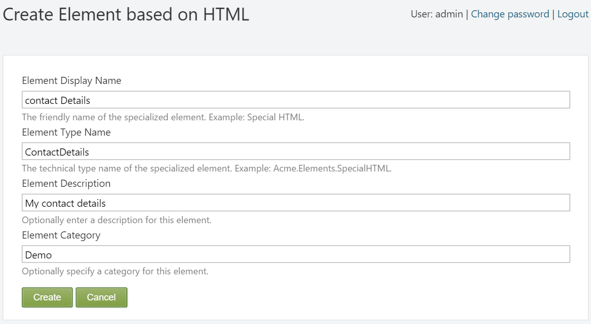
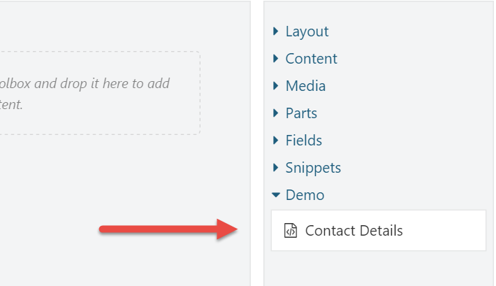

# Element Blueprints

In this chapter we'll take a look at **Element Blueprints**, which is a feature that enables the user to create preconfigured elements that become available from the toolbox.

## When to use Element Blueprints

Whenever you find that you are duplicating elements in various layouts, those elements are a candidate to be turned into an element blueprint. For example, if you need to display contact information on various pages but at different locations, you could create a preconfigured Html element with the relevant content, name the element “Contact Details”, and reuse that element anywhere you like.

## Try it out: Creating an Element Blueprint

In the walkthrough that follows, we will create a blueprint element called **Contact Details**. The purpose of this element is for the user to be able to manage their contact details from a single place, while being able to place this element on various pages. Whenever the user changes their contact details, the changes are reflected everywhere.

### Step 1

Click on the Elements admin menu item.

### Step 2

Click the **Create **button on the top right side of the window and select the Html element as the base element for our element blueprint.

### Step 3

On the screen that appears next, you are prompted for the following values:

| Field | Description |
| --- | --- | --- | --- | --- |
| **Element Display Name** | The user friendly name used when displaying the element in the toolbox and on the canvas.
 |
| **Element Type Name** | The technical name of the element, and is used when serializing and de-serializing the element. No two elements can have the same name. |
| **Element Description** | An optional field that gives you the opportunity to describe what the element represents. The description helps users get a better understanding of what this element represents. |
| **Element Category** | An optional field that lets you control in what category of the toolbox this element appears. If no category is specified, Blueprints is used as the category. |

Provide the following values:

| Field | Value |
| --- | --- | --- | --- | --- |
|  Element Display Name |  Contact Details |
|  Element Type Name |  ContactDetails |
|  Element Description |  My contact details |
|  Element Category |  Demo |



Hit **Create **to continue to the next screen, where the Html element editor will appear.

### Step 4

Enter the following HTML code into the HTML editor \(using the HTML view of TinyMCE\):

```text
<p>John van Dyke</p>
<p>Cell: +18723456</p>
<p>Email: <a href="mailto:j.vandyke@acme.com">j.vandyke@acme.com</a></p>
<p>Skype: johnvandyke</p>
```

And hit **Save**.

### Step 5

Now that the blueprint has been created, we can start using it. Create or edit a **Page **content item and notice the new category called **Demo **and the new **Contact Details** element.
 



You can now add this element to as many pages as you like. When the time comes that your contact details change, all you have to do is update the blueprint element once, and the changes get reflected everywhere.

## Summary

Blueprint elements enable you to create preconfigured elements and use them as normal elements. Blueprint elements are useful when you find that you use the same elements with the same configuration in multiple places. Whenever you change the blueprint element itself, the changes are reflected everywhere the element appears.


