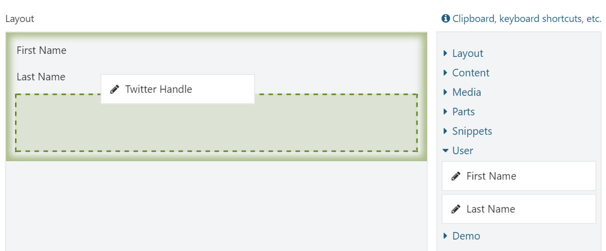
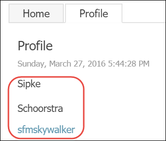

# Element Harvesters

In this chapter, we will talk about element harvesters, what they are and how we can write our own.

Element Harvesters are, simply put, providers of elements. They are the ones that make available all the elements we can choose from the layout editor's toolbox. The reason they are called "harvesters" is because of how they provide elements: they collect elements from a variety of sources.

As we have seen in the previous chapter, we can add custom elements to the system by writing classes that derive from `Element`. The Layouts module, however, doesn't discover these types directly based on the mere existence of those types. Instead, it relies on element harvesters to provide element descriptors. The Layouts module comes with a few element harvesters out of the box, one of them being the `TypedElementHarvester`. That class is the one responsible for providing element descriptors based on the classes derived from `Element`.

This decoupling of Element types and Element Descriptors offers great flexibility and is why Orchard is able to provide all sorts of elements dynamically. For example, the **Part** and **Field** elements are provided by the `ContentPartElementHarvester `and `ContentFieldHarvester`, respectively. There are no actual Element classes for each content part in the system. Instead, these harvesters yield element descriptors dynamically based on the existence of content part and field definitions.

## Element Descriptors

An element descriptor, as it name implies, is an object that describes an element. It contains information such as the concrete .NET type to use when creating element instances, the technical name, description and display text. It also contains delegates to methods that are responsible for displaying element instances and element event handlers.

Element descriptors are provided by element harvesters. When you look at the Layout Editor Toolbox, the elements you see there represent the available element descriptors.

## Element Harvesters Out of the Box

The following table lists all of the element harvesters that ship with Orchard, along with a description of what source is used to yield element descriptors:

| Type | Description |
| --- | --- | --- | --- | --- | --- | --- | --- |
| BlueprintElementHarvester | Provides elements based on blueprint \(preconfigured\) elements. |
| ContentFieldElementHarvester | Provides elements based on the available content field definitions. |
| ContentPartElementHarvester | Provides elements based on the available content part definitions. |
| PlaceableContentElementHarvester | Provides elements based on the content types whose Placeable setting is set to true. |
| SnippetElementHarvester | Provides elements based on the existence of Razor views whose name end in “Snippet.cshtml”. |
| TypedElementHarvester | Provides elements based on the existence of .NET types that inherit from the Element type. |
| WidgetElementHarvester | Provides elements based on the existence of Widget content types \(content types whose Stereotype is “Widget”\). |

With all of the available element harvesters, you probably won't need to implement your own anytime soon. However, there may be advanced scenarios where it makes perfect sense to dynamically provide your own elements. For example, you could be writing a module that integrates with a third-party CRM that provides customer related fields as defined by that system, and you want to be able to add these fields as elements to content pages. Another example could be a custom harvester that yields elements based on the existence of content items of a certain type.

Whatever the case may be, knowing how to write custom element harvesters may come in handy. So in the next two sections, we'll see how to implement our own.

## IElementHarvester

All element harvesters implement the _IElementHarvester _interface, which resides in the `Orchard.Layouts.Framework.Harvesters` namespace. 

```csharp
public interface IElementHarvester : ISingletonDependency {
    IEnumerable<ElementDescriptor> HarvestElements(HarvestElementsContext context);
}
```

The interface contains a single member that accepts a `HarvestElementsContext` argument and is expected to return a collection of `ElementDescriptor` objects.

Notice that the interface is derived from `ISingletonDependency`, which will cause any implementation to be registered with the Singleton lifetime scope with the IoC container. This means that you need to be aware of the lifetime scopes of other dependencies you may inject in your implementations.

For example, if you wanted to use the `IContentManager` service in your element harvester class, which has a **per-request** lifetime scope, you will have to inject that service using the `Work<T>` wrapper so that instances of `IContentManager` implementations are resolved in the current request context, as opposed to the application lifetime scope. Failing to do so in this example will cause connection disposed errors, since the content manager holds a reference to a database connection, which will be disposed of at the end of each request.

The `HarvestElementsContext` object has only one property:

```csharp
public class HarvestElementsContext {
    public IContent Content { get; set; }
}
```

The `Content` property is provided whenever the harvesters are invoked from a class or controller class that is somehow related to a content item. For example, in the case of the `LayoutEditorPartDriver`, which is responsible for creating the Layout Editor shape \(which includes the elements toolbox\), it passes along the content item associated with the `LayoutPart`. It is up to the individual harvesters if they need to do something with this information.

There are also cases where element harvesters are invoked outside the context of a specific content item. For example, when you create a blueprint element and are presented with a list of available base elements, there is no content item available to be used as context, so the `Content` property will be `null`. Therefore it's important to always check for null if your harvester can potentially do something with the `Content` property. 

Two examples that take the `Content` property into account are the `ContentPartElementHarvester` and `ContentFieldElementHarvester`. These harvesters yield part and field element descriptors based on the parts and fields attached to the current content item for which the layout editor is being displayed.

## Try it out: Writing a Custom Element Harvester

In this tutorial we will write a simple element harvester that demonstrates how to dynamically provide elements to the system.

For demo purposes, we will implement a custom harvester that selects all fields from a custom content part called User Profile Part, and present those fields as elements available from the toolbox. The user can then create pages using these elements.

Let's see how that works.

### Step 1: The UserProfilePart

The first thing to do is to define the `UserProfilePart` with bunch of content fields. You can do this either via the dashboard or via a migration as shown below:



```csharp
using Orchard.ContentManagement.MetaData;
using Orchard.Core.Contents.Extensions;
using Orchard.Data.Migration;

namespace OffTheGrid.Demos.Layouts.Migrations {
    public class UserProfileMigrations : DataMigrationImpl {
        public int Create() {

            // Define the UserProfilePart.
            ContentDefinitionManager.AlterPartDefinition("UserProfilePart", part => part
                .WithField("FirstName", f => f
                    .OfType("TextField")
                    .WithSetting("TextFieldSettings.Flavor", "Wide")
                    .WithDisplayName("First Name"))
                .WithField("LastName", f => f
                    .OfType("TextField")
                    .WithSetting("TextFieldSettings.Flavor", "Wide")
                    .WithDisplayName("Last Name"))
                .WithField("TwitterHandle", f => f
                    .OfType("TextField")
                    .WithSetting("TextFieldSettings.Flavor", "Wide")
                    .WithDisplayName("Twitter Handle"))
                .WithDescription("Provides additional information about the user.")
                .Attachable());

            // Attach the UserProfilePart to the User content type.
            ContentDefinitionManager.AlterTypeDefinition("User", type => type
                .WithPart("UserProfilePart"));

            return 1;
        }
    }
}


```



### Step 2: The Element Harvester

Next, create a new class that implements `IElementHarvester` as follows:



```csharp
using System.Collections.Generic;
using Orchard.Layouts.Framework.Elements;
using Orchard.Layouts.Framework.Harvesters;


namespace OffTheGrid.Demos.Layouts.Layouts.Harvesters {
    public class UserProfileElementHarvester : IElementHarvester {
        public IEnumerable<ElementDescriptor> HarvestElements(HarvestElementsContext context) {
            // TODO: Return element descriptors based on the content fields attached to the UserProfilePart.
        }
    }
}
```



To complete the above implementation, this is what we need to do:

1. Get the UserProfilePart content part definition and query the attached content fields.
2. For each content field that is attached to the User Profile Part, instantiate a new `ElementDescriptor` and configure it with appropriate data and handlers that implement the element's functionality. The `ElementDescriptor` constructor requires a `Type` based on `Element`, so we will need to implement one. To prevent this element from being harvested by the `TypedElementHarvester`, we’ll need to override the `IsSystemElement` property.

The following is the complete code for the harvester:



```csharp
using System;
using System.Collections.Generic;
using System.Linq;
using OffTheGrid.Demos.Layouts.Elements;
using Orchard;
using Orchard.ContentManagement.MetaData;
using Orchard.Environment;
using Orchard.Layouts.Framework.Display;
using Orchard.Layouts.Framework.Elements;
using Orchard.Layouts.Framework.Harvesters;
using Orchard.Layouts.Services;

namespace OffTheGrid.Demos.Layouts.Harvesters {
    public class UserProfileElementHarvester : Component, IElementHarvester {
        private readonly Work<IContentDefinitionManager> _contentDefinitionManager;
        private readonly Work<IContentFieldDisplay> _contentFieldDisplay;
        private readonly IWorkContextAccessor _workContextAccesor;

        public UserProfileElementHarvester(
           Work<IContentDefinitionManager> contentDefinitionManager,
           Work<IContentFieldDisplay> contentFieldDisplay,
           IWorkContextAccessor workContextAccesor) {

            _contentDefinitionManager = contentDefinitionManager;
            _workContextAccesor = workContextAccesor;
            _contentFieldDisplay = contentFieldDisplay;
        }

        public IEnumerable<ElementDescriptor> HarvestElements(HarvestElementsContext context)
        {
            // Get the UserProfilePart definition.
            var partDefinition =
               _contentDefinitionManager
               .Value
               .GetPartDefinition("UserProfilePart");

            // Get the content fields from the UserProfilePart definition.
            var fieldDefinitions = partDefinition.Fields;

            // For each field, yield an element descriptor.
            return from field in fieldDefinitions
                   let settingKeys = field.Settings.Keys
                   let descriptionKey = settingKeys.FirstOrDefault(x => x.IndexOf("description", StringComparison.OrdinalIgnoreCase) >= 0)
                   let description = descriptionKey != null ? field.Settings[descriptionKey] : $"The {field.DisplayName} field."
                   select new ElementDescriptor(
                       elementType: typeof(UserProfileField),
                       typeName: $"UserProfile.{field.Name}",
                       displayText: T(field.DisplayName),
                       description: T(description),
                       category: "User"
                   )
                   {
                       ToolboxIcon = "\uf040",
                       Displaying = displayingContext =>
                          OnDisplaying(field.Name, displayingContext)
                   };
        }

        private void OnDisplaying(
            string fieldName,
            ElementDisplayingContext context)
        {
            var workContext = _workContextAccesor.GetContext();
            var currentUser = workContext.CurrentUser;
            var profilePart = currentUser?.ContentItem.Parts.SingleOrDefault(x => x.PartDefinition.Name == "UserProfilePart");
            var field = profilePart?.Fields.SingleOrDefault(x => x.Name == fieldName);

            if (field == null)
            {
                // The field is no longer part the UserProfilePart.
                // This situation can occur when a user removed the field
                // and the harvested element descriptors cache entry hasn't been
                // evicted yet.
                return;
            }

            // Render the field and add it to the element shape.
            var fieldShape = _contentFieldDisplay.Value.BuildDisplay(currentUser, field, context.DisplayType);
            context.ElementShape.ContentField = fieldShape;
        }
    }
}
```



Let’s go over the above code section by section, starting with the HarvestElements:

```csharp
// Get the UserProfilePart definition.
var partDefinition =
    _contentDefinitionManager
    .Value
    .GetPartDefinition("UserProfilePart");

// Get the content fields from the UserProfilePart definition.
var fieldDefinitions = partDefinition.Fields;
```

Here we simply use the Content Definition Manager to get the User Profile Part definition so that we can get a collection of its attached fields, which we use to generate element descriptors, as seen next:

```csharp
// For each field, yield an element descriptor.
return from field in fieldDefinitions
       let settingKeys = field.Settings.Keys
       let descriptionKey = settingKeys.FirstOrDefault(x => x.IndexOf("description", StringComparison.OrdinalIgnoreCase) >= 0)
       let description = descriptionKey != null ? field.Settings[descriptionKey] : $"The {field.DisplayName} field."
       select new ElementDescriptor(
           elementType: typeof(UserProfileField),
           typeName: $"UserProfile.{field.Name}",
           displayText: T(field.DisplayName),
           description: T(description),
           category: "User"
        )
        {
            ToolboxIcon = "\uf040",
            Displaying = displayingContext => OnDisplaying(field.Name, displayingContext)
        };
```

The above code projects the field definitions into ElementDescriptors. Notice the assignment of the Displaying property of the descriptors being created, which is a delegate type. Whenever a field element is being displayed, this delegate is invoked, which provides you with the opportunity to configure the element shape that will be displayed. In the case of this example, we need to actually render the content field, which looks like this:

```csharp
private void OnDisplaying(string fieldName, ElementDisplayingContext context)
{
    var workContext = _workContextAccesor.GetContext();
    var currentUser = workContext.CurrentUser;
    var profilePart = currentUser?.ContentItem.Parts.SingleOrDefault(x => x.PartDefinition.Name == "UserProfilePart");
    var field = profilePart?.Fields.SingleOrDefault(x => x.Name == fieldName);

    if (field == null)
    {
        // The field is no longer part the UserProfilePart.
        // This situation can occur when a user removed the field
        // and the harvested element descriptors cache entry hasn't been
        // evicted yet.
        return;
    }

    // Render the field and add it to the element shape.
    var fieldShape = _contentFieldDisplay.Value.BuildDisplay(currentUser, field, context.DisplayType);
    context.ElementShape.ContentField = fieldShape;
}
```

The above code basically gets a reference to the authenticated user and the specified content field of the `UserProfilePart`.

The harvester references a type called `UserProfileField`, which you’ll need to create as well:



```csharp
using Orchard.Layouts.Framework.Elements;
namespace OffTheGrid.Demos.Layouts.Elements
{
    public class UserProfileField : Element
    {
        public override string Category => "Demo";
        public override bool IsSystemElement => true;
    }
}

```



This class will be used to instantiate user profile field elements. The `IsSystemElement` is overridden to return `true`, which prevents the `TypedElementHarvester` from harvesting this element class as an element. This is important, otherwise the user would be able to add elements of type `UserProfileField` to the canvas, which would be rather useless.

Next, we need to create a shape template for the `UserProfileField` element so that we can actually render the content field. As mentioned earlier, an alternate is added to the Element shape based on the .NET type name of the element class. Since the harvester uses the `UserProfileField` type as the element type, there will be an alternate available called `"Elements.UserProfileField"`.

Let's go ahead and create a Razor view called `"UserProfileField.cshtml"` in the `Views/Elements` folder of the custom module and provide the following code:



```aspnet
@if(Model.ContentField != null) {
    @Display(Model.ContentField)
}
else {
    <!-- The content field is not available. -->
}
```



All this code does is render the `ContentField` shape created by the harvester, if one was set.

And with that in place, you should now be able to attach content fields to the `UserProfilePart` and add those fields as elements to the canvas.



###  Improvements

When you use the profile field elements as-is, they render their content field using the default template for that field. Although we could use one of the existing alternates based on content field name or content type, the downside is that these changes will affect the way the fields are rendered everywhere. Therefore, let's add our own alternate based on our element's type name and the content field type and name in question. This way, we can customize the rendering of content fields just for the user profile field elements without affecting the default rendering of these fields.

The alternates we will add will be based on the element type name \(`UserProfileField`\), the content field type name \(for example `"TextField"`\) and the content field name \(for example `"FirstName"`\). With these alternates in place we can then create common templates for `UserProfileField` elements in general, or provide more specific templates for elements rendering a specific content field type, and even customize individual content fields.

To add these alternates, we first need to get our hands onto the shape \(or shapes\) created by the content field driver \(or drivers\). Because the thing is, `IContentFieldDisplay` does not actually return the field shapes directly. Instead, it returns a shape of type `ContentField` which has a `Content` property of type `ZoneHolding`, which in turn holds the shapes returned by the content field drivers.

Since content field drivers can return any number of shapes of any given type, we will iterate over each content field shape and add the following alternates to them.

* An alternate based on the shape type name and the term “UserProfile” to indicate that it is create by the element harvester.
* Another alternate that is the same as the first one, but appended with the technical name of the content field.

The following is an updated version of the `OnDisplaying` method that will add the alternates:

```csharp
private void OnDisplaying(string fieldName, ElementDisplayingContext context)
{
    var workContext = _workContextAccesor.GetContext();
    var currentUser = workContext.CurrentUser;
    var profilePart = currentUser?.ContentItem.Parts.SingleOrDefault(x => x.PartDefinition.Name == "UserProfilePart");
    var field = profilePart?.Fields.SingleOrDefault(x => x.Name == fieldName);

    if (field == null)
    {
        // The field is no longer part the UserProfilePart.
        // This situation can occur when a user removed the field
        // and the harvested element descriptors cache entry hasn't been
        // evicted yet.
        return;
    }

    // Render the field.
    var contentFieldShapeHolder = _contentFieldDisplay.Value.BuildDisplay(currentUser, field, context.DisplayType);

    // The returned shape is a ContentField shape that has a Content property of type ZoneHolding,
    // which in turn contains a single shape which is the field shape we're interested in.
    var fieldShapes = ((IEnumerable<dynamic>)contentFieldShapeHolder.Content.Items);

    // Add alternates to each content field shape.
    foreach (var fieldShape in fieldShapes)
    {
        fieldShape.Metadata.Alternates.Add($"{fieldShape.Metadata.Type}__UserProfile");
        fieldShape.Metadata.Alternates.Add($"{fieldShape.Metadata.Type}__UserProfile__{field.Name}");
    }

    // Assign the field shape to a new property of the element shape.
    context.ElementShape.ContentField = contentFieldShapeHolder;
}
```

Now let's create two Razor templates that customize the Text Field shapes:

1. One text field template to get rid of the content field name.
2. Another text field template that is specific to the **TwitterHandle** field so that we can render it as a hyperlink.

Create the first Razor view with the following contents:



```aspnet
@if (HasText(Model.Value)) {
    <p>@Model.Value</p>
}
```



And the second Razor view specific to the twitter handle field:



```aspnet
@if (HasText(Model.Value)) {
    <a href="@String.Format("https://twitter.com/{0}", Model.Value)">@Model.Value</a>
}
```



When you now add the user profile fields to a page and check it out on the front end, you’ll see something like figure 14.2.



## Summary

In this chapter, we learned about element harvesters, which are providers of element types called element descriptors.

Orchard comes with a few element harvesters of its own, the most important one being the `TypedElementHarvester`, which populates the toolbox with elements based on the mere existence of classes that derive from `Element`.

We then saw how easy it is to implement a custom harvester by implementing a custom one.

Being able to write custom harvesters has the potential to unlock many advanced scenarios.


