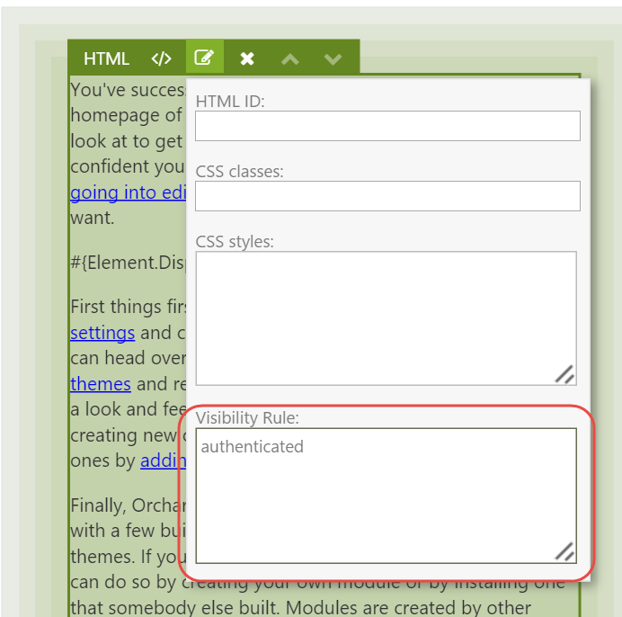

# Element Rules

**Element Rules** are very similar to Widget Layer Rules, or Layer Rules for short, but instead of controlling widget layer visibility, they control element visibility. Element Rules, like Layer Rules, use the rule engine provided by **Orchard.Conditions**.
 


**Orchard.Conditions** is a new module as of Orchard 1.10, and replaces the now deprecated rules engine provided by the **Orchard.Widgets** module.


If a rule applied to a container element evaluates to false, then that element, and its children, will not be rendered.

One scenario where you could use this would be where you have elements that should be displayed only to authenticated users. 

## Available Functions

To use rules, you use functions that evaluate to a boolean value. The following is a list of functions that are available out of the box:

| Function | Description |
| --- | --- | --- | --- |
| **authenticated** | Evaluates to true if the current user is authenticated, false otherwise. |
| **contenttype** | Evaluates to `true` if the current content item being displayed is of the specified content type, `false` otherwise. Example usage: `contentype("Page")` |
| **url** | Evaluates to `true` if the current content item being displayed is of the specified content type, `false` otherwise. Example usage: `url("~/contact")` |

Functions can be combined using the logical `and` and `or` operators and negated with the `not` operator. For example, the following rule will evaluate to `true` if the requested URL is either `"~/contact"` or `"~/about"` and the user is not authenticated:

```text
 (url('~/contact') or url('~/about')) and not authenticated
```

## Applying Element Rules

To apply an element rule, click on an element's **Edit** toolbar icon and enter the desired rule into the **Visibility Rule** text area. Make sure to publish the content item to save the changes. The next time you visit the content item on the front end, the element will only be rendered if the specified rule evaluates to true.



## Summary

That's really all there is to element rules. The rules engine is the same one used by the Widgets module, and provides control over the visibility of elements.

