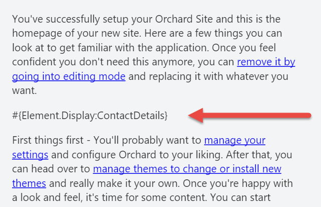
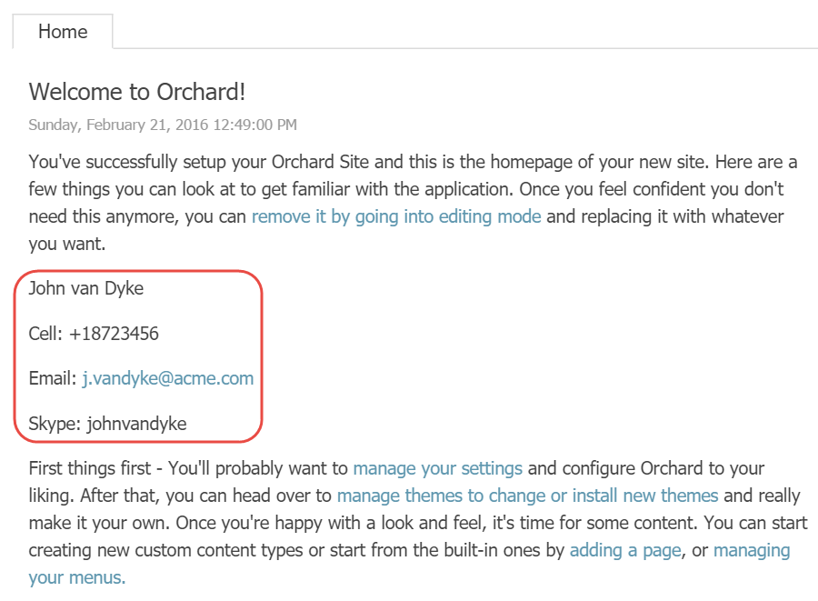

# Element Tokens

If you’ve worked with Orchard for a while, you are probably already familiar with tokens. They basically provide a way to insert variables into content. These variables are processed at runtime, and it is up to the token providers to provide the result. A few examples of tokens are:

| Token | Description |
| --- | --- | --- | --- | --- | --- |
| `{Content.Author}` |  Renders the author name of the content item. |
| `{Content.DisplayUrl}` |  Renders the display URL of the content item. |
| `{Content.DisplayUrl.Absolute}` |  Renders the fully qualified URL of the content item. |
| `{Request.QueryString}` | Renders the specified query string value, e.g `{Request.QueryString:MyQueryKey}`. |
| `{Site.SiteName}` |  Renders the site name as configured in the **Settings** section. |

There are various places where you can use tokens. For example, **Orchard.Autoroute** uses tokens for its configurable route patterns, and many **Orchard.Workflows** activities support tokens as configuration values.

## The Element.Display Token

The Layouts module also provides a token, which is the **Element.Display** token.


 This token is provided by the **Element Tokens** feature, so you need to enable that before you can use this token.


The **Element.Display** token renders the element that is provided as its argument. For example, the following will render the **ContactDetails** element created in chapter 5:

```text
 #{Element.Display:ContactDetails}
```

This token is especially useful when you want to render elements in HTML content. For example, let's say you have a content type with a **Body Part**. You can input some HTML, and insert elements using the **Element.Display** token, causing the specified element type to be rendered right there inline.

Although the **Element.Display** token does not support additional arguments to provide values for the element's properties, you can work around that limitation by creating element blueprints \(which essentially are preconfigured elements\) and for example render a **Projection element**. If an element does not require configuration, then you can use it directly without creating a blueprint.

### Trying it out: Using Element.Display

In this example, we’ll have a look at how the **Element.Display** token works by going through the following steps.

#### Step 1

Make sure the **Element Tokens** feature is enabled.

#### Step 2

Create an element blueprint called **ContactDetails **as shown in chapter 5.

#### Step 3

Edit the _Welcome to Orchard_ content item and edit the first Html element containing the introductory text, and insert the `Element.Display:ContactDetails` token anywhere between two sentences or paragraphs.



Click the **Publish Now** button.


Notice that I'm using the **new token syntax** where tokens start with the hash-tag symbol \(\#\). Omitting this will cause your tokens not to be executed.


Now go to the homepage of your site and notice how the token has been replaced with the actual ContactDetails.



This works pretty much everywhere you can use tokens, such as the Body Part and the Email field of the Email Workflows Activity.

## Summary

In this chapter, we've seen yet another way to display elements, this time using the Element.Display token.

Although this token does not support the specified element to be configured, we can create element blueprints and render them instead. The intended use of the token is to allow elements to be rendered anywhere, such as inside bodies of text.


