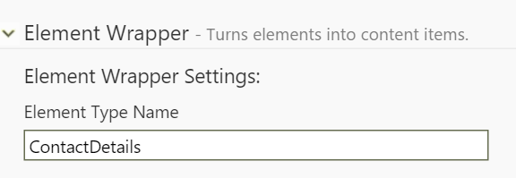
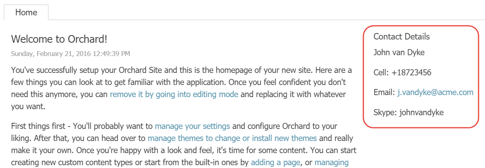

# Elements as Widgets

So far, we have seen how to work with elements and the layout editor. But elements can be used for more things than that. In this chapter, we'll see how we can use elements as widgets without the need for writing any code.

## Why Elements as Widgets?

So, when would you use elements as widgets? Strictly speaking, you don’t have to. Let’s say that you want to display a useful element in some zone. You could simply add the Layout Widget to that zone, and then add the element. But if you find yourself doing this often, it could make sense to simply turn the element into a widget, so that you can add that widget directly without the need for the Layout Widget.

With the advent of the Layouts module, we now have the world of Widgets and the world of Elements. The long-term goal is to unify the two worlds. Until then, you can choose to implement custom elements and reuse them as widgets. This saves you from having to implement both an element and a widget if you wanted to enable your users to use them both. You could of course choose to implement a widget, since widgets can be added to layouts all the same. However, a widget is a content item, which means for each widget displayed on a layout, a content item has to be loaded. Unless your page is output-cached, elements are faster to load and initialize than widgets, so that’s something to keep in mind when making a decision.

Let’s find out how to turn an element into a widget.

## Using Elements as Widgets

Before you can use an element as a widget, you need to define a Widget content type that has the Element Wrapper Part attached.

### Element Wrapper Part

The **Element Wrapper Part** has a single setting called **Element Type Name**. The element type name is technical name of the element that you are wrapping as a widget.

The way the Element Wrapper Part works is that it instantiates the configured element type by name and takes care of invoking the editor and display methods of that element and then returns the created shapes.

### Try it out: Creating a Widget based on an Element

In this example, we'll see how the **Contact Details** element created in chapter 5 can be reused as a widget.

#### Step 1

Create a new content type called **Contact Details** with the following parts:

* WidgetPart
* CommonPart
* IdentityPart
* ElementWrapperPart

Make sure that the stereotype is set to **Widget** and that the type is _not creatable or listable_.

#### Step 2

Expand the Element Wrapper Part and provide the following value for the Element Type Name property:
 **ContactDetails
**

Hit **Save **to save your changes.

With that in place, we can now add Contact Detail widgets to any zone and layer.

## Existing Widgets based on Elements

Being able to use elements as widget can be quite useful. For example, the Layouts module comes with a Content Item element. Although Orchard doesn't come with a content picker widget, it's very simple to create one with the Element Wrapper Part.

In fact, when the Layouts feature is enabled, the following additional widget types based on elements are added to the system:

* Text Widget
* Media Widget
* Content Widget

The **Text Widget** lets the user enter some plain text value. The **Media Widget** lets the user select one or more Media Items to be displayed, and the **Content Widget** lets the user select one or more Content Items to be displayed using a configurable display type.

## Summary

Elements can be used in many different ways other than being added to a canvas. One such way is turning them into widgets using the Element Wrapper Part.

