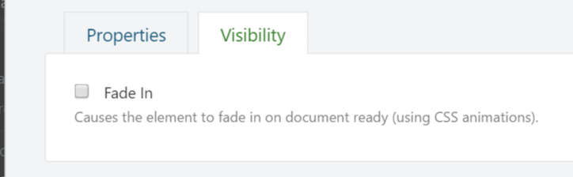

# Extending Existing Elements

In the previous chapters, we learned how to create new types of elements by creating new element classes and harvesters.

In this chapter, instead of creating new element types, we will see how we can extend existing ones by creating _additional element drivers and element handlers_.

By creating drivers and handlers, we can store additional information for an element, provide additional UI to manage that information, and provide additional behavior.

Extending elements with additional information does not work the same as with content types. The content type system is one of _composition_. Elements on the other hand are atomic, which means one does not simply stick additional properties on them. Which begs the question: how can we add additional information to element types that we haven’t written ourselves?

As it turns out, the answer to that question is quite simple. Elements have a public data dictionary which we can access to read and write additional information. This dictionary is exposed from the base `Element` class via a property called `Data` and is of type `IDictionary<string, string>`.

## Using Multiple Drivers

Another way that elements can be extended are by creating additional element drivers, which allows you to provide additional UI on the element editor dialog screen. You can write drivers for a specific element type, or for a base class that is shared by multiple element types.

## Using Multiple Handlers

In addition to writing additional drivers, you can also implement additional element handlers. In fact, the very element driver system itself is implemented by such an element handler. This means that we can extend very specific element types as well as any other element types based on whatever criteria we like.

To create a custom element handler, all you need to do is create a class that either implements the `IElementEventHandler` interface, or derives from the `ElementEventHandlerBase` class.

Let’s see how this all works.

## Try It Out: Extending Elements

If you know how to write an element handler or element driver, you already know how to extend existing elements, since the process is the same. The primary difference is that we don't “own” the element, and that we can't implement strongly-typed properties on them that access their data dictionary.

To see how it all works, let’s implement a common driver for any element type and provide an editor UI for a custom property called `FadeIn`. This will demonstrate how to add additional properties to existing elements. This property will be a simple `Boolean` value, and when set to `true`, will append a certain CSS class that will cause the element to fade in on page load. 

### Creating the CommonElementDriver

The goal of the `CommonElementDriver` is to provide an additional editor for all elements, so we’ll create a driver for the base `Element` class.

The driver will implement the `OnBuildEditor` method to display and handle post backs. For that we'll create a view model to pass in and receive back the FadeIn value. We'll also assign the editor UI to a tab named _“Visibility”_.

To simplify working with the `FadeIn` property from code, we'll create two extension methods on the `Element` class so we don't have to deal with converting to and from strings all the time. The extension methods look like this:



```csharp
using System;
using Orchard.ContentManagement;
using Orchard.Layouts.Framework.Elements;
using Orchard.Layouts.Helpers;

namespace OffTheGrid.Demos.Layouts.Helpers {
    public static class ElementExtensions {
        private const string FadeInKey = "FadeIn";
        private const string DefaultFadeInValue = "false";

        public static bool GetFadeIn(this Element element) {
            return XmlHelper.Parse<bool>(element.Data.Get(FadeInKey, DefaultFadeInValue));
        }

        public static void SetFadeIn(this Element element, bool value) {
            element.Data[FadeInKey] = XmlHelper.ToString(value);
        }
    }
}

```



As you can see, the extension methods work with the element's data dictionary directly and set and get the value stored by the `"FadeIn"` key.

The view model is defined as follows:



```csharp
using System;

namespace OffTheGrid.Demos.Layouts.ViewModels {
    public class ElementViewModel {
        public bool FadeIn { get; set; }
    }
}

```



Next, implement the driver as follows:



```csharp
using OffTheGrid.Demos.Layouts.Helpers;
using OffTheGrid.Demos.Layouts.ViewModels;
using Orchard.Layouts.Framework.Drivers;
using Orchard.Layouts.Framework.Elements;

namespace OffTheGrid.Demos.Layouts.Elements {
    public class CommonElementDriver : ElementDriver<Element> {
        
        protected override EditorResult OnBuildEditor(Element element, ElementEditorContext context) {
            // Initialize the view model with existing data.
            var viewModel = new ElementViewModel {
                FadeIn = element.GetFadeIn()
            };
            
            // Model bind the view model if an Updater is provided.
            if(context.Updater != null) {
                if (context.Updater.TryUpdateModel(viewModel, context.Prefix, null, null)) {
                    element.SetFadeIn(viewModel.FadeIn);
                }
            }

            // Create the editor template shape.
            var visibilityEditorTemplate = context.ShapeFactory.EditorTemplate(
                TemplateName: "Elements/Common.Visibility",
                Model: viewModel,
                Prefix: context.Prefix);

            // Specify the position of the editor shapes.
            // This is key to assigning editor templates to a tab.
            visibilityEditorTemplate.Metadata.Position = "Visibility:1";

            // Return the editor shape.
            return Editor(context, visibilityEditorTemplate);
        }
    }
}

```



Now all that's left is actually implementing the editor template's view and implement the `FadeIn` property so that it will add a certain CSS class and a stylesheet that defines the rule for that CSS class. This CSS class will achieve the fade in effect on the element when the page is loaded.



```aspnet

@model OffTheGrid.Demos.Layouts.ViewModels.ElementViewModel
<fieldset>
    <div class="form-group">
        @Html.CheckBoxFor(m => m.FadeIn)
        @Html.LabelFor(m => m.FadeIn, T("Fade In").ToString(), new { @class = "forcheckbox" } )
        @Html.Hint(T("Causes the element to fade in on document ready (using CSS animations)."))
    </div>
</fieldset>
```



The result should look like this:



### Implementing the FadeIn Behavior

To make the `FadeIn` setting actually do something, we need to do the following:

1. Append a CSS class to the element's tag being rendered
   .
2. Provide the CSS rule for that class
   .
   1. Which means we need a stylesheet
      .
   2. Get that stylesheet included on the page
      .

Appending the CSS class is easy. All we need to do is implement the `OnDisplaying` method in the driver, and add a CSS class to the `Classes` list of the element shape:

```csharp
protected override void OnDisplaying(Element element, ElementDisplayingContext context) {
    if (context.DisplayType == "Design")
        return;

    if (!element.GetFadeIn())
        return;

    context.ElementShape.Classes.Add("auto-fade-in");
}
```

Notice I added a check on the display type. Although this check is not strictly necessary, it is cleaner if we don't add the CSS class when the element is rendered in **design** mode.

Next, create a LESS file with the following CSS:



```css
.auto-fade-in {
    -webkit-animation: fadein 2s; /* Safari, Chrome and Opera > 12.1 */
       -moz-animation: fadein 2s; /* Firefox < 16 */
        -ms-animation: fadein 2s; /* Internet Explorer */
         -o-animation: fadein 2s; /* Opera < 12.1 */
            animation: fadein 2s;
}

@keyframes fadein {
    from { opacity: 0; }
    to   { opacity: 1; }
}

/* Firefox < 16 */
@-moz-keyframes fadein {
    from { opacity: 0; }
    to   { opacity: 1; }
}

/* Safari, Chrome and Opera > 12.1 */
@-webkit-keyframes fadein {
    from { opacity: 0; }
    to   { opacity: 1; }
}

/* Internet Explorer */
@-ms-keyframes fadein {
    from { opacity: 0; }
    to   { opacity: 1; }
}

/* Opera < 12.1 */
@-o-keyframes fadein {
    from { opacity: 0; }
    to   { opacity: 1; }
}
```



Also add the following configuration to _Assets.json_:



```javascript
{
    "inputs": [
        "Assets/Elements/Common/Style.less"
    ],
    "output": "Styles/CommonElement.css"
}
```



The tricky part is registering this stylesheet. Since this driver executes for all shapes being rendered, there's no single shape template that we can use to include our stylesheet, and we definitely don't want to override every element shape template out there.

So the best thing we can do is to define a resource manifest for the stylesheet, and require it using the `IResourceManager`.

The resource manifest provider looks like this:



```csharp
using Orchard.UI.Resources;

namespace OffTheGrid.Demos.Layouts {
    public class CommonElementResourceManifest : IResourceManifestProvider {
        public void BuildManifests(ResourceManifestBuilder builder) {
            var manifest = builder.Add();
            manifest.DefineStyle("CommonElement").SetUrl("CommonElement.min.css", "CommonElement.css");
        }
    }
}
```



Next, update the driver's `OnDisplaying` method by adding the following line:

```csharp
 _resourceManager.Require("stylesheet", "CommonElement");
```

The `_resourceManager` is a private field on the driver's class and injected as follows:

```csharp
private readonly IResourceManager _resourceManager;

public CommonElementDriver(IResourceManager resourceManager) {
    _resourceManager = resourceManager;
}
```

With that in place, we can now have any element we like fading in. Except for the elements **Canvas**, **Grid**, **Row** and **Column**, since they are defined as not having an element editor. Hopefully we get more control over dynamically setting the `HasEditor` setting for those elements in the future, so we can extend their settings and behavior as well.

Go ahead and try out this new setting. When `FadeIn` is enabled on an element, that element should fade in when displayed on the front end.

### An Alternative Implementation

We have just seen how to extend an element using an element driver. But what if you wanted to extend only elements that meet other criteria than being of a certain type? For example, what if we only wanted to expose the `FadeIn` property for the following elements: **Html** and **Image**?

One approach could be to write two specific drivers, and that would be fine in this scenario. But a better approach which is much more flexible would be to implement an element handler instead.

The following code demonstrates exactly that.



```csharp
using System;
using System.Collections.Generic;
using OffTheGrid.Demos.Layouts.Helpers;
using OffTheGrid.Demos.Layouts.ViewModels;
using Orchard.Layouts.Elements;
using Orchard.Layouts.Framework.Display;
using Orchard.Layouts.Framework.Drivers;
using Orchard.Layouts.Services;
using Orchard.UI.Resources;

namespace OffTheGrid.Demos.Layouts.Elements {
    public class CommonElementHandler : ElementEventHandlerBase {
        private readonly IResourceManager _resourceManager;

        public CommonElementHandler(IResourceManager resourceManager) {
            _resourceManager = resourceManager;
        }

        private IList<Type> SupportedTypes = new List<Type> {
            { typeof(Html) },
            { typeof(Image) },
        };

        public override void BuildEditor(ElementEditorContext context) {
            var element = context.Element;
            var elementType = element.GetType();

            if (!SupportedTypes.Contains(elementType))
                return;
            
            // Initialize the view model with existing data.
            var viewModel = new ElementViewModel {
                FadeIn = element.GetFadeIn()
            };

            // Model bind the view model if an Updater is provided.
            if (context.Updater != null) {
                if (context.Updater.TryUpdateModel(viewModel, context.Prefix, null, null)) {
                    element.SetFadeIn(viewModel.FadeIn);
                }
            }

            // Create the editor template shape.
            var visibilityEditorTemplate = context.ShapeFactory.EditorTemplate(
                TemplateName: "Elements/Common.Visibility",
                Model: viewModel,
                Prefix: context.Prefix);

            // Specify the position of the editor shapes.
            // This is key to assigning editor templates to a tab.
            visibilityEditorTemplate.Metadata.Position = "Visibility:1";

            // Add the editor shape.
            context.EditorResult.Add(visibilityEditorTemplate);
        }

        public override void Displaying(ElementDisplayingContext context) {
            if (context.DisplayType == "Design")
                return;

            var element = context.Element;
            var elementType = element.GetType();

            if (!SupportedTypes.Contains(elementType))
                return;

            if (!element.GetFadeIn())
                return;

            context.ElementShape.Classes.Add("auto-fade-in");
            _resourceManager.Require("stylesheet", "CommonElement");
        }
    }
}
```



Notice that the element handler is almost the same as the driver implementation, but with a few differences:

* The handler inherits from `ElementEventHandlerBase` instead of `ElementDriver<T>`
* The handler gets a reference to the element being displayed from the context argument, since it's not provided as a separate argument like the driver implementation
* The handler implements specific logic to when the `FadeIn` editor and behavior is applied. The handler declares a `SupportedTypes` collection property as a whitelist. Only elements within that whitelist can be configured to fade in.

Everything else remains the same: no need to change anything in the views. 

## Summary

So there you have it. This chapter explained how one can extend existing elements with additional properties and behavior. You can do this at a very granular level or on a global level, or anything in between, by implementing element drivers and element handlers.


