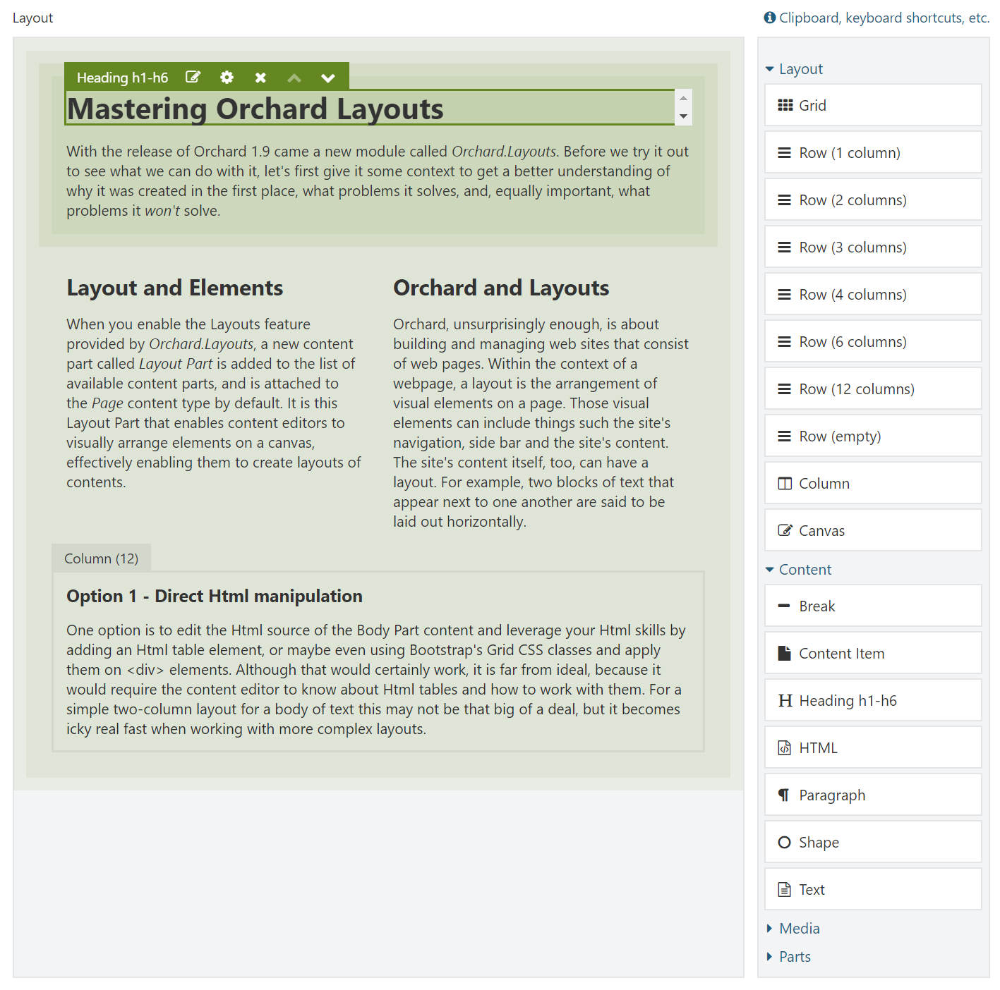
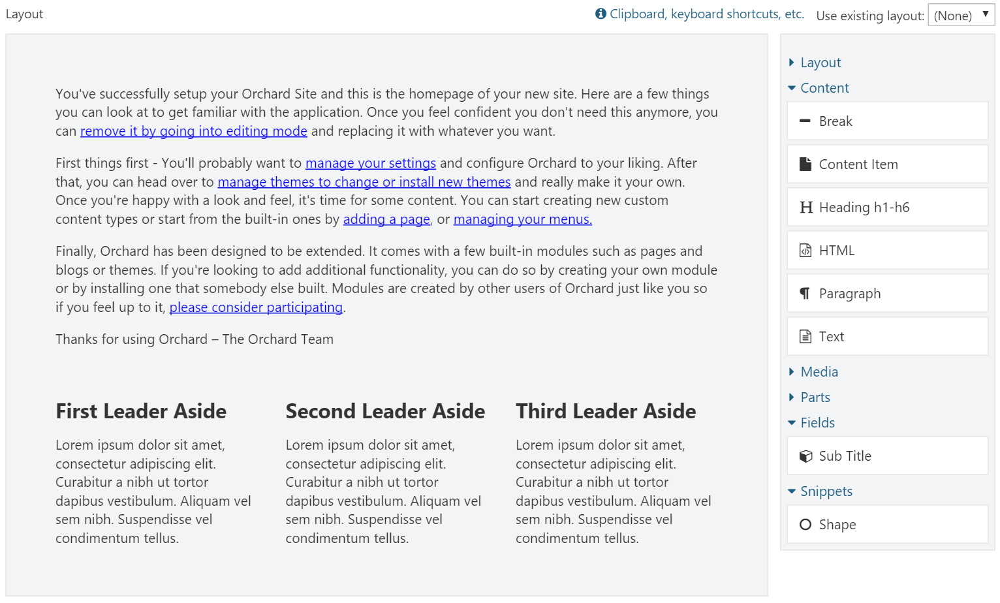

# Introduction to Layouts

With the release of Orchard 1.9 came a new module called **Orchard.Layouts**. Before we try it out to see what we can do with it, let's first give it some context to get a better understanding of why it was created in the first place, what problems it solves, and, equally important, what problems it won't solve.

## Defining Layouts

Layouts are everywhere. You find them not only in newspapers, magazines, and the book you're currently reading, but you find them just about anywhere, like in the office and your living room. Cities, planets and the universe, they all have a layout.

Elements, objects and shapes that are placed in a specific position relative to each other, are said to be part of a layout. In other words, a layout is an arrangement of elements. That's a great definition for sure, but how does this relate to Orchard you ask? Let's find out.

## Orchard and Layouts

Orchard, is about building and managing web sites that consist of web pages. Within the context of a webpage, a layout is the arrangement of visual elements on a page. Those visual elements can include things such the site's navigation, side bar and the site's content. The site's content itself, too, can have a layout. For example, two blocks of text that appear next to one another are said to be laid out horizontally.

And that is where the Layouts module comes in: it enables content editors to create layouts of contents.

Now, technically speaking, a theme developer can choose to set up their theme in such a way that the entire layout is controlled by the Layouts module. But, practically speaking, this is probably not the best use of the module in its current form. One reason is the fact that layouts are provided through a content part \(the Layout Part\), which means layouts created by the Layouts module can only be applied to content items. Although you could very well add a Menu element to a page content item, not all pages in Orchard are provided by content items.

For example, the Login screen is provided by a controller. If the site's main navigation is implemented as a layout element, the main navigation would disappear as soon as a page is displayed by something other than a content item.

As the Layouts module evolves over time, new site editing paradigms using the Layouts module may emerge. Until then, we will focus on how to use the Layouts module from a content editor's perspective.

## Layout and Elements

When you enable the Layouts feature provided by the Layouts module, a new content part called Layout Part is added to the list of available content parts. It is this Layout Part that enables content editors to visually arrange elements on a canvas, effectively enabling them to create layouts of contents.

These elements are a new type of entity in Orchard and represent the objects you can place on a canvas. An example of these elements is the Html element, which enables the user to add content. Another example is the Grid element, which enables the user to create a layout by adding Row and Column elements to it. The Column element is a container element into which you can add other elements, such as Html and Image elements. You can imagine that using these elements, it is easy to create a layout of contents. It is this capability that gave Orchard.Layouts its name.

## When to use Orchard Layouts?

From what you have read so far, the answer to the question of when to use the Layouts module may seem obvious: whenever you need to create a layout of content, use the Layouts module. But you may be wondering that surely, this was possible before we had this module? Well, yes, but that was more difficult and less flexible to do. Let me explain.

 Let's say we have a web page with content that consists of two paragraphs as seen in the following figure:

Now, let's say that we want to display those two paragraphs laid out horizontally instead, as seen in the next figure:

Before we see how to achieve that with the layouts module, let's explore our options before Orchard.Layouts.

### Option 1: Direct Html manipulation

One option is to edit the Html source of the Body Part content and leverage your Html skills by adding an Html table element, or maybe even using Bootstrap's Grid CSS classes and apply them on `
` elements. Although that would certainly work, it is far from ideal, because it would require the content editor to know about Html tables and how to work with them. For a simple two-column layout for a body of text this may not be that big of a deal, but it becomes icky real fast when working with more complex layouts.

### Option 2: Widgets and Zones

Another option is to provide two zones, let's say _AsideFirst_ and _AsideSecond_. The theme’s Layout.cshtml view renders these zones horizontally. You would then simply add an Html Widget to both zones, and the two Html widgets would appear next to each other. Although this approach works, a major disadvantage is that now the textual content becomes unrelated to the content item itself, since you are using widgets. To manage the content on this page, you have to go to the Widgets screen, create a page specific layer, and add two widgets. Now imagine you have to do that for 20 pages. That means 20 widget layers, 2 Html widgets per layer, and 20 Page content items with no contents. And this is just two columns. Imagine you have other types of layouts, for example one row with two columns, another row with 4 columns, and perhaps rows with one column taking up 2/3 of the row and a second column 1/3 of the row. Crazy. Allowing this level of freedom to the content editor user would easily end up in a maintenance nightmare.


 There is a way to associate widgets with content items directly by taking advantage of a free gallery module called IDeliverable.Widgets. Although this is better than having to create a layer per page, it is still not ideal.


### Option 3: Content Fields and Placement.info

Yet another option is to create various content types, where a content type would have multiple content fields.

For example, we could create a new content type called TwoColumnPage with two TextField fields. The theme would use Placement.info to place each field into two horizontally laid out zones.

Although this option is \(arguably\) better than the previous option using widgets, there is still the limitation of freedom when you want to introduce additional layouts. Not to mention the fact that we're now basing the content type name on what it looks like, rather than its semantic meaning. Not pretty.

## Enter Orchard.Layouts

With the inclusion of the Layouts module, a fourth option appeared. And a much better one too!

With Orchard.Layouts, creating a two-column layout could not be simpler. Simply add a Grid element with a single Row and two Column elements to the canvas, add some content elements, and you're done. No need for Html editing, no additional zones, no widgets and layers, and no additional content types. 

The layout editor consists of a design surface called the canvas and a toolbox containing elements that the user can drag and drop onto the canvas. 

To sum it up, thanks to the Layouts module,

* It is no longer necessary to create page-specific layers and widgets to achieve complex layouts of contents.
* It is no longer necessary to create specific content types just for supporting multiple layouts.
* We have an easy way to create various layouts of content.

## Where did the Body Part go?

When you install Orchard 1.9 or later for the first time and have a look at the Page content type, you will notice that it doesn’t have the Body Part anymore. Instead, you will see the new Layout Part attached. However, the Body Part is still a happy citizen within the Orchard, and will remain as such. The Layout Part simply serves a different purpose, namely to enable the user to layout pieces of contents. The Body Part is great when all you need is an editable body of text. Blog Posts are a great example where I would rather use the Body Part instead of the Layout Part, because all I want to do there is simply start writing content without having to first add an Html element to the canvas. In the end, it's all about choice and being able to pick the right tool for the job.

## What happens to my existing site and its contents when upgrading to Orchard 1.9?

If you're worried about your existing content, fear not. When you upgrade your site to 1.9 or beyond, the Layouts feature will not be automatically enabled. And even when you enable the feature yourself, it will not change your content type definitions. If you do want to use Layouts on existing Orchard installations that have been upgraded to the latest codebase, you will simply have to enable the Layouts feature and attach the Layout Part manually.

## The Nature of Elements

With the Layouts module came a new type of entity called Element. Unlike Widgets, Elements are not content items, but are, quite simply, instances of the Element class. Elements can contain other elements, and this is how layouts emerge.

The hierarchy of elements are stored using the infoset storage part of the content item, implemented via the Layout Part. This means that whenever a content item is loaded with the Layout Part attached, the elements are loaded all at once, unlike Widgets, where each widget is loaded individually. Elements are simpler entities, similar to content parts or fields, whereas widgets are composite objects with a content type that can be modified.

Similar to content items, or more accurately, content parts, Elements have their own drivers, which decouples element data from element behavior. This pattern is borrowed from the content part and content field system that also leverage drivers.

## Does Orchard.Layouts work with grid systems such as Bootstrap?

Many websites today use CSS grid frameworks such as Bootstrap. These grid systems enable web designers to layout visual components onto a grid that is made up of rows and columns. So, you may be wondering whether the Layouts module plays nice with such grid systems. As it turns out, this scenario is well-supported. The **Grid**, **Row** and **Column** elements map nicely to Bootstrap's **container**, **row** and **col-md-\*** CSS classes. You will have to override the shape templates for these elements in your theme so you can modify the CSS classes to use. We'll look into this in detail.

## Summary

In this chapter, I introduced you to the new Layouts module, what it is for and why we need it.

Orchard.Layouts enables users to arrange elements of various types onto a canvas. 

We explored what problem the Layouts module solves and when to use it. Where we had to resort to rather cumbersome solutions before, Layouts makes it a breeze to create all sorts of content layouts. 

In the next chapter, we'll have a closer look at Orchard.Layouts from a user's perspective, and see how to actually use it.

