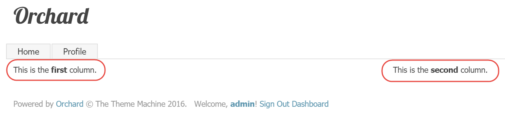
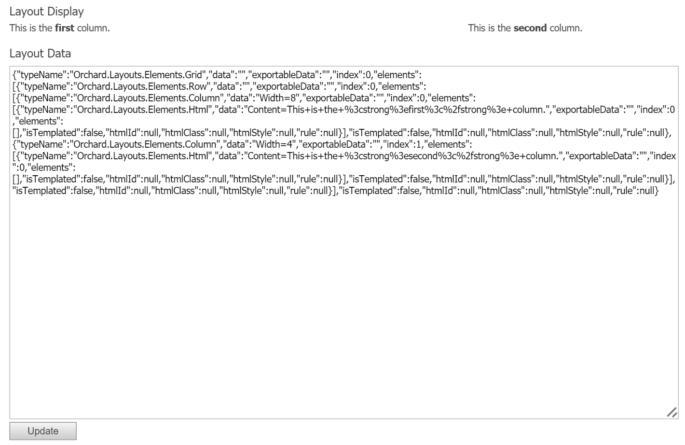
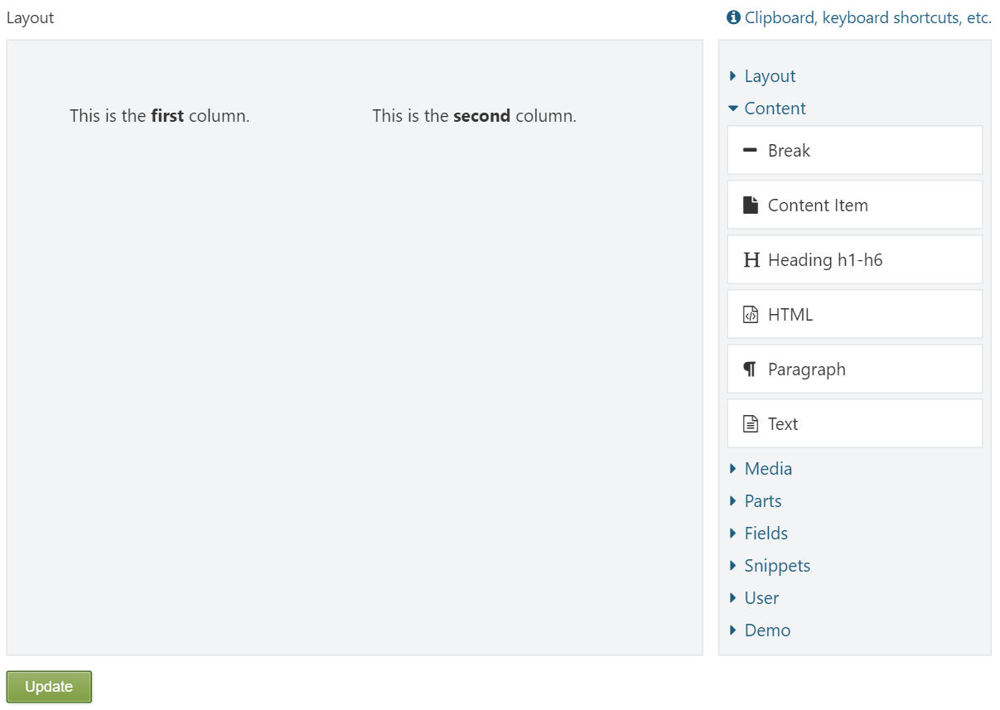

# Layout and Element APIs

So far we've seen how to write custom elements by creating custom element classes and harvesters. In this chapter, we will learn about the APIs at our disposal to programmatically work with elements. More specifically, we will learn how to:

* Work with the element manager to query all available element categories and descriptors.
* Use the element factory to instantiate elements
  .
* Render elements and layouts of elements with the layout manager and element manager.
* Serialize and deserialize elements
  .
* Handle element events by implementing the `IElementEventHandler` interface.
* Reuse the layout editor from your own module
  .

Knowing about these APIs will enable you to take advantage of all that the Layouts module has to offer and implement all sorts of applications yourself. For example, in the next part, we will write a `SlideShowPart` that uses the APIs from this chapter to enable the user to create slides that are based on layouts. To achieve such functionality, it is important to have a decent understanding of how the various APIs work.

We'll get started with an overview of the most interesting APIs first, and then move forward with examples and see how they work. 

## Managing Layouts and Elements

The Layouts module comes with two services that you can use to programmatically manage layouts and elements:

* Layout Manager
* Element Manager

We’ll discuss these next.

### The Layout Manager

The Layout Manager is provided via the `ILayoutManager` interface, and relies on the Element Manager \(discussed next\) to manage elements on a somewhat higher level.

For example, it has a method that accepts a serialized string of elements which it can render into a complete tree of element shapes. It also provides methods to manage Layout content items and apply layout templates.

The following table provides a description for each member of the `ILayoutManager` interface:

| Member |  Description |
| --- | --- | --- | --- | --- | --- | --- | --- | --- | --- | --- | --- | --- |
| GetTemplates | Returns a list of all content items with a `LayoutPart` attached whose `IsTemplate` content type-part setting is set to true. This method is used to populate the Templates drop down list on the layout editor from which the user can choose a layout template to apply to the current layout. |
| GetLayouts | Returns a list of all content items with a LayoutPart attached \(regardless of the IsTemplate setting\). |
| LoadElements | Deserializes the LayoutData string value of the specified `ILayoutAspect` \(which is typically a content item with a `LayoutPart` which itself implements this interface\) and returns a list of elements. |
| RenderLayout | Deserializes the specified data string into a list of elements \(internally invoking `LoadElements`\) and then invokes `IElementDisplay.DisplayElements` internally, which returns a hierarchy of element shapes. In addition, this method accepts two optional arguments: displayType and content. The display type is used to add shape alternates. The content argument should be specified if there is any. |
| ApplyTemplate | Used by the layout editor to apply the elements of the selected layout template to the elements of the current layout elements, essentially combining the two sets of elements and returning the resulting set. |
| DetachTemplate | The counterpart of ApplyTemplate, stripping out all sealed \(templated\) elements of the specified list and returning the result of that. |
| GetTemplateClients | Returns a list of all content items that use the specified layout template. This is used by the layout content handler to re-apply an updated layout template to all content items using the updated layout template. |
| CreateDefaultLayout | Returns a list of elements that represents a default layout which consists of a root Canvas, a Grid, Row and Column. |
| Exporting | Invokes the `Exporting` method on the element manager service for each element in the specified list of elements \(as provided via the `context` argument\). |
| Exported | Invokes the `Exported` method on the element manager service for each element in the specified list of elements \(as provided via the `context` argument\). |
| Importing | Invokes the `Importing` method on the element manager service for each element in the specified list of elements \(as provided via the context argument\). |
| Imported | Invokes the `Imported` method on the element manager service for each element in the specified list of elements \(as provided via the `context` argument\). |

## The Element Manager

The Element Manager is a service that deals with elements, such as loading and rendering them.

The element manager is provided in the form of the `IElementManager` interface, and has the following methods:

| Member | Description |
| --- | --- | --- | --- | --- | --- | --- | --- | --- | --- | --- | --- | --- | --- | --- | --- |
| DescribeElements | Returns a list of all available element descriptors by querying all available element harvesters. This method is used by the Layout Editor to provide the elements you see in the toolbox, as well as by the blueprint element controller |
| GetCategories | Returns a list of all the element categories. |
| GetElementDescriptorByTypeName | Returns a single element descriptor with the specified type name. |
| GetElementDescriptorByType | Returns a single element descriptor with the type name based on the specified generic argument type. |
| ActivateElement | Instantiates an element based on the given element descriptor. It internally relies on the `IElementFactory` to instantiate elements. |
| GetDrivers | Returns a list of all element drivers for the specified element descriptor or type, if specified. If no descriptor or type is specified, all element drivers are returned. |
| BuildEditor | Invokes the `BuildEditor` method on all `IElementEventHandler` implementations. |
| UpdateEditor | Invokes the `UpdateEditor` method on all `IElementEventHandler` implementations. |
| Saving |  Invokes the `LayoutSaving` method on all `IElementEventHandler` implementations. |
| Removing |  Invokes the `Removing` method on all `IElementEventHandler` implementations. |
| Exporting |  Invokes the `Exporting` method on all `IElementEventHandler` implementations. |
| Exported |  Invokes the `Exported` method on all `IElementEventHandler`implementations. |
| Importing |  Invokes the `Importing` method on all `IElementEventHandler`implementations. |
| Imported |  Invokes the `Imported` method on all `IElementEventHandler`implementations. |
| ImportCompleted |  Invokes the `ImportCompleted` method on all `IElementEventHandler`implementations. |

## Element Events

Part of writing custom elements consists of implementing element drivers, which allow you to handle events specific to the element type of that driver. Alternatively, we can implement event handlers to handle events for any type of element. This is done by implementing the `IElementEventHandler` interface, which looks like this:

```csharp
interface IElementEventHandler : IEventHandler
{
    void Creating(ElementCreatingContext context);
    void Created(ElementCreatedContext context);
    void CreatingDisplay(ElementCreatingDisplayShapeContext context);
    void Displaying(ElementDisplayingContext context);
    void Displayed(ElementDisplayedContext context);
    void BuildEditor(ElementEditorContext context);
    void UpdateEditor(ElementEditorContext context);
    void LayoutSaving(ElementSavingContext context);
    void Removing(ElementRemovingContext context);
    void Exporting(ExportElementContext context);
    void Exported(ExportElementContext context);
    void Importing(ImportElementContext context);
    void Imported(ImportElementContext context);
    void ImportCompleted(ImportElementContext context);
}
```

The majority of these methods are invoked either by the Element Manager or the Element Display service.

Oftentimes, when implementing an event handler, you're typically only interested in one or some methods to implement. So instead of implementing this interface directly, you can implement the abstract class `ElementEventHandlerBase` instead. That way you just need to override the method you're interested in handling.

## Displaying Elements

The service that is responsible for creating shapes from elements is the Element Display service, which is defined as follows.

```csharp
interface IElementDisplay : IDependency 
{
    dynamic DisplayElement(Element element, IContent content, string displayType = null, IUpdateModel updater = null);
    dynamic DisplayElements(IEnumerable<Element> elements, IContent content, string displayType = null, IUpdateModel updater = null);
}
```

The `DisplayElement` method returns a shape of type “Element”, while the `DisplayElements` method returns a shape of type **“LayoutRoot”**, whose child shapes are all of type “Element”.

## The Layout Editor

The Layout Editor that is used by the Layout Part can be reused y your own modules. The Layout Editor is implemented as a simple view model class that is rendered using a Razor editor template view. To get your hands on a fully initialized layout editor view model, use the **Layout Editor Factory** service.

### ILayoutEditorFactory

The Layout Editor Factory service enables you to instantiate a fully initialized `LayoutEditor` object, which is used as a view model. You use the standard MVC Html helpers `Editor` and `EditorFor` on `LayoutEditor` objects to display the entire layout editor. You typically use this layout editor factory class from your own controller, and then supply the `LayoutEditor` object to your view.

The following code shows the interface declaration:

```csharp
public interface ILayoutEditorFactory : IDependency
{
    LayoutEditor Create(LayoutPart layoutPart);
    LayoutEditor Create(string layoutData, string sessionKey, int? templateId = null, IContent content = null);
}
```

As you see, there is a single method called `Create` with two overloads. The first overload takes a `LayoutPart` to read element information from, while the second overload allows you to provide this information yourself.

We’ll see a fully functioning example of how to work with the layout editor in this chapter.

## Serialization

The Layouts module comes with two services that handle serialization and deserialization of elements:

* Layout Serializer
* Element Serializer

### ILayoutSerializer

The Layout Serializer service is provided via the `ILayoutSerializer` interface. This service can serialize an array of elements into a JSON string, and deserialize a JSON string back into an array of elements.

Internally, it relies on the Element Serializer service which contains the logic to serialize and deserialize individual elements and JSON nodes. 

The following table describes each member of `ILayoutSerializer`:

| Member | Description |
| --- | --- | --- |
|  Serialize |  Serializes a hierarchy of elements into a JSON string. |
|  Deserialize |  Deserializes a JSON string into a hierarchy of elements. |

### IElementSerializer

The Element Serializer is provided via the `IElementSerializer` interface, and is responsible for converting individual elements from and to JSON.

The following table describes the members of `IElementSerializer`:

| Member | Description |
| --- | --- | --- | --- | --- |
| Serialize | Serializes an element into a JSON string. If the element has child elements, they too will be serialized recursively. |
| Deserialize | Deserializes a JSON string into a single element. If the element has child elements, they too will be deserialized recursively. |
| ToDto | This is used by the Serialize method to turn a given element into an anonymous object, which is then serialized into a JSON string. The reason this method is exposed on the interface is because `ILayoutSerializer` needs to use the same code. |
| ParseNode | This is the counterpart of `ToDto` and used by the `Deserialize` method to parse a given JSON node into an actual element instance. The reason this method is exposed on the interface is because `ILayoutSerializer` needs to use the same code. |

## Try it out: Working with the APIs

In this tutorial, we’ll see how to work with the various APIs covered in this chapter. We'll see how to manually construct a tree of elements, initialize them, serialize and deserialize them and finally render them. We'll then see how to work with the layout editor.

An easy way to demonstrate the APIs is to work with them from a controller, so that’s what we’ll create first.

### Creating the Controller

Create the following controller:



```csharp
using System.Web.Mvc;

namespace OffTheGrid.Demos.Layouts.Controllers {
    public class ElementsApiController : Controller {
        public ActionResult Index() {
            return View();
        } 
    }
}
```



Make sure to create an empty Razor View as well.

### Creating Elements

With that in place, let's create an element of type **Html** and initialize it with some HTML content:



```csharp
using System.Web.Mvc;
using Orchard.Layouts.Elements;
using Orchard.Layouts.Services;

namespace OffTheGrid.Demos.Layouts.Controllers {
    [Themed]
    public class ElementsApiController : Controller {
        private readonly IElementManager _elementManager;

        public ElementsApiController(IElementManager elementManager) {
            _elementManager = elementManager;
        }

        public ActionResult Index() {

            // Create a new instance of the Html element using the element manager.
            var html = _elementManager.ActivateElement<Html>();

            // Configure the element.
            html.Content = "<p>This is an <strong>Html</strong> element.</p>";
            html.HtmlClass = "demo-content";
            html.HtmlId = "Paragraph1";
            html.HtmlStyle = "color: hotpink;";

            return View();
        } 
    }
}
```



The above code listing demonstrates how to work with the `IElementManager` to instantiate an element of a given type.

Instead of setting up the instantiated Html element as I did above, I could have provided an anonymous function instead, which looks like this:

```csharp
// Create a new instance of the Html element using the element manager.
var html = _elementManager.ActivateElement<Html>(e => {
    // Configure the element.
    e.Content = "<p>This is an <strong>Html</strong> element.</p>";
    e.HtmlClass = "demo-content";
    e.HtmlId = "Paragraph1";
    e.HtmlStyle = "color: hotpink;";
});
```

It's almost the same, but this time I used the element initializer callback instead. Another difference is that this code initializes the element before the `Created` event is triggered. Although this may be irrelevant in most cases, but it’s good to keep in mind for certain advanced scenarios where you handle the `Created` event and require a fully initialized element. 

When invoking `_elementManager.ActivateElement<Html>`, what happens under the covers is that the element manager uses the C\# `typeof` keyword to get the .NET type to get the `FullName` property of the type, by which the element descriptors are registered. To get a descriptor by name directly, use the `GetElementDescriptorByTypeName` method. This is useful in scenarios where an element is not registered by its .NET type name, but dynamically, such as element blueprints for example.

The following code demonstrates how we could instantiate the Html element by its element type name:

```csharp
// Create a new instance of the Html element using the element manager.
var htmlDescriptor = 
    _elementManager
    .GetElementDescriptorByTypeName(DescribeElementsContext.Empty, "Orchard.Layouts.Elements.Html");

// Need to cast to Html, since this overload does not know the .NET type of the element being activated.
var html = (Html)_elementManager.ActivateElement(htmlDescriptor);
```

### Rendering Elements

Now that we have seen how to programmatically instantiate elements, we'll have a look at how to render them. You could of course simply send the element to the view, and render it from there. For example, the following would totally work:

```csharp
public ActionResult Index() {

    // Create a new instance of the Html element using the element manager.
    var html = _elementManager.ActivateElement<Html>(e => {
        // Configure the element.
        e.Content = "<p>This is an <strong>Html</strong> element.</p>";
        e.HtmlClass = "demo-content";
        e.HtmlId = "Paragraph1";
        e.HtmlStyle = "color: hotpink;";
    });

    // Assign the Html element to a property on the dynamic ViewBag.
    ViewBag.HtmlElement = html;
    return View();
} 
```

And then in the “Index.cshtml” view:

```aspnet
@using Orchard.Layouts.Elements
@{
    // Access the Html element from the ViewBag.
    var htmlElement = (Html)ViewBag.HtmlElement;
}
<div id="@htmlElement.HtmlId" style="@htmlElement.HtmlStyle"  class="@htmlElement.HtmlClass">
    @Html.Raw(htmlElement.Content)
</div>
```

However, this will become quite cumbersome when you want to create entire trees of elements, because the view now requires hardcoded knowledge about the structure of the element tree, including the types of each element. You could create HTML helpers and partial views that render individual elements and their children recursively, and that would work. But you would be reinventing the wheel.

Let’s see how it should be done instead by leveraging the Element Display service.

Change the controller code as follows:

```csharp
public ActionResult Index() {

    // Create a new instance of the Html element using the element manager.
    var html = _elementManager.ActivateElement<Html>(e => {
        // Configure the element.
        e.Content = "<p>This is an <strong>Html</strong> element.</p>";
        e.HtmlClass = "demo-content";
        e.HtmlId = "Paragraph1";
        e.HtmlStyle = "color: hotpink;";
    });

    // Render the Html element.
    var htmlShape = _elementDisplay.DisplayElement(html, content: null);

    // Assign the HtmlShape to a property on the dynamic ViewBag.
    ViewBag.HtmlShape = htmlShape;

    return View();
}
```

The above code shows the usage of the `IElementDisplay` service, which is injected via the constructor \(not shown above\). Invoking the element display service is easy: pass the element instance to display and optionally a content item to serve as context to elements, and what you get back is an element shape that is ready for rendering, which is done from the view:

```aspnet
 @Display(ViewBag.HtmlShape)
```

This also means that, by virtue of leveraging shapes, any alternates get applied to the shape templates.

Before we move on to serialization, let's see how to create a more advanced element hierarchy. For example, let's create a Grid with one Row and 2 Columns. We'll add one Html element to each column.

```csharp
public ActionResult Index() {

    // Create an hierarchy of elements.
    var rootElement = New<Grid>(grid => {
        // Row.
        grid.Elements.Add(New<Row>(row => {
            // Column 1.
            row.Elements.Add(New<Column>(column => {
                column.Width = 8;
                column.Elements.Add(New<Html>(html => html.Content = "This is the <strong>first</strong> column."));
            }));

            // Column 2.
            row.Elements.Add(New<Column>(column => {
                column.Width = 4;
                column.Elements.Add(New<Html>(html => html.Content = "This is the <strong>second</strong> column."));
            }));
        }));
    });

    // Render the Html element.
    var gridShape = _elementDisplay.DisplayElement(rootElement, content: null);

    // Assign the HtmlShape to a property on the dynamic ViewBag.
    ViewBag.RootElementShape = gridShape;

    return View();
}

// A private helper method that acts as an alias to: _elementManager.ActivateElement.
private T New<T>(Action<T> initialize) where T:Element {
    return _elementManager.ActivateElement<T>(initialize);
}
```

Then the View looks like this:

```aspnet
 @Display(ViewBag.RootElementShape)
```

When you now navigate to `/OrchardLocal/Books.MasteringLayouts/ElementsApi`, you should see the following:



Next, let's see how we can serialize and deserialize elements.

### Element Serialization

The following code demonstrates working with ILayoutSerializer to serialize and deserialize a hierarchy of elements. To make it a little bit more interesting, we'll provide the resulting JSON string to a text area control and allow the user to make changes to it and submit those changes back to the controller. We'll then deserialize the submitted JSON and render the updated set of elements.

The following code shows element serialization in action:

```csharp
// Serialize the root element.
var json = _elementSerializer.Serialize(rootElement);
```

Next, we’ll add the JSON string to the `ViewBag` of our controller:

```csharp
// Assign the JSON string to a property in the dynamic ViewBag.
ViewBag.LayoutData = json;
```

Then update the view as follows:

```aspnet
<h2>@T("Layout Display")</h2>
@Display(ViewBag.RootElementShape)

<h2>@T("Layout Data")</h2>
@using (Html.BeginFormAntiForgeryPost()) {
    @Html.TextArea("LayoutData", (string) ViewBag.LayoutData, new {rows = 30, cols = 150})
    <button type="submit">@T("Update")</button>
}
```

Now let's update the action method so that it will handle the form submission by deserializing the posted JSON string and rendering the elements.

The completed controller looks like this:



```csharp
using System;
using System.Web.Mvc;
using Orchard.Layouts.Elements;
using Orchard.Layouts.Framework.Display;
using Orchard.Layouts.Framework.Elements;
using Orchard.Layouts.Services;
using Orchard.Themes;

namespace OffTheGrid.Demos.Layouts.Controllers {
    [Themed]
    public class ElementsApiController : Controller {
        private readonly IElementManager _elementManager;
        private readonly IElementDisplay _elementDisplay;
        private readonly IElementSerializer _elementSerializer;

        public ElementsApiController(IElementManager elementManager, IElementDisplay elementDisplay, IElementSerializer elementSerializer) {
            _elementManager = elementManager;
            _elementDisplay = elementDisplay;
            _elementSerializer = elementSerializer;
        }

        public ActionResult Index(string layoutData = null) {

            Element rootElement;

            if (layoutData == null) {
                // Create a default hierarchy of elements.
                rootElement = New<Grid>(grid => {
                    // Row.
                    grid.Elements.Add(New<Row>(row => {
                        // Column 1.
                        row.Elements.Add(New<Column>(column => {
                            column.Width = 8;
                            column.Elements.Add(New<Html>(html => html.Content = "This is the <strong>first</strong> column."));
                        }));

                        // Column 2.
                        row.Elements.Add(New<Column>(column => {
                            column.Width = 4;
                            column.Elements.Add(New<Html>(html => html.Content = "This is the <strong>second</strong> column."));
                        }));
                    }));
                });

                // Serialize the root element.
                var json = _elementSerializer.Serialize(rootElement);

                // Assign the JSON string to a property in the dynamic ViewBag.
                ViewBag.LayoutData = json;
            }
            else {
                rootElement = _elementSerializer.Deserialize(layoutData, DescribeElementsContext.Empty);
            }

            // Render the Html element.
            var rootElementShape = _elementDisplay.DisplayElement(rootElement, content: null);

            // Assign the HtmlShape to a property on the dynamic ViewBag.
            ViewBag.RootElementShape = rootElementShape;
            
            return View();
        }

        private T New<T>(Action<T> initialize) where T:Element {
            return _elementManager.ActivateElement<T>(initialize);
        }
    }
}
```



The key updates are the addition of the optional layoutData parameter, which, if not null, is deserialized using the following code:

```csharp
 rootElement = _elementSerializer.Deserialize(layoutData, DescribeElementsContext.Empty);
```

We either construct a layout of elements manually, or deserialize a JSON string, and render the resulting element instance. We can now view the default JSON, manipulate it, and submit it back to the controller.



### Working with the Layout Editor

Although editing layouts of elements with raw JSON is far from ideal, it does demonstrate the potential for implementing more advanced editors, since JSON is easy to work with.

The Layouts module itself provides a fully-functioning layout editor that we can reuse.

Let’s continue with the current sample controller and replace the text area with a full-blown layout editor.

The first thing to do is to inject the `ILayoutEditorFactory` and create the LayoutEditor viewmodel, which we'll render from the view. We'll also change out the `IElementSerializer` with the `ILayoutSerializer`. The primary difference between the two is that the latter one expects an array of elements instead of a single element, which in turn the default `ILayoutEditorFactory` implementation expects.


The layout editor requires the root element to by a `Canvas`, so the default implementation of `ILayoutEditorFactory` relies on `ILayoutEditorFactory`, which always serializes from and to an array of elements, the first element expected to be a `Canvas`. If the first element is not a canvas, a root Canvas element is created on the fly to which the array of elements is added.


We'll also use the Canvas element as the root, which is a requirement for the layout editor.

Another thing we'll change is replace the `ThemedAttribute` with the `AdminAttribute`, since the layout editor is designed to work from the backend only.

#### Layout JSON vs Layout Editor JSON

The Layout Editor works with a slightly different JSON schema than the schema used by the layout serializer. The reason for this is that the editor needs additional information about the layout model.

What this means is that we need to be able to convert from and to one format to the other. Fortunately, the Layouts module comes with a service for that called the **Layout Model Mapper**.

When working with `ILayoutEditorFactory`, its `Create` method expects the standard layout JSON format as its first argument. However, when the layout editor submits its data, that data is in the form of the layout editor JSON.

Therefore, whatever data we get back from the layout editor, it needs to be mapped back into the standard layout JSON if we want to deserialize it with the layout serializer.

#### Layout Editor Factory 

Taking all of the above into account, the following code demonstrates how to work with the layout editor factory:

```csharp
using System;
using System.Collections.Generic;
using System.Linq;
using System.Web.Mvc;
using Orchard.Layouts.Elements;
using Orchard.Layouts.Framework.Display;
using Orchard.Layouts.Framework.Elements;
using Orchard.Layouts.Services;
using Orchard.Layouts.ViewModels;
using Orchard.UI.Admin;

namespace OffTheGrid.Demos.Layouts.Controllers {
    [Admin] // The layout editor is designed to work from the back end.
    public class ElementsApiController : Controller {
        private readonly IElementManager _elementManager;
        private readonly IElementDisplay _elementDisplay;
        private readonly ILayoutSerializer _layoutSerializer;
        private readonly ILayoutEditorFactory _layoutEditorFactory;
        private readonly ILayoutModelMapper _modelMapper;

        public ElementsApiController(
            IElementManager elementManager,
            IElementDisplay elementDisplay,
            ILayoutSerializer layoutSerializer,
            ILayoutEditorFactory layoutEditorFactory,
            ILayoutModelMapper modelMapper) {

            _elementManager = elementManager;
            _elementDisplay = elementDisplay;
            _layoutSerializer = layoutSerializer;
            _layoutEditorFactory = layoutEditorFactory;
            _modelMapper = modelMapper;
        }

        [ValidateInput(false)] // The submitted data may contain Html.
        public ActionResult Index(LayoutEditor layoutEditor /* The LayoutEditor type serves as a viewmodel which can be modelbound. */) {

            IEnumerable<Element> layout;
            string layoutData = null;

            if (layoutEditor.Data != null) {
                // The posted layout data is not the raw Layouts JSON format, but a more tailored one specific to the layout editor.
                // Before we can use it, we need to map it to the standard layout format.
                layout = _modelMapper.ToLayoutModel(layoutEditor.Data, DescribeElementsContext.Empty).ToList();

                // Serialize the layout.
                layoutData = _layoutSerializer.Serialize(layout);
            }
            else {
                // Create a default hierarchy of elements.
                layout = CreateDefaultLayout();

                // Serialize the layout.
                layoutData = _layoutSerializer.Serialize(layout);
            }

            // The session key is used for the IObjectStore service
            // used by the layout editor to transfer data to the element editor.
            // The actual value doesn't matter, just as long as its unique within the application.
            var sessionKey = "DemoSessionKey";

            // Create and initialize a new LayoutEditor object.
            layoutEditor = _layoutEditorFactory.Create(layoutData, sessionKey);

            // Assign the LayoutEditor to a property on the dynamic ViewBag.
            ViewBag.LayoutEditor = layoutEditor;

            return View();
        }

        // Creates an element tree with a default layout (Grid, Row, and two Columns).
        private IEnumerable<Element> CreateDefaultLayout() {
            return new[] { New<Canvas>(canvas => {
                canvas.Elements.Add(
                    New<Grid>(grid => {
                    // Row.
                    grid.Elements.Add(New<Row>(row => {
                        // Column 1.
                        row.Elements.Add(New<Column>(column => {
                            column.Width = 6;
                            column.Elements.Add(New<Html>(html => html.Content = "This is the <strong>first</strong> column."));
                        }));

                        // Column 2.
                        row.Elements.Add(New<Column>(column => {
                            column.Width = 6;
                            column.Elements.Add(New<Html>(html => html.Content = "This is the <strong>second</strong> column."));
                        }));
                    }));
                }));
            })};
        }

        // An alias to IElementManager.ActivateElement<T>.
        private T New<T>(Action<T> initialize) where T : Element {
            return _elementManager.ActivateElement<T>(initialize);
        }
    }
}
```

Notice that I'm reusing the `LayoutEditor` class as an action parameter. This will cause the model binder to bind the posted values to an object of that class, which is very convenient, as it means we don't have to create a view model ourselves.

If a non-null value is provided for the `LayoutEditor.Data` property, we use the `ILayoutModelMapper` to parse the posted JSON string into a list of element objects, which we then serialize back to a standard JSON string. The reason for doing that is that we need to re-create the `LayoutEditor` object using the layout editor factory, since not all of its properties are being round-tripped.

If there was no data posted, we create a default layout by constructing a tree of elements manually, which we then serialize. Whatever the source of the layoutData string, we feed it into the layout editor factory to get a new, properly configured, `LayoutEditor` object.

One final point of interest is the sessionKey variable that is being sent into the layout editor's Create method. This value is used for the `IObjectStore` service used by the layout editor to transfer data to the element editor. The actual value doesn't matter, just as long as it’s unique within the application.

The view is updated with the following code:

```aspnet
@using Orchard.Layouts.ViewModels;
@{
    var layoutEditor = (LayoutEditor)ViewBag.LayoutEditor;
    Style.Include("~/Modules/Orchard.Layouts/Styles/default-grid.css");
}
@using (Html.BeginFormAntiForgeryPost()) {
    @Html.EditorFor(m => layoutEditor)
    <button type="submit">@T("Update")</button>
}
```

Notice the usage of the `Html.EditorFor` HTML helper method. This method will automatically select the “LayoutEditor.cshtml” view that is provided by the Layouts module to render the editor.

Now, with the updated controller and view in place, this is what our layout editor looks like when run:



As you can see, it's the fully-functioning layout editor. We can add and remove elements, and when we hit the _Update _button, the changes are persisted across form submissions.

Although we aren't storing the layout data in more durable storage such as a database, it would be easy to do so, since all we need to store and retrieve is a simple layout data string.

Some additional work that would need to be done is handle the deletion of elements. When a user deletes elements from the canvas, those elements are posted back to the controller via the `LayoutEditor.RecycleBin` property. You would model-map that string to a list of elements as well, and then invoke `IElementManager.Removing` to give each element a chance to do some cleanup. Such code would look like this \(taken from the `LayoutPartDriver`\):

```csharp
var describeContext = DescribeElementsContext.Empty;
var recycleBin = (RecycleBin)_mapper.ToLayoutModel(layoutEditor.RecycleBin, describeContext).SingleOrDefault();
var updater = this; // This requires your controller to impement IUpdater.
var context = new LayoutSavingContext {
    Updater = updater,
    Elements = layout,
    RemovedElements = recycleBin?.Elements ?? Enumerable.Empty<Element>()
};

_elementManager.Removing(context);
```

Notice that the `RecycleBin` data string actually results in a `RecycleBin` element, which owns the removed elements.

In addition to handling the removal of elements, you would also have to invoke the `IElementManager.Saving` method, which will invoke the `Saving` event on all elements.

## Summary

In this chapter we learned about various services that are provided by the Layouts module, which itself relies on them to implement the layout editor and Layout Part for example. Knowing how to use these services enable you to implement more advanced modules that rely on elements.

In the next chapter, we will take everything we learned in this chapter and use it to build a rather advanced element called _SlideShow_. We'll see how we can have that element store each individual slide and how to implement slide editors using layout and element APIs.


