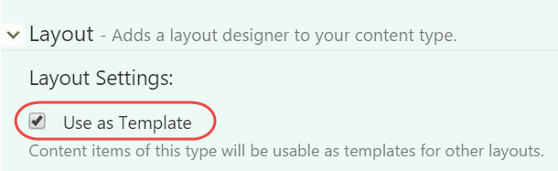
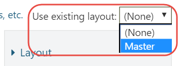

# Layout Templates

Layout templates are a way to reuse layouts that you created earlier. For example, if you have a lot of content items that use a two-column layout, instead of re-creating that layout from scratch each time, you can create a layout once and reuse it on your pages.

Layout templates are implemented as content items that have the Layout Part attached. The Layout Part has a setting called **Use as Template**, which is used by the Layout Editor to populate the templates drop down list.

The templates drop down list is only present when there's at least one template in the system.

After you apply a layout, you'll notice that the elements inherited from that template are not selectable or editable, with the exception of the column elements - they are still selectable so that you can still add elements to them.

Whenever you make a change to a template, that change gets applied to all content items using that template.

## Sealed Elements and Placeholder Containers

As I mentioned before, the elements inherited from a template are marked as sealed. Sealed elements cannot be modified by the user. If the sealed element is an empty container, the user can still add elements to it. However, if this container contains at least one element added via the template, then the user cannot add additional elements.

If you want to allow the user to add elements to a templated container element that already contains other elements, you will have to add an empty container to it, such as the Canvas element. The Canvas element would act as a placeholder container into which the user can add elements.

## Summary

Layout templates are templates for content items that use the Layout Part. Elements inherited from a template are sealed, which means they cannot be modified from child layouts. In order to be able to add elements to a container inherited from a template, that container must be empty, otherwise it becomes sealed as well.

In conclusion, Layout templates are a powerful way to reuse commonly used layouts across many pages. Changing a template will affect all of its child layouts.

