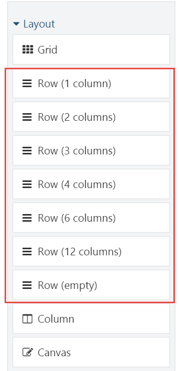
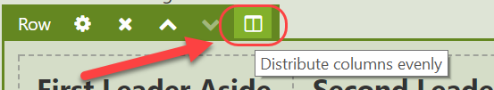
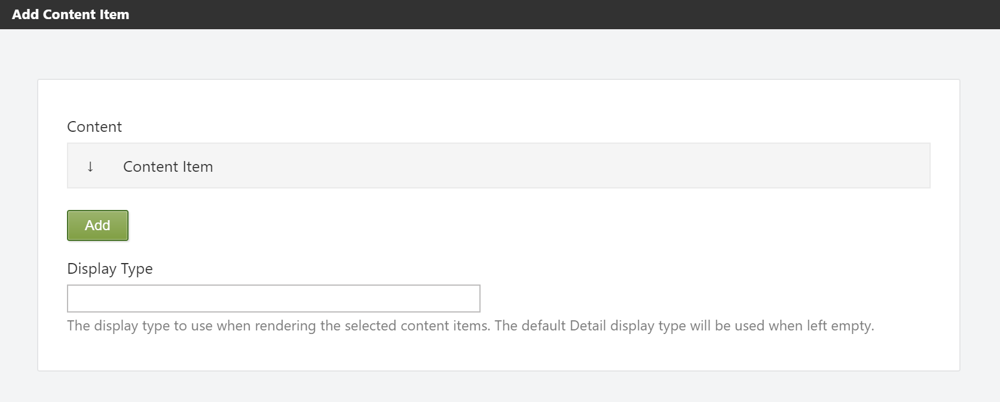
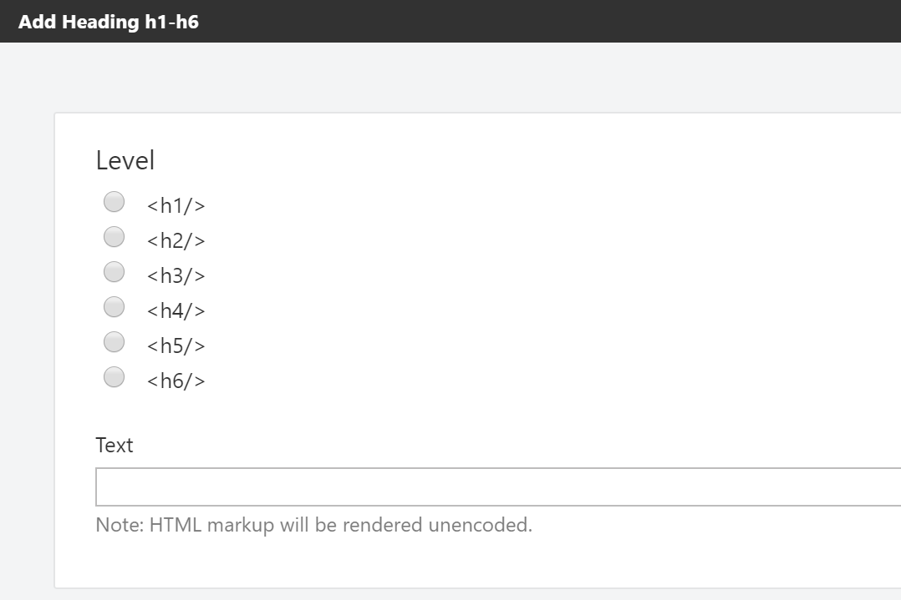
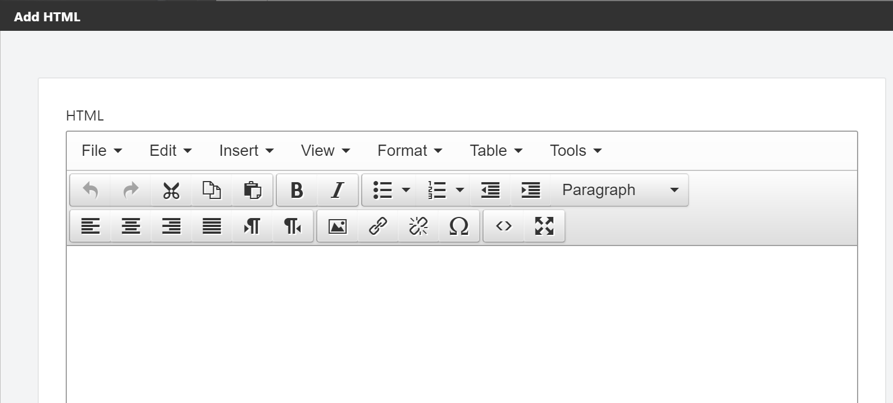
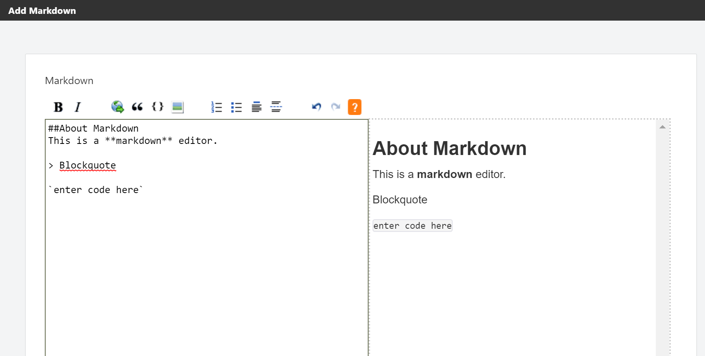

# Meet the Elements

In this chapter, we'll go over all of the available elements in the default Orchard distribution. Most elements should be self-explanatory to use, but I think that some of them could use a little bit of a background to get a decent understanding on how to use them.

Elements are grouped by their category.

## Element Categories

The list of elements as well as categories are extensible, but by default Orchard ships with the following categories and their elements:

### Layout

Elements in this category are typically container elements that layout their child elements in a particular way. Some container elements only support a specific set of child element types. For example, the Grid element can only contain Row elements, which in turn can only contain Column elements.

#### Grid

The Grid element is a container element that can hold only Row elements.

Use the Grid element whenever you want to create a layout of elements. As mentioned, Grids contain Rows, and Rows in turn contain Columns. As you can imagine, these three types of elements are fundamental to create layouts.

When you add a new Grid to the canvas, it will not contain any Row elements initially. You will need to add Row elements to the Grid yourself. Easy enough.

#### Row

The Row element, like the Grid element, is a container element. However, this element can only contain Column elements.

The Row element is represented in the toolbox as 7 preconfigured Row elements. The first Row toolbox item will add a single Row element with 1 Column element, the second toolbox item will add a single row with 2 columns, and so forth.



The Row element has a specific toolbar command called **Distribute columns evenly**. 



As its name implies, this command will evenly distribute the width of the columns of the row based on a maximum size of 12 columns. For example, if a Row element has 4 columns with varying sizes, and the maximum size is 12, each column will be re-sized to be exactly 3 units in size. 

#### Column

Unlike the Grid and Row elements, the Column element can hold any type of child elements, except for Row and Column elements. Columns themselves can only be contained by Row elements.

A column has two specialized properties: **Width **and **Offset**. Together, these values make up the total size of the column. 

**Adding Columns
**

There are various ways to add columns to a row. 

*  Add any number of Column elements from the Toolbox.
*  If the Row element contains at least one Column, you can split that column into two. Repeat this until you have the desired number of columns.

**Offsetting
**

Another property of the Column element is its **Offset**. By default, the offset for any column is 0. Increasing the offset increases the overall size of the column. You typically use an offset if you want to leave a blank that is a multiple of the grid kern. Otherwise, CSS is almost always a better option to add a margin or padding.

#### Canvas

The Canvas element, like the Column element, can contain any type of element, except for Row and Column elements. Unlike the Column element, the Canvas element can be added to any other container element, except for Grid and Row, since they have an exclusive whitelist of allowed children.

Whenever you create a new layout, that layout always start with a root element of type Canvas.

The Canvas element is useful if you need a generic type of container element. Although in most cases you probably won't need it since the Column element already is a container, there are occasions where a Canvas proves quite useful. One example is when working with Layout Templates. A layout template enables the reuse of existing layouts. When a layout template is applied to a layout, the elements from the template are _sealed_, which means the user cannot make any modifications to these elements. If a sealed container element is empty however, it will accept elements as its children. But if a sealed container element contains at least one element, no elements are allowed to be added to that container. To work around that, you need to add an empty container element that acts as a placeholder. The Canvas is quite suitable for that purpose.

See chapter 4 for more information on Layout Templates.

### Content

The Content category contains elements that are pure content.

#### Break

The Break element is probably one of the simplest elements available. It has no specialized properties. All it does is render the &lt;hr&gt; Html element.
 

#### Content Item

The Content Item element is very similar to the Content Picker Field and enables the user to select one or more content items to render inline on the canvas.

When adding or editing a Content Item element, the user is presented with a dialog window displaying the content properties of the element. 

The element has two specialized properties:

* A list of content items to render
* The DisplayType to use when rendering the selected content items



The Content Item element enables you to render the same content item at various locations in different layouts.

#### Heading

The Heading element maps directly to the `<h1> `to `<h6>` Html elements, and has two specialized properties:

* Level
* Text

The **Level** indicates the size of the heading and ranges from 1 to 6. For example, if you specify level 3, the `<h3>` tag will be rendered.



 

The following is an example of Html output when specifying level 6 and the text "Hello Layouts!":

```text
 <h6>Hello Layouts!</h6>
```

#### Html

The Html element is probably the most commonly used one when it comes to placing content onto the canvas. 

It has a single property called Html, which stores the Html markup. Use this element whenever you want to display textual content anywhere on the canvas.



The Html editor used by default is TinyMCE, but you can change this by enabling other features that provide another editor for the html flavor. For example, if you enable the CKEditor feature, that's the editor you'll see when editing Html elements.

#### Markdown

The Markdown element lets the user use Markdown syntax, which gets transformed into HTML when being rendered on the front-end.

You'll need to enable the Markdown Element feature to enable this element.



#### Paragraph

The Paragraph element maps directly to the `<p>` HTML element and enables the user to add individual paragraphs to the page.


You may be wondering why you would want to use this element over the Html element. All elements have common properties such as **Html ID**, **Html Class **and **Html Style**. These property values are rendered as HTML attributes on the start tag of a given HTML element. When the Html element is rendered and has a value for at least one of the three common properties, a surrounding `<div>` element is rendered onto which the common properties are rendered as attributes. However, there may be occasions where you actually want these common property values to be rendered as attributes on a `<p>` tag directly instead of a surrounding `<div>` element. That's when you use the Paragraph element.


#### Projection

The Projection element works the sames as the Projection Part and allows the user to select a Query to project a list of content items.


 You need to enable the **Projection Element** feature before you can use the Projection element.


#### Shape

The Shape element is a simple yet very useful element that has just one content property called **Shape Type**. If you provide the shape name of an existing shape here, then that shape will be rendered wherever you place the Shape element. 


When you enable the **Templates** feature and create a template, you can use that as the shape type for the Shape element.


#### Text

The Text element provides a simple textarea control for its content input and renders it as raw HTML.

### Media

The Media category contains all elements that display some form of media, such as images, documents and videos.

#### Image

The Image element allows the user to pick a single image content item from the media library. When rendered on the front-end, the element renders the `` tag. Use the Image element when:

* You only need to display a single image per element.
* You want the common properties to be rendered as part of the &lt;img&gt; Html tag rather than the &lt;div&gt; element that is rendered when using the Media Item element.

#### Media Item

The Media Item element allows the user to pick more than one media item. The user can control what display type to use when rendering the selected media items. Use the Media Item element when:

* You want to display a list of various types of media.
  \
* You want to control the display type being used to render each media item.

#### Vector Image

The Vector Image element is similar to the Image element, but only supports vector graphics formats such as `.svg`. In addition to the selected media item, the Vector Image element has two additional properties: **Width** and **Height**, both expressed in number of pixels. These values will be rendered as width and height attributes on the `` tag.

### Parts

The Parts category dynamically provides a set of elements for content parts that:

* Have their **Placeable** property set to true.
* Are attached to the current content item's content type.

Part elements enable the user to place the content parts attached to the content type anywhere within the layout of the content item.


In order to prevent the content parts from being displayed at their default locations, you will need to configure Placement.info. Refer to chapter 9 for more information.


#### Placeable Parts

Content parts aren’t placeable by default. The **Placeable** property is a new part property that controls whether the content part is harvested as an element. By default, the Placeable property is set to true for the following content parts:

* BodyPart
* CommonPart
* TagsPart
* TitlePart

#### Fields

The Fields category is similar to the way the Part elements work, but with a few differences:

* Only content fields attached to the current content item's type are displayed as elements
  .
* There is no Placeable property for content fields, which means that all content fields are placeable when attached to a content type.

#### Snippets

The Snippets category has two types of elements by default: One is a generic **Shape **element, and the others are based on a convention where Razor files are named in a certain way.
 These elements are called **Snippets**.

#### Snippet Elements

Snippets are similar to the Shape element, but the key difference is that instead of you providing the shape type name, the Snippet element harvester provides elements based on the existence of Razor files in the current theme whose file name end in Snippet.cshtml.


Snippets are provided by the Layout Snippets feature, so be sure to enable it when you want to try it out.


For example, a Razor file called `LogoSnippet.cshtml` in the Views folder of the current theme \(or any module for that matter\) would yield an element called `Logo`.

Snippets are a great tool for theme and module developers, as they provide a quick way of providing elements without having to write element classes and drivers.

What's more, Snippets can be made configurable. We will how this works in detail in chapter 11.

### UI

Elements in the UI category contain various UI elements such as _menus_, _breadcrumbs_ and _notifications_.


 The UI elements are provided by the **UI Elements** feature.


#### Widgets

This category provides all widgets as elements, enabling the user to add widgets to layouts.

When you place a widget element onto a layout, the widget element harvester will create an actual widget content item for you and render that one on the front end. The created widget is not linked with any zone or layer, since it is linked with the content item containing the layout. If you delete the content item or the widget element, the widget itself is deleted as well, since it's managed by the element.

### Forms

The Forms category provides all elements exposed by the Dynamic Forms feature. These elements allow you to create forms. Form submissions can be stored automatically in Orchard, and or you can handle form submissions yourself by writing a custom module or even simply via a workflow.

Here's the complete list of Form elements available to you out of the box:

#### Button

Add this element to the Form element to have that form be submitted when the user clicks this button.

#### Check Box

Displays a checkbox.

#### Email Field

Displays an input field with `type=email`.

#### Enumeration

Displays a set of options . This list is provided manually when you add the element to the canvas. You can control the type of list to display by setting the **Input Type** property to any of the following values:

* Select List
* Multi Select List
* Radio List
* Check List

#### Fieldset

This element is a container element, which means that you can add other elements to this one.

#### Form

Renders a form on the page. The Form element allows you to specify the following:

* A custom target URL. If left empty, the form will be submitted to an Orchard controller, which will raise a Form Submission event. Otherwise, the form will be submitted to the specified URL.
* Method \(POST by default\).
* Enable Client Validation. 
* Store Submission. When checked, all submissions will be stored. You can access form submissions via the **Form Submissions** menu item.
* Html Encode. Check this option to automatically HTML-encode submitted values.
* Create Content. This option allows you to automatically create a content item when a form is submitted. This is an advanced feature that allows you to bind each form field to a particular part or field property for the specified content type.
* Show Notification. When the form is submitted, the specified message will be displayed as a notification.
* Redirect URL. If a value is specified, the user will be redirected to this URL after the form has been submitted.

#### Hidden Field

Renders a hidden field.

#### Ip Address Field

This element doesn't render anything by default, but is executed on the server when a form is submitted and will automatically include the user host IP address as part of the form submission.

#### Label

Displays a label element. You can specify the ID of an associated input element using the **For** property.

#### Password

Displays a password field.

#### Radio Button

Displays a radio input field.

#### Text Area

Displays a text area.

#### Text Field

Displays a simple text field.

#### Url Field

Displays an input field with `type=url`.

#### User Name Field

This element doesn't render anything by default, but is executed on the server when a form is submitted and will automatically include the currently logged in user name as part of the form submission.

#### Validation Message

Displays a validation message when the associated input field has a validation error. You associate an input field by specifying its ID in the **For** property.

#### Validation Summary

Displays a list of validation messages if there are any.

## Summary

In this chapter, we got to meet all of the elements that ship with Orchard out of the box.

We went over each element in detail to get a better understanding of each element’s intended use.

The set of elements can be extended by custom element harvesters, which are responsible for providing elements to the system. Module developers can create custom harvesters, into which we will look in great detail in Part 3 - Extensibility.


