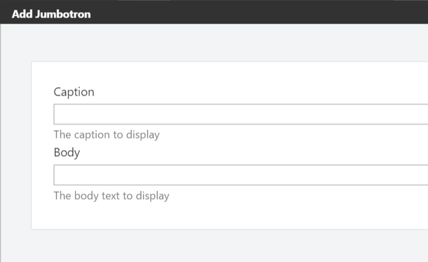

# Snippets

Snippets are another type of element that are dynamically discovered based on the mere existence of Razor views whose name follow a certain convention. When a Razor view ends in **Snippet.cshtml**, it is harvested as a Snippet element. For example, _ButtonSnippet.cshtml_ would be harvested as an element called _Button Snippet_.

Snippets are a great tool for theme developers to create custom elements without the need to write element classes. All they need to do is create a Razor view and provide the necessary markup.

## Parameterized Snippets

As of Orchard 1.10, the Snippets feature was enhanced to provide parameterized snippets. A **parameterized snippet** enables the user to add snippet elements and configure these snippets with custom fields.

To add configurable fields to a snippet, you need to do two things:

1. Create a snippet manifest file.
2. Render the fields from the snippet.

The snippet manifest is a text file using YAML syntax that has the same name as the snippet file, but using the **.txt** extension instead of **.cshtml**.

The manifest file provides the following \(optional\) information about the snippet:

* Display name \(used by the Layout editor\)
* Toolbox icon \(a FontAwesome identifier used by the Layout editor\)
* Description \(used by the Layout editor\)
* Category \(used by the Layout editor\)
* List of fields \(used by the snippet itself\)

The following is an example snippet manifest:

```text
DisplayName: Jumbotron
ToolboxIcon: \uf10c
Description: A configurable jumbotron
Category: Bootstrap
Fields:
    - Name: Caption
      DisplayName: Caption
      Description: The caption to display
      Type: Text
    - Name: Body
      DisplayName: Body
      Description: The body text to display
      Type: Text
```

As you can see, the manifest declares two fields: _Caption_ and _Body_, both of type **Text**.

When the user adds a _Jumbotron_ snippet using the Layout editor, they will be presented with a dialog that displays the two fields.

The snippet template itself can render the values of those fields by simply accessing them via the Model property, like this:

```text
var caption = Model.Caption;
var body = Model.Body;
```


To get a good understanding of what you can do with parameterized snippets, let's see how to create one.

### Try it out: Parameterized Snippets

In this example, we'll build a reusable, parameterized snippet called _JumbotronSnippet_ with two fields: _Caption_ and _Body_. The idea is that users can add any number of jumbotrons to their pages and provide a caption and a body text for every one of them.

The first thing to do is create a view called _JumbotronSnippet.cshtml_ in the current theme or any custom module, and provide the following markup:

```text
<div class="jumbotron">
   <h2>Model.Caption</h2>
   @Html.Raw(Model.Body)
</div>
```

Next, create the _JumbotronSnippet.txt_ manifest file:

```text
DisplayName: Jumbotron
ToolboxIcon: \uf10c
Description: A configurable jumbotron
Category: Bootstrap
Fields:
    - Name: Caption
      DisplayName: Caption
      Description: The caption to display
      Type: Text
    - Name: Body
      DisplayName: Body
      Description: The body text to display
      Type: Text 
```

With this in place, you should now be able to add Jumbotron elements to your pages.

Notice that as soon as you add a Jumbotron element to the page, the element editor dialog appears, showing the two fields as defined in the JumbotronSnippet.cshtml file.



## Custom Field Editors

Besides the default set of snippet field editors, you can provide your own snippet field editor types. All you need to do is create a Razor view in the _Views/EditorTemplates_ folder of your theme or module, and give it a name as follows: _Elements.Snippet.Field.\[YourEditorTypeName\].cshtml_. For example, if you wanted to provide an editor called _Multiline_, you would create a Razor file called _Elements.Snippet.Field.Multiline.cshtml_. Then, when rendering snippet fields, you would specify _Multiline_ as the snippet field type, as is demonstrated in the following sample snippet:

```text
 @Html.SnippetField("Paragraph", "Multiline")
```

The following code shows an example implementation of the field editor snippet:

```text
@model Orchard.Layouts.ViewModels.SnippetFieldViewModel
@{
    var field = Model;
}
<div class="form-group">
    @Html.Label(field.Descriptor.Name, field.Descriptor.DisplayName.ToString())
    @Html.TextArea(field.Descriptor.Name, field.Value, 10, 50, new { @class = "text large" })
    @if (field.Descriptor.Description != null) {
        @Html.Hint(field.Descriptor.Description)
    }
</div>
```

The only requirement for a custom snippet field type Razor view is to render some input field that has the same name as the value provided by `SnippetFieldViewModel.Descriptor.Name`, which wires up the user's input with the backing store of the snippet field.

## Summary

In this chapter, we saw what snippets are and how they work. You can “parameterize” snippets so that users can configure them from the layout editor. Snippets enable theme developers to create custom elements without having to write C\# classes. All that's required is a Razor view.

We also saw how to provide custom snippet field type editors, simply by creating another Razor view that follows a particular naming convention.

