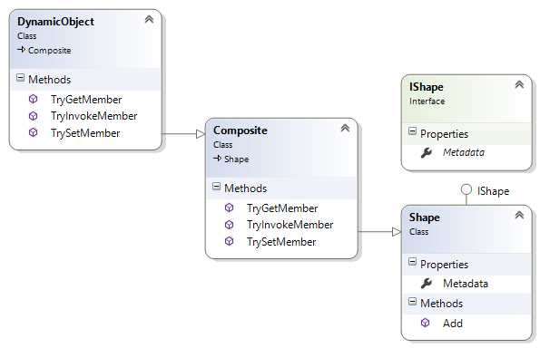
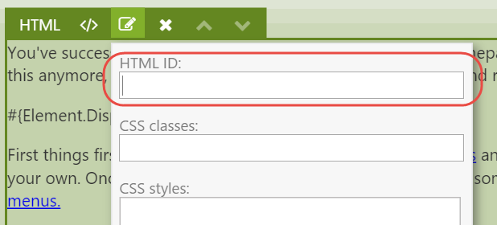

# Theming

Orchard has a powerful theming story that allows theme developers endless freedom to customize pretty much everything. In this chapter, we’ll go over what shape templates to override when customizing the rendering of elements. To understand how theming works, it is important to understand an Orchard concept called Shapes. Now, you don’t need to know everything there is to know about shapes, but here’s a primer.

## A Primer on Shapes

Shapes are at the heart of the Orchard rendering engine and are dynamic objects that can be rendered into HTML. Shapes act as the view model for a given shape template, which is typically \(but not necessarily\) a Razor view. In fact, shape templates can be implemented as:

* Razor views
* Shape methods
* Templates \(a content type provided by Orchard.Templates\)


 This list can be extended with custom implementations of `IShapeTableProvider`.


Some key characteristics of shapes:

* Shapes can be rendered. This means that we can render a given shape into an HTML string. This is made possible because a shape carries information about what shape templates to use for rendering.
* Shapes can contain child shapes. This means that we can build and render trees of shapes.
* Shapes are dynamic. This means that we can add properties and methods to a shape at runtime.

The following section dives a little deeper into the anatomy of shapes, however this is not something you need to understand in order to be effective with overriding element shape templates. The reason I included it is because I think one can never read enough about shapes, as they are the single most complex concept in Orchard. Once you fully grasp how they work, the world is at your feet. Or at the very least, you’ll be able to create themes and modules with confidence.

### Anatomy of a Shape

All shape objects are instances of the `Shape` class, which itself implements the `IShape` interface and inherits from `Composite`, which in turn inherits from the .NET `DynamicObject` class.

The `Composite` class implements the dynamic behavior when typed as dynamic. This is not unlike the way the .NET `ExpandoObject` works, where you can dynamically add members to a dynamic instance at run-time, using an internal dictionary to store members and their values.



As you can see in the above diagram, every shape has a **Metadata** property which contains information such as the name of the shape. It is this metadata that is key to rendering shapes, as we’ll see next.

### Shape Templates

To render a shape, Orchard relies on a service called the **display manager**. The display manager needs to know what shape template to use. In order to determine that, it uses three pieces of information to find the template to use:

1. The shape's **name** \(stored in Metadata\).
2. The shape's **alternates** \(stored in Metadata\).
3. A **shape table** to get a **shape binding** based on either the shape name or one of the shape alternates.

The shape binding contains a delegate that will perform the actual rendering \(which could be the Razor view engine, a shape method, or potentially something else entirely\).

If the shape table matches any of the alternates, the first match is used. If no alternates match, a binding based on the shape name is returned. If no binding was found, an exception is thrown.


 If you try to render a shape for which no binding exists, an `OrchardException` with the message `"Shape type {0} not found"` will be thrown.


Once a binding is found, the display manager invokes its **Binding **property, which is of type `Func<DisplayContext, IHtmlString>`.

The shape rendering process essentially boils down to:

1. Given a shape object, get a function from the shape table provider to render that shape.
2. Invoke that function and render the returned Html string.

If the previous section went over your head, don’t worry. In practice, all you need to do to render a shape is invoke `@Display` from a Razor view, passing in an instance of a shape. The `Display` property of a Razor view ultimately invokes `IDisplayManager.Execute`, which does the shape table look-up as I just described.

Ok, now let’s see what shapes are created by the Layouts module and get a better understanding of what shapes and alternates we can use.

## Elements and Shapes

As is the case with content items, parts and fields, Elements too are rendered using shapes. More specifically, for any given Element to render, a shape with the name Element is created and rendered.

To differentiate one Element shape form another, a set of alternates are included as part of the shape. One such alternate is based on the technical name of the element. That way, each element has its own shape template.


Similar to the `IContentDisplay` service that turns a `ContentItem` instance into a Content shape, the `IElementDisplay` services turns an `Element` instance into an Element shape. If an element has child elements, the service recursively creates shapes for them as well, adding those shapes to their parent shape.


Out of the box, the following alternates are added when creating an Element shape:

* Elements\_&lt;typeName&gt;
* Elements\_&lt;typeName&gt;\_&lt;displayType&gt;
* Elements\_&lt;typeName&gt;\_\_&lt;category&gt;
* Elements\_&lt;typeName&gt;\_&lt;displayType&gt;\_\_&lt;category&gt;

The **typeName** used in the alternates is the **.NET type name** \(without the namespace\) of the element class. For example, when an Element shape is created for the Html element, the typeName will be “Html”., since the class name is `Html`.

The **category** is the name of the category to which the element descriptor is assigned, “Content” for example.

The **displayType** is the value provided for the `displayType` argument when displaying a shape using the Element Display service.

If Orchard finds a shape template matching one of the alternates \(where the last added alternate is considered the most specific one and has therefore priority\), it uses that template.


 Orchard maps alternate name syntax to filename syntax by replacing underscores with dots and double underscores with hyphens. Check out the documentation for how this works, or my blog post at [http://www.ideliverable.com/blog/a-closer-look-at-content-types-drivers-shapes-and-placement](http://www.ideliverable.com/blog/a-closer-look-at-content-types-drivers-shapes-and-placement)


For example, given a display type of **“Design”** and a category of **“Content”**, the Element shape alternates map to the following Razor view filenames:

* Elements.Html.cshtml or Elements/Html.cshtml
* Elements.Html.Design.cshtml or Elements/Html.Design.cshtml
* Elements.Html-Content.cshtml or Elements/Html-Content.cshtml
* Elements.Html-Content.Design.cshtml or Elements/Html-Content.Design.cshtml


Notice that you can use a slash instead of a dot after “Element”. This conveniently enables you to organize your Element shape templates in an “Elements” folder.


##  Overriding Element Shape Templates

Out of the box, Orchard takes care of rendering the Element shapes for you. Most of the times, you don't need to override these templates. Except, for example, if you're creating a theme based on a CSS Grid framework such as Bootstrap. Then you will want to override the Grid.cshtml and Column.cshtml shape templates so that you can provide the appropriate CSS classes that Bootstrap expects. Another example may be where you have a specific requirement for rendering additional Html around a particular element.

To override a shape template, all you need to do is copy one of the existing templates from the Layouts module into the Views folder of your theme and apply your customizations. Easy, right? It is. The tricky part is discovering what shape templates to override and what shape alternates you have at your disposal. Although the Shape Tracing feature is a tremendous help when getting started, I found it even easier to just attach a debugger and set breakpoints in various Razor views and inspect the Model property \(which is the shape object itself\) and its list of Alternates.

## Custom Alternates

As mentioned, the Element shape contains a default set of alternates. But, as is the case with any shape, you can programmatically add custom alternates yourself, giving you fine-grained control over what shape template to use based on whatever conditions you like.

For example, let's say you wanted to provide an alternate based on the Html ID property of an element so that you can use a specific shape template for certain elements with certain IDs. To do so, you would implement the `IShapeTableProvider `interface and add an `OnDisplaying` event handling function from where you add the alternates.

Let's see how that works.

### Trying it out: Creating Custom Alternates for Element Shapes

The following code snippet shows a shape table provider class that adds an alternate based on the element's Html ID property. I excluded the namespaces for brevity, but the complete code is provided as the complimentary sample code accompanying this book.

```text
public class CustomElementShapes : IShapeTableProvider {        
   public void Discover(ShapeTableBuilder builder) {
      builder.Describe("Element").OnDisplaying(context => {
         var element = (Element)context.Shape.Element;

         // Get the HtmlId value of the element.
         var htmlId = element.HtmlId;

         // Don't add custom alternates if no Html ID value was provided.
         if (String.IsNullOrWhiteSpace(htmlId))
            return;

         var typeName = element.GetType().Name;
         htmlId = htmlId.ToSafeName();

         // Example: Elements/Html-MyJumbotron.cshtml
         var alternate = $"Elements_{typeName}__{htmlId}";
         context.ShapeMetadata.Alternates.Add(alternate);

       });
    }
}
```

The above shape table provider describes the Element shape type and adds a handler for the `OnDisplaying `event of shapes of that type. When that handler executes, it gets a reference to the actual Element instance. This is necessary so that we can get its configured `HtmlId` property. If no such value was specified, we do nothing and return. Otherwise, we construct an alternate using the element type name and its HtmlId value.



Given this new alternate, we can now provide specific shape templates by assigning an Html ID to an element and providing a shape template in or theme based on our custom alternate for that Html ID value.

For example, if you provide an Html ID value of “MyJumbotron” to an Html element, you can create a Razor view with the following filename: **Elements/Html-MyJumbotron.cshtml**. 

## Content Part and Field Elements

In [chapter 3](meet-the-elements.md) we were introduced to various element types and their categories, two of which being Parts and Fields elements. These elements allow the user to place content parts and fields attached to the current content type anywhere on the canvas.

When you first start using Part and Field elements, you'll notice that these parts and fields are rendered at least twice on the front-end, which is not typically what you want. 

The reason this happens is because that out of the box, part and field shapes are configured to be placed in the Content zone using Placement.info files. A Placement.info file is an XML file that contains placement configuration for shapes created by content part and field drivers. Now, in addition to those shapes being placed, any part and field elements placed onto the canvas will also render these parts and fields.

To fix this, we need to tell Orchard to not render the shapes as configured by the default Placement.info files, since we are placing those things ourselves via the layout editor. The way to do this is by updating the Placement.info file of the current theme, which is easy to do once you know how.

### Updating Placement.info

To prevent a part or field shape from being rendered, all you need to do is specify an empty string \(or a hyphen\) as the value of the attribute representing the shape type. For example, let's say you wanted to place the Title Part shape onto the layout. Since the Title Part Driver returns a shape called **Parts\_Title**, we can add the following XML to Placement.info in the current theme:

```text
<Placement>
   <Place Parts_Title="-" />
</Placement>
```

With that change, however, neither the default shape nor the shape created by the element will be displayed. This is because the part and field element drivers use the Content Display service to execute the part and field drivers and process the returned shapes by applying Placement.info. So, if we configured those shapes to not be rendered, no shape will be created.

What we need to do instead is add a `<Match DisplayType=”Layout”>` element. The secret sauce here is that Part and Field element drivers use the **Layout display type**. Within that Match element we then configure the **Parts\_Title** shape to be placed in the Content zone of the element shape. The final Placement.info configuration would look like this:

```text
<Placement>
   <!-- Don't render the Parts_Title shape by default. -->
   <Place Parts_Title="-" />
   <!-- Except for Parts_Title shape being rendered using the "Layout" display type that is used by Layouts. -->
   <Match DisplayType="Layout">
        <Place Parts_Title="Content" />
    </Match>
</Placement>
```


With this placement configuration in place, you can now place the Title Part anywhere on the canvas without that part being rendered twice.

It works exactly the same for Content Field elements.

## Summary

In this chapter, we learned about shapes, which are dynamic objects that serve as view models for shape templates. Shape templates take care of generating Html, and can be implemented either using Shape methods or Razor views.

We also learned about shape alternates, which are key to understanding how to customize shape templates in your custom theme.

We then looked at a specific category of elements: Part and Field elements. They provide the user with control over where to place them on a canvas. However, the theme's Placement.info file needs to be updated to prevent the default shapes from being rendered into their default zones.   


