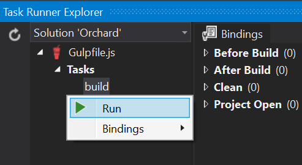

# Writing Container Elements

## Writing Container Elements

In the previous chapter, we learned how to write custom elements. However, if you want to write a custom element that can contain other elements, there are quite a few more steps involved. In this chapter, we will unravel all those steps that are involved when creating custom container elements.

### Steps to Create a Container Element

When writing custom container elements, follow these steps:

1. Implement a class that derives from `Container`.
2. Implement a driver for your element.
3. Implement a mapper class that derives from `LayoutModelMapBase<T>` that takes care of mapping values between the layout editor and elements back and forth.
4. Implement a client-side model for the element as well as an Angular directive.
5. Implement a resource manifest provider that provides the client script to the layout editor.
6. Implement a shape table provider that invokes the resource manager to include the element resources.

Most of the work when creating a custom container element goes into making it work with the layout editor. The primary reason for this is the fact that the layout editor has a client side model of elements, and it needs to know what the type of object is to be used on the client.

The layout editor roughly divides elements into two categories:

* Content elements \(Html, Image, Heading, etc.\)
* Non-content elements \(Canvas, Grid, Row, Column\)

The distinction is made as follows: if a given element type declares its own Model Map, it means it has a specific client side \(JavaScript\) representation of that element. If not, the client side representation is always the `Content` JavaScript class.

## Layout Model Mappers

"Layout model mapping" is a process that converts a list of server-side `Element` objects into JSON format that the layout editor can work with, and the other way around: to convert a layout editor data JSON string back into a list of `Element` objects.

The reason we need to do that is because the layout editor requires its own JSON schema to work with elements, so we need a mechanism to serialize elements into that JSON format.

Another way of thinking about layout model mapping is to think of it as a provider for the client-side representation of your custom element.

To implement a model map for your own element, you need to implement the `ILayoutModelMap` interface and provide a DTO to be serialized into JSON, or parse a JNode object back into an `Element` instance.

The `ILayoutModelMap` interface has the following members:

| Member | Description |
| --- | --- | --- |
| Priority | If multiple model maps can convert from and to a given element type, the one with the highest priority is selected to do that job. This is useful in cases such as the ContentModelMap, which can basically map any element that is not a container. So in order to allow other non-container elements to provide their own model map implementation, they need to be able to provide a higher priority. |
| LayoutElementType | Returns the client-side “class” name of the element. When the layout editor needs to instantiate an element based on its JSON data, it uses this name to instantiate an object of that class. |
| CanMap | Returns true if this model map implementation can map the specified element, false otherwise. |
| ToElement | Returns an Element object initialized with the provided JNode data. This is a way for the client-side layout editor to pass in data set by the user and into the element as stored on the server side. Examples of this are the HtmlId, HtmlClass and HtmlStyle properties on an Element. |
| FromElement | The counterpart of ToElement. This method expects implementations to populate the specified JNode with data from the specified Element. |

The layout editor allows the user to manipulate element properties in two ways:

1. Via the Element Editor Dialog.
2. Directly from the Layout Editor.

The first way is by invoking the element editor dialog, where element drivers are involved to render the editor UI and handle form submissions. The resulting element data is then sent back as a JSON string to the layout editor via JavaScript and stored in a `Data` property on the client-side model that represents the layout and its individual elements.

The second way is to edit element properties directly from the layout editor. This set of properties is not typically the same set as shown in the element editor dialog. Instead, it shows common properties such as `HtmlId`, `HtmlClasses` and `HtmlStyles`. These property values are set on a client-side model representing the layout and its individual elements, so we need a way to include this information when everything gets submitted to the server.

That is where the layout model mappers come into play.

## Client Side Support

Implementing the client side story of container elements involves the following steps:

1. Implement the client-side model of the element
2. Implement the directive \(the layout editor is implemented with AngularJS\)
3. Implement the template for the directive
4. Register the element with the client-side element factory

Once you got all that in place, you'll be able to add your custom container element onto the canvas, and add any other elements to it.

Let's dive in and see what it looks like when actually implementing a container element.

## Try it out: Writing a Tile element

In this walkthrough, we'll implement a custom container element called `Tile` that enables the user to specify a background image. Once you understand how to implement container elements, you'll be able to create any other type of elements.

The Tile element will have the following features:

* A Tile element can contain any other type of element.
* A Tile element can optionally have a background image.
* A Tile element can optionally have a background size.
* The user will be able to change the background size property using the quick properties accessor.

The quick properties accessor is the little pop-out window that appears when you click the "Edit \[element type\] properties \(Space\)" icon in an element's toolbar, and offer a way for users to quickly change certain properties without having to launch the element editor's dialog. Common to all elements are properties such as Html ID, CSS Classes, CSS Styles and Visibility Rule. However, as we'll see in this walkthrough, custom elements have complete control over this set of properties.

Since the Tile element stores a reference to a content item \(the background image\), we'll need to make sure that we export the content item identity, since the content item id \(a primary key value\) will be useless when importing.

To learn more about content identity, check out Bertrand Leroy’s blog post on the matter: [http://weblogs.asp.net/bleroy/identity-in-orchard-import-export](http://weblogs.asp.net/bleroy/identity-in-orchard-import-export)

### The Tile Element

First of all, we need to create an element class called `Tile`, which will override the `Category` and `ToolboxIcon` properties, and add two additional properties: the `BackgroundImageId`, which will store the image content item ID that the user selected, and the `BackgroundSize` property, which will control how the background image gets applied in terms of the background-size CSS attribute. The following code listing shows the complete Tile class:

```csharp
using Orchard.Layouts.Elements;
using Orchard.Layouts.Helpers;

namespace OffTheGrid.Demos.Layouts.Elements {
    public class Tile : Container {
        public override string Category => "Demo";
        public override string ToolboxIcon => "\uf03e";

        public int? BackgroundImageId {
            get { return this.Retrieve(x => x.BackgroundImageId); }
            set { this.Store(x => x.BackgroundImageId, value); }
        }

        public string BackgroundSize {
            get { return this.Retrieve(x => x.BackgroundSize); }
            set { this.Store(x => x.BackgroundSize, value); }
        }
    }
}

```

### The Tile Driver

The Tile driver will be responsible for the following things:

* Handling the Tile element editor.
* Handling the OnDisplaying event to prepare some data when the Tile element is being rendered. We need to load the selected background image by the ID that is stored in the `BackgroundImageId` property.
* Implementing Import/Export for the Tile in order to export/import the background image content item identity.

The following code shows the complete implementation of the Tile driver:

```csharp
using System.Linq;
using OffTheGrid.Demos.Layouts.Elements;
using OffTheGrid.Demos.Layouts.ViewModels;
using Orchard.ContentManagement;
using Orchard.Layouts.Framework.Display;
using Orchard.Layouts.Framework.Drivers;
using Orchard.Layouts.Helpers;
using Orchard.MediaLibrary.Models;

namespace OffTheGrid.Demos.Layouts.Drivers {
    public class TileDriver : ElementDriver<Tile> {
        private readonly IContentManager _contentManager;

        public TileDriver(IContentManager contentManager) {
            _contentManager = contentManager;
        }

        protected override EditorResult OnBuildEditor(Tile element, ElementEditorContext context) {
            var viewModel = new TileViewModel {
                BackgroundImageId = element.BackgroundImageId?.ToString(),
                BackgroundSize = element.BackgroundSize
            };

            // If an Updater is specified,
            // it means the element editor form is being submitted
            // and we need to read and store the submitted data.
            if(context.Updater != null) {
                if (context.Updater.TryUpdateModel
                   (viewModel, context.Prefix, null, null)) {
                    element.BackgroundImageId = Orchard.Layouts.Elements.ContentItem.Deserialize(viewModel.BackgroundImageId).FirstOrDefault();
                    element.BackgroundSize = viewModel.BackgroundSize?.Trim();
                }
            }
            
            viewModel.BackgroundImage = GetBackgroundImage(element, VersionOptions.Latest);

            var editorTemplate = context.ShapeFactory.EditorTemplate(
                TemplateName: "Elements/Tile",
                Model: viewModel,
                Prefix: context.Prefix);

            return Editor(context, editorTemplate);
        }

        protected override void OnDisplaying(
          Tile element, ElementDisplayingContext context) {
            var versionOptions = context.DisplayType == "Design" 
            ? VersionOptions.Latest 
            : VersionOptions.Published;
            Context.ElementShape.BackgroundImage = 
             GetBackgroundImage(element, versionOptions);
        }

        protected override void OnExporting(
           Tile element,
           ExportElementContext context) {

            // Load the actual background content item.
            var backgroundImage = GetBackgroundImage(element, VersionOptions.Latest);

            if (backgroundImage == null)
                return;

            // Use the content manager to get the content identities.
            var backgroundImageIdentity = _contentManager.GetItemMetadata(backgroundImage).Identity;

            // Add the content item identities to the ExportableData dictionary.
            context.ExportableData["BackgroundImage"] = backgroundImageIdentity.ToString();
        }

        protected override void OnImporting(Tile element, ImportElementContext context) {
            // Read the imported content identity from
            // the ExportableData dictionary.
            var backgroundImageIdentity = context.ExportableData.Get("BackgroundImage");

            // Get the imported background content item from
            // the ImportContentSesison store.
            var backgroundImage = context.Session.GetItemFromSession(backgroundImageIdentity);

            if (backgroundImage == null)
                return;

            // Get the background content item id (primary key value)
            // for each background image.
            var backgroundImageId = backgroundImage.Id;

            // Assign the content id to the BackgroundImageId property so
            // that they contain the correct values, instead of the
            // automatically imported value.
            element.BackgroundImageId = backgroundImageId;
        }

        private ImagePart GetBackgroundImage(Tile element, VersionOptions options) {
            return element.BackgroundImageId != null
                ? _contentManager.Get<ImagePart>(element.BackgroundImageId.Value, options, QueryHints.Empty.ExpandRecords<MediaPartRecord>())
                : null;
        }
    }
}

```

Let's go over that driver method-by-method.

#### OnBuildEditor

The `OnBuildEditor` method takes care of both displaying the element editor as well as handling post-back. The first 4 lines initialize a new view model used by the editor template:

```csharp
var viewModel = new TileViewModel {
    BackgroundImageId = element.BackgroundImageId?.ToString(),
    BackgroundSize = element.BackgroundSize
};
```

This simply constructs a new `TileViewModel `object and initializes it with existing Tile element data. The reason I introduced a view model is because I need to pass an actual Image content item object to the view, as you’ll see.

The `TileViewModel` is defined as follows:

```aspnet
using Orchard.MediaLibrary.Models;
namespace OffTheGrid.Demos.Layouts.ViewModels {
    public class TileViewModel {
        public string BackgroundImageId { get; set; }
        public string BackgroundSize { get; set; }
        public ImagePart BackgroundImage { get; set; }
    }
}
```

In case you’re wondering about the `BackgroundImageId` being of type `string` rather than `int`, that’s because of the way the `MediaLibraryPicker `shape works, which I’m reusing to render a media item picker. Basically, it stores potentially multiple selected image IDs using a comma-separated list of ids.

After initializing the view model, we check to see if we're in “post-back” mode by checking whether the Updater is null or not. The Updater is specified by the framework when the user submitted the form on the element editor dialog, and really is just a reference to a controller. If the Updater is not null, we go ahead and use it to model bind the posted values against our view model like this:

```csharp
// If an Updater is specified, it means the element editor form is being submitted
// and we need to read and store the submitted data.
if(context.Updater != null) {
    if (context.Updater.TryUpdateModel(viewModel, context.Prefix, null, null)) {
        element.BackgroundImageId = Orchard.Layouts.Elements.ContentItem.Deserialize(viewModel.BackgroundImageId).FirstOrDefault();
        element.BackgroundSize = viewModel.BackgroundSize?.Trim();
    }
}

```

Notice that we're converting the `viewModel.BackgroundImageId` from string to `IEnumerable<int>` using the `Deserialize `static method as defined on `Orchard.Layouts.Elements.ContentItem`. The ContentItem element just happened to provide this convenient method since Orchard 1.10, so I chose to reuse it here. Since the Tile only supports a single background image, we call `FirstOrDefault `to get the first selected image, if any.

After handling the post-back scenario, the method continues by loading the selected background image using the content manager:

```aspnet
 viewModel.BackgroundImage = GetBackgroundImage(element, VersionOptions.Latest);
```

We need the Image content item to initialize the MediaLibraryPicker shape which will be used by the Tile’s editor shape template.

The `GetBackgroundImage `method is a private convenience method implemented as follows:

```text
private ImagePart GetBackgroundImage(Tile element, VersionOptions options) {
    return element.BackgroundImageId != null
        ? _contentManager.Get<ImagePart>(element.BackgroundImageId.Value, options, QueryHints.Empty.ExpandRecords<MediaPartRecord>())
        : null;
}
```

This basically uses the content manager to load the image content item using the specified version options. It also “expands” the `MediaPartRecord`, since we'll be accessing its `MediaUrl`, so it makes sense to join the `ImagePartRecord `and `MediaPartRecord `tables when loading the image.

Finally, we create a new shape of type `EditorTemplate`, where we provide all the information it needs.

The EditorTemplate shape is configured to use the **Elements/Tile** template, which maps to the Razor view **Views/EditorTemplates/Elements/Tile.cshtml**:

```text
@using Orchard.ContentManagement
@model OffTheGrid.Demos.Layouts.ViewModels.TileViewModel

@Display.MediaLibraryPicker(
    FieldName: Html.FieldNameFor(m => m.BackgroundImageId),
    DisplayName: T("Background Images").ToString(),
    Multiple: true,
    Required: false,
    Hint: T("Optionally select one or more background images. Additional background images may be used for specific breakpoints, depending on the current theme's implementation.").ToString(),
    ContentItems: Model.BackgroundImage != null ? new ContentItem[] { Model.BackgroundImage.ContentItem } : null,
    PromptOnNavigate: false,
    ShowSaveWarning: false)

<fieldset>
    <div class="form-group">
        @Html.LabelFor(m => m.BackgroundSize, T("Background Size"))
        @Html.TextBoxFor(m => m.BackgroundSize, new { @class = "text medium" })
        @Html.Hint(T("Optionally specify a background-size value. Examples: auto, [length], cover, contain, initial and inherit. Substitute [length] with a widht and optionally a height, either in pixels or percentage."))
    </div>
</fieldset>

```

The above code listing shows the usage of the `MediaLibraryPicker `shape as provided by the **Orchard.MediaLibrary** module.

#### OnDisplaying

The `OnDisplaying `method is called whenever the element is about to be rendered, and gives us a chance to prepare some data or objects for easy consumption from the view. In our case, we need to load the selected background image, which we pass into the element shape. Since the OnDisplaying event is triggered for both the front-end and layout editor back-end, we get a chance to optimize the data for both display types.


 Whenever the layout editor renders the elements, it uses the “Design” display type. This enables you to provide tailor-made views optimized for being displayed as part of the layout editor.


Since the background image is a content item, it can potentially be saved as a draft. This means that you'll want to get the latest version when being rendered as part of the layout editor, but only the published version when being rendered on the front-end:

```text
var versionOptions = context.DisplayType == "Design" ? VersionOptions.Latest : VersionOptions.Published;
context.ElementShape.BackgroundImage = GetBackgroundImage(element, versionOptions);
```

#### OnExporting and OnImporting

`OnExporting `and `OnImporting `are invoked when the content item is being exported or imported, and gives you an opportunity to include any additional information about the element that you need when being imported again.

The reason we need to implement these methods here is because we are referencing a content item by its primary key value \(ID\), which may be of a different value when content is exported and then imported into another database. Therefore we need to export the content identity of the image content item, which we can use during import.

The exporting code looks like this:

```csharp
// Use the content manager to get the content identities.
var backgroundImageIdentity = _contentManager.GetItemMetadata(backgroundImage).Identity;

// Add the content item identities to the ExportableData dictionary.
context.ExportableData["BackgroundImage"] = backgroundImageIdentity.ToString();
```

Notice the usage of the `ExportableData `dictionary, which is where you store information to be exported and imported.

The importing code mirrors the exporting code:

```csharp
    // Read the imported content identity from the ExportableData dictionary.
    var backgroundImageIdentity = context.ExportableData.Get("BackgroundImage");

    // Get the imported background content item from the
    // ImportContentSession store.
    var backgroundImage = context.Session.GetItemFromSession(backgroundImageIdentity);

    if (backgroundImage == null)
        return;

    // Get the background content item id (primary key value)
    // for the background image.
    var backgroundImageId = backgroundImage.Id;

    // Assign the content id to the BackgroundImageId property so
    // that they contain the correct values, instead of the automatically
    // imported value.
    element.BackgroundImageId = backgroundImageId;
}

```

The `context.Session` object maintains a dictionary of imported content items, keyed by content identity. Once we get our hands on the referenced content item, we use its primary key value \(ID\) to update the element's `BackgroundImageId`.

### The Tile Element Shape Template

In order for the Tile element to be able to render its child elements, It needs its own shape template, so create a file called **Tile.cshtml** in the **Views/Elements folder**. Its contents should look like this:



```csharp
@using Orchard.ContentManagement;
@using Orchard.DisplayManagement.Shapes
@using Orchard.Layouts.Helpers
@using Orchard.MediaLibrary.Models
@using OffTheGrid.Demos.Layouts.Elements
@{
    var tagBuilder = (OrchardTagBuilder)TagBuilderExtensions.CreateElementTagBuilder(Model);
    var element = (Tile)Model.Element;
    var backgroundImage = (ImagePart)Model.BackgroundImage;

    if(backgroundImage != null) {
        var mediaPart = backgroundImage.As<MediaPart>();
        var backgroundSize = !String.IsNullOrWhiteSpace(element.BackgroundSize) ? element.BackgroundSize : "cover";
        tagBuilder.Attributes["style"] = String.Format("background-image: url('{0}'); background-size: {1};", mediaPart.MediaUrl, backgroundSize);
    }
}
@tagBuilder.StartElement
@DisplayChildren(Model)
@tagBuilder.EndElement
```



The first thing this view does is creating an `OrchardTagBuilder`. Then we check if we have a non-null `BackgroundImage `available, which is set from the `OnDisplaying `method in the driver.

If there is a `BackgroundImage `set, we add a style attribute to our tag with the background image URL and background image size, falling back to “cover” as a default size.

The rest of the code renders the tag, and any child elements. Child element shapes will be added to the Element shape automatically by the Layouts module, so all you have to do is render them using `@DisplayChildren`.

### The Client Side

So far the process of writing a container element hasn't been that different from creating a regular element. The key differences are the fact that we derived the Tile class from Container instead of Element and some additional code to deal with the `MediaLibraryPicker `shape and additional import/export code because of that.

#### Implementing Containment

Surely enough, at this point the Tile element works like any other element. Except for the fact that you can’t currently add elements to the Tile, despite the fact that it derives from Container. From the server-side’s point of view, you could programmatically add child elements, but to enable the user to drag and drop elements using the Layout Editor, additional work needs to be done.

#### Client-Side Assets

When implementing custom elements with a customized client-side representation, it is important to realize that the layout editor is implemented using Angular and that it relies heavily on model binding. At the moment of this writing, there is no generic container element class that we could reuse unfortunately, so we’ll have to do quite some coding ourselves.


Regular \(non-container\) elements do have a generic client-side representation, which is the Content element model. Future versions of Orchard may provide a generic Container representation to implement custom containers, but until then we'll have to implement our own.


Although not required, I chose to write JavaScript and Less files that take advantage of the Gulp pipeline support provided with Orchard.

#### Gulp and Assets.json

To see how the Gulp pipeline works, let's go ahead and create the following file & folder structure in the module:

* Assets
  * Elements
    * Tile
* Directive.js
* Model.js
* Style.less
* Assets.json

These files won't be referenced by our views directly. Instead, we'll provide a configuration file called Assets.json that Gulp will use to compile, combine and minify the assets and output them to the Scripts and Styles folder.

The Assets.json file needs to live in the root of the module, and will have the following contents:



```javascript
 [
    {
        "inputs": [
            "Assets/Elements/Tile/Style.less"
        ],
        "output": "Styles/TileElement.css"
    },

    {
        "inputs": [
            "Assets/Elements/Tile/Directive.js",
            "Assets/Elements/Tile/Model.js"
        ],
        "output": "Scripts/TileElement.js"
    }
]
```



If you have worked with Gulp before, the structure of this JSON file should look quite familiar. It's basically an array with inputs/output objects, where the inputs are compiled, combined, minified and stored in the output file. The specified paths are relative to the module's root.

The above Assets.json configuration will generate four files:

* /Scripts/TileElement.js
* /Scripts/TileElement.min.js

And

* /Styles/TileElement.css
* /Styles/TileElement.min.css

The easiest way to execute Gulp is to use the **Task Runner Explorer**. Simply right-click on the build task and hit Run. When you do this for the first time, the resulting files will be created, but not be made part of the project automatically.




 When the Task Runner Explorer shows the message “Failed to load. See output window”, this is usually an indication that you haven't installed the NodeJS packages. This is easily fixed by opening the Package.json file in the Solution Items/Gulp solution folder, and simply saving that file. When you do, Visual Studio will start downloading NodeJS packages, including Gulp. Gulp is used to compile, minify and bundle files such as CSS, LESS, JavaScript and TypeScript. Installing the various NodeJS packages may take a few minutes, so keep a close eye on the status bar \(which should read “Installing packages” while installing packages, and “Installing packages complete” when done. Once the packages have been installed, click the refresh icon in the Task Runner Explorer and wait a second for it to refresh. Now you should see the Tasks and its child nodes **build**, **rebuild** and **watch**. Right-click on **build **and then left-click **Run **to have your Assets.json file executed.


With that in place, we are ready to provide actual contents to each asset file. We'll start with _Assets/Elements/Tile/Model.js_.

#### The Tile Model

The following code shows the minimum amount of boilerplate code required to make the Tile element a container element:



```javascript
var LayoutEditor;

(function (LayoutEditor) {

    // The constructor.

    LayoutEditor.Tile = function (data, contentType, htmlId, htmlClass, htmlStyle, isTemplated, rule, hasEditor, children) {
        var self = this;

        // Inherit from the Element base class.
        LayoutEditor.Element.call(self, "Tile", data, htmlId, htmlClass, htmlStyle, isTemplated, rule);

        // Inherit from the Container base class.
        LayoutEditor.Container.call(self, ["Canvas", "Grid", "Content"], children);

        // This Tile element is containable, which means it can be added
        // to any container, including Tiles.
        self.isContainable = true;

        // Used by the layout editor to determine if it should launch
        // the element editor dialog when creating new Tile elements.
        // Also used by our "LayoutEditor.Template.Tile.cshtml" view
        // that is used as the layout-tile directive's template.
        self.hasEditor = hasEditor;

        // The element type name, which is sent back to the
        // element editor controller when being edited.
        self.contentType = contentType;

        // The "layout-common-holder" CSS class is used by the layout editor
        // to identify drop targets.
        self.dropTargetClass = "layout-common-holder";

        // Implements the toObject serialization function.
        // This is called when the layout is being serialized into JSON.
        var toObject = self.toObject; // Get a reference to the base function.
        self.toObject = function () {
            var result = toObject(); // Invoke the base implementation.
            result.children = self.childrenToObject();
            return result;
        };
    };

    // Registers the factory function with the element factory.
    LayoutEditor.registerFactory("Tile", function (value) {
        var tile = new LayoutEditor.Tile(
            value.data,
            value.contentType,
            value.htmlId,
            value.htmlClass,
            value.htmlStyle,
            value.isTemplated,
            value.rule,
            value.hasEditor,
            LayoutEditor.childrenFrom(value.children));

        // Initializes the toolbox specific properties.
        tile.toolboxIcon = value.toolboxIcon;
        tile.toolboxLabel = value.toolboxLabel;
        tile.toolboxDescription = value.toolboxDescription;

        return tile;
    });

})(LayoutEditor || (LayoutEditor = {}));

```



It is not complex code, but there are quite a few things that aren't very obvious. The inline comments should be self-explanatory, but I will go over some of the more interesting aspects section by section.

```javascript
// Inherit from the Element base class.
LayoutEditor.Element.call(self, "Tile", data, htmlId, htmlClass, htmlStyle, isTemplated, rule);
```

As the comment indicates, this makes the `Tile `class inherit from the `Element` base class by calling into the `LayoutEditor.Element` function, which will add all the required members. The second parameter being passed in, “Tile”, is the client side type name of the element. Mind you, this is not the same value as the server side element type name! Instead, this value must be the same as the value returned from `LayoutElementType `property of the model map class, which we’ll look into after we’re done with the client-side story.

In addition to inheriting from Element, the Tile class also inherits from Container:

```javascript
// Inherit from the Container base class.
LayoutEditor.Container.call(self, ["Canvas", "Grid", "Content"], children);
```

That call turns the Tile into an actual container so it can receive elements. The second argument being passed in is an array of element types that the Tile element can contain. However, this list does not need to include every element type out there, since any element whose isContainable field is set to `true` can be added to any container. This means that the Tile element itself for example can be added to other Tile elements, since we're setting exactly that property on the next line:

```javascript
// This Tile element is containable, which means it can be added to any container, including Tiles.
self.isContainable = true;
```

The following line is key to turn our element into a drop target:

```javascript
// The "layout-common-holder" CSS class is used by the layout editor to identify drop targets.
self.dropTargetClass = "layout-common-holder";
```

The same goes for the next and final block of code of the constructor function:

```javascript
// Implements the toObject serialization function.
// This is called when the layout is being serialized into JSON.
var toObject = self.toObject; // Get a reference to the default implementation before we override it.
self.toObject = function () {
    var result = toObject(); // Invoke the original (base) implementation.
    result.children = self.childrenToObject();
    return result;
};
```

The above code overrides the `toObject` function in order to have its children be serialized as well. The layout editor invokes `toObject `on all elements whenever the elements are being serialized into JSON.

The final piece of the Model.js file registers the `Tile` class with the layout editor's element factory:

```javascript
// Registers the factory function with the element factory.
LayoutEditor.registerFactory("Tile", function (value) {
    var tile = new LayoutEditor.Tile(
        value.data,
        value.contentType,
        value.htmlId,
        value.htmlClass,
        value.htmlStyle,
        value.isTemplated,
        value.rule,
        value.hasEditor,
        LayoutEditor.childrenFrom(value.children));

    return tile;
});
```

The first argument is the client-side element type \(“Tile”\) which serves as a key into an internal dictionary. The second argument takes a function that is invoked by the factory when a new Tile element needs to be instantiated. This is where we “new up” the `Tile `class, passing in various bits and pieces of the specified value argument. This value is an object that contains all the values provided from the \(yet to be created\) model map class.

#### The Tile Directive

In addition to implementing a client-side model for the tile element, we also need to implement an Angular directive so that Angular templates can render the elements.

The Tile directive defined in **Directive.js** requires the following code in order for it to function as a container:



```javascript
angular
    .module("LayoutEditor")
    .directive("orcLayoutTile", ["scopeConfigurator", "environment",
        function (scopeConfigurator, environment) {

            return {
                restrict: "E",
                scope: { element: "=" },
                controller: ["$scope", "$element", "$attrs",
                    function ($scope, $element, $attrs) {
                        scopeConfigurator.configureForElement($scope, $element);
                        scopeConfigurator.configureForContainer($scope, $element);
                        $scope.sortableOptions["axis"] = "y";
                    }
                ],
                templateUrl: environment.templateUrl("Tile"),
                replace: true
            };
        }
    ]);
```



A few important aspects to note:

For starters, it is important that the directive is defined as part of the `"LayoutEditor"` Angular module, and that the directive name starts with `"orcLayout"`, followed by the client-side element type name `"Tile"`. This is a convention used by the `orcLayoutChild` directive that is provided by the Layouts module.

Next, we need to setup the controller function such that it configures the Angular `$scope` \(which is more or less the model of the directive\) using the injected `scopeConfigurator`, which adds all the necessary functions to the scope and the element. Also, since we're configuring a container, we need to configure the sortableOptions, which is specific to the Sortable jQueryUI widget used by the layout editor to implement drag & drop.

Finally, we need to configure the directive's template, which we do using the injected environment service and its templateUrl function. This function constructs a relative path to the Template controller of the Layouts module, which returns a view based on the specified parameter. When passing in “Tile”, the resulting template URL will become: `"Admin/Layouts/Template/Get/Tile"`. The `TemplateController` creates a shape based on the element name being passed in using the following format: `"LayoutEditor_Template_{0}"`.

This means that you have to provide a Shape template named `"LayoutEditor.Template.Tile.cshtml"` for the Tile’s directive.

#### The Tile Directive Template

After implementing the element's directive, we need to provide the directive's template, which is implemented as a shape template.

When implementing a directive’s template, you will need to keep in mind that that will be the template used when the element is rendered in the layout editor, and not **Tile.cshtml** or **Tile.Design.cshtml** shape template, if you specified any. The directive basically ‘takes over’ the rendering of the element when used in the layout editor.


 The reason regular Content client-side elements are able to render their templates using the Design display type is because those elements are actually pre-rendered on the server side. The resulting HTML is then passed into the Content client-side model, and used by its Angular directive's template to display it. We could in principle do the same for the Tile element, if only it didn't need the ability to receive child elements from drag & drop operations for example.


Let’s go ahead and create a Razor file called `"LayoutEditor.Template.Tile.cshtml"` with the following markup:



```aspnet
<div class="layout-element-wrapper layout-element-background" ng-class="{'layout-container-empty': getShowChildrenPlaceholder()}">
    <ul class="layout-panel layout-panel-main">
        <li class="layout-panel-item layout-panel-label">Tile</li>
        <li class="layout-panel-item layout-panel-a

ction layout-panel-action-edit" ng-show="{{element.hasEditor}}" title="Edit tile (Enter)" ng-click="edit()"><i class="fa fa-code"></i></li>
        @Display(New.LayoutEditor_Template_Properties(ElementTypeName: "tile"))
        <li class="layout-panel-item layout-panel-action" title="@T("Delete tile (Del)")" ng-click="delete(element)" ng-show="element.canDelete()"><i class="fa fa-remove"></i></li>
        <li class="layout-panel-item layout-panel-action" title="@T("Move tile up (Ctrl+Up)")" ng-click="element.moveUp()" ng-show="element.canMoveUp()"><i class="fa fa-chevron-up"></i></li>
        <li class="layout-panel-item layout-panel-action" title="@T("Move tile down (Ctrl+Down)")" ng-click="element.moveDown()" ng-show="element.canMoveDown()"><i class="fa fa-chevron-down"></i></li>
    </ul>
    <div class="layout-container-children-placeholder" style="{{element.getTemplateStyles()}}">
        @T("Drag an element from the toolbox and drop it here to add content.")
    </div>
    @Display(New.LayoutEditor_Template_Children())
</div>

```



All of the Angular bindings you see in this file are bindings against methods and fields of the $scope, which is configured by the Tile directive code. This template takes care of the entire rendering of the element's representation in the layout editor. This means that if we were to add additional information to our Tile model, we could bind that information with this template. This is how you can make our template more specific to the Tile element, which we'll see later on.

#### Registering the Tile Assets

Although we created various Tile assets and configured Gulp to generate their output files, we haven't actually included those files anywhere yet, and the Layouts module isn't doing that for us automatically. So how do we take care of that?

Your initial thought may be to simply include those files from the Tile shape templates. But these templates are rendered after the layout editor has been rendered and using AJAX calls. So even though the `Script.Include` and `Style.Include` calls would register the assets, it won't do you any good since the main page will already have been rendered, and the HTML being sent back is just the HTML output of a single element, not the entire HTMLdocument. So how do we solve that?

We need a way to register the assets at the same time the layout editor is rendered. This will cause all elements’ assets to be rendered during the initial page load.

We'll implement an `IShapeTableProvider` and handle the `OnDisplaying` event for the `EditorTemplate` shape, and check if its `TemplateName `value equals `"Parts.Layout"`, since that's the template name used by the `LayoutPartDriver `when creating the layout editor object.


There is a limitation with this approach in case it’s used outside the context of the `LayoutPart`. For example, if you were to manually construct the `LayoutEditor` object yourself using the `ILayoutEditorFactory` and then render that object using the `Html.Editor` HTML helper, the layout editor would be rendered, but the handler in the shape table provider would not be triggered, since you would not be rendering any `EditorTemplate` shape. I created a GitHub issue for it with a proposed solution: [https://github.com/OrchardCMS/Orchard/issues/6221](https://github.com/OrchardCMS/Orchard/issues/6221).


Let's go ahead and create the following class in the **Handlers **folder:



```csharp
using Orchard.DisplayManagement.Descriptors;
using Orchard.Environment;
using Orchard.UI.Resources;

namespace OffTheGrid.Demos.Layouts.Handlers {
    public class TileResourceRegistrations : IShapeTableProvider {
        private readonly Work<IResourceManager> _resourceManager;
        public TileResourceRegistrations(Work<IResourceManager> resourceManager) {
            _resourceManager = resourceManager;
        }

        public void Discover(ShapeTableBuilder builder) {
            builder.Describe("EditorTemplate").OnDisplaying(context => {
                if (context.Shape.TemplateName != "Parts.Layout")
                    return;

                _resourceManager.Value.Require("stylesheet", "TileElement");
                _resourceManager.Value.Require("script", "TileElement");
            });
        }
    }
}

```



What we're doing here is adding a handler for the `OnDisplaying `event of the `EditorTemplate `shape. If the template being displayed is the “Parts.Layout” template, we register two resources with the injected resource manager:

* “TileElement” stylesheet
* “TileElement” script

We haven't defined those resources yet, but we'll get to that in a bit. You may be wondering why I didn’t use the Include method of the resource manager instead of the Require method, since then I wouldn't have to create a resource manifest provider that defines these resources. Well, the reason is that I need to ensure that the layout editor scripts are included before the Tile scripts, and the only way to ensure that is to have those resources depend on the layout editor’s resources. Since we can't declare that dependency directly, we will have to rely on a resource manifest provider to do so.

#### The Resource Manifest Provider

Now that we have our client-side assets in place, we need to make them available as resources. Create the following class in a new folder called **ResourceManifests**:



```csharp
using Orchard.UI.Resources;

namespace OffTheGrid.Demos.Layouts.Handlers {
    public class TileResourceManifest : IResourceManifestProvider {
        public void BuildManifests(ResourceManifestBuilder builder) {
            var manifest = builder.Add();
            manifest.DefineStyle("TileElement").SetUrl("TileElement.min.css", "TileElement.css");
            manifest.DefineScript("TileElement").SetUrl("TileElement.min.js", "TileElement.js").SetDependencies("Layouts.LayoutEditor");
        }
    }
}
```



Nothing fancy here, but notice the dependency on the `"Layouts.LayoutEditor"` resource, which is provided by the Layouts module.

#### The Tile Model Map

Now that we have the server-side Tile element and client-side representation in place, it is time to implement the model map.

As mentioned earlier, you need to implement the `ILayoutModelMap` interface, but to make that process easier, a base class called `LayoutModelMapBase<T>` has been made available which we’ll use.

All we need to do is create a class that derives from `LayoutModelMapBase<T>`, substituting `T` with `Tile`:



```csharp
using OffTheGrid.Demos.Layouts.Elements;
using Orchard.Layouts.Services;

namespace OffTheGrid.Demos.Layouts.Handlers {

    public class TileModelMap : LayoutModelMapBase<Tile> {
    }
}

```



I mentioned earlier that the model map needs to implement the `LayoutElementType` property by returning the element type name \(“Tile”\). This is done for us by the base class, which is implemented as follows:

```csharp
 public virtual string LayoutElementType { get { return typeof(T).Name; } }
```

Since `T` is of type `Tile`, the resulting string will be “Tile”. Exactly what we want.

### Test Drive

When you launch the site now, you should be able to add the Tile element to the canvas and provide a background image and size, and see the element appear on the canvas. You should also be able to add elements to the Tile element.

When you view the page on the front-end, you should see the Tile element with the configured background image and contained Html element rendered as expected.


The reason we're not seeing the selected background image in the layout editor is because we're not rendering the element using the `Elements/Tile.cshtml` template. Instead, as mentioned before, the Angular directive's template use now used, which is necessary to render the Tile element’s children.

All this means is that instead of relying on the `Elements/Tile.cshtml` shape template to render the background, we'll just have to render it from the directive's template. This requires us to provide the image URL to the client-side Tile model and update the directive's template to model-bind against that value.

And while we're at it, we may just as well add support for editing the background size property of the element from the property editor, so that the user doesn't have to launch the element's editor dialog to change the background size. Instead, they would be able to do so directly from the layout editor and instantly see the result.

Let's see how that works.

### Updating TileModelMap

The first thing we need to do is get the background image URL and background image size down to our client-side Tile model. To do so, update the `TileModelMap` class as follows:



```csharp
using Newtonsoft.Json.Linq;
using OffTheGrid.Demos.Layouts.Elements;
using Orchard.ContentManagement;
using Orchard.Layouts.Services;
using Orchard.MediaLibrary.Models;

namespace OffTheGrid.Demos.Layouts.Handlers {
    public class TileModelMap : LayoutModelMapBase<Tile> {
        private readonly IContentManager _contentManager;

        public TileModelMap(IContentManager contentManager) {
            _contentManager = contentManager;
        }

        public override void FromElement(Tile element, DescribeElementsContext describeContext, JToken node) {
            base.FromElement(element, describeContext, node);

            var backgroundImage = element.BackgroundImageId != null
                ? _contentManager.Get<ImagePart>(element.BackgroundImageId.Value)
                : default(ImagePart);
            var backgroundImageUrl = backgroundImage?.As<MediaPart>().MediaUrl;

            node["backgroundUrl"] = backgroundImageUrl;
            node["backgroundSize"] = element.BackgroundSize;
        }

        protected override void ToElement(Tile element, JToken node) {
            base.ToElement(element, node);

            element.BackgroundSize = (string)node["backgroundSize"];
        }
    }
}

```



The above code implements the `FromElement` and `ToElement` methods to map the background image URL and background size properties. Remember, these values are sent to and received from the client-side representation of the Tile element, which we’ll update next.

### Updating Tile/Model.js

Since we want to model-bind the background image URL and background size properties with the Tile element directive, we'll need to stick those values into our Tile model:



```javascript
var LayoutEditor;
(function (LayoutEditor) {

    LayoutEditor.Tile = function (data, contentType, htmlId, htmlClass, htmlStyle, isTemplated, rule, hasEditor, backgroundUrl, backgroundSize, children) {
        var self = this;

        // Inherit from the Element base class.
        LayoutEditor.Element.call(self, "Tile", data, htmlId, htmlClass, htmlStyle, isTemplated, rule);

        // Inherit from the Container base class.
        LayoutEditor.Container.call(self, ["Canvas", "Grid", "Content"], children);

        // This Tile element is containable, which means it can be added to any container, including Tiles.
        self.isContainable = true;

        // Used by the layout editor to determine if it should launch
        // the element editor dialog when creating new Tile elements.
        // Also used by our "LayoutEditor.Template.Tile.cshtml" view that is used as the layout-tile directive's template.
        self.hasEditor = hasEditor;

        // The element type name, which is sent back to the element editor controller when being edited.
        self.contentType = contentType;

        // The "layout-common-holder" CSS class is used by the layout editor to identify drop targets.
        self.dropTargetClass = "layout-common-holder";

        // The configured background image URL and background size.
        self.backgroundUrl = backgroundUrl;
        self.backgroundSize = backgroundSize;

        // Implements the toObject serialization function.
        // This is called when the layout is being serialized into JSON.
        var toObject = self.toObject; // Get a reference to the default implementation before we override it.
        self.toObject = function () {
            var result = toObject(); // Invoke the original (base) implementation.
            result.children = self.childrenToObject();
            result.backgroundUrl = self.backgroundUrl;
            result.backgroundSize = self.backgroundSize;
            return result;
        };

        // Override the getEditorObject so we can include our backgroundSize property.
        // This is called when the element editor dialog is invoked and we need to
        // pass in the client side values.
        var getEditorObjectBase = this.getEditorObject;
        this.getEditorObject = function () {
            var props = getEditorObjectBase();
            props.BackgroundSize = self.backgroundSize;
            return props;
        }

        // Executed after the element editor dialog closes.
        this.applyElementEditorModel = function (data) {
            self.backgroundUrl = data.backgroundUrl;
            self.backgroundSize = data.backgroundSize;
            self.applyBackground();
        }

        this.hasBackground = function () {
            return self.backgroundUrl && self.backgroundUrl.length > 0;
        };

        this.applyBackground = function () {
            if (self.hasBackground()) {
                var styles = {
                    "background-image": "url('" + self.backgroundUrl + "')",
                    "background-size": self.backgroundSize && self.backgroundSize.length > 0 ? self.backgroundSize : "cover"
                };

                if (self.children.length == 0)
                    self.templateStyles = styles;
                else
                    self.containerTemplateStyles = styles;
            }
            else {
                self.templateStyles = {};
                self.containerTemplateStyles = {};
            }
        }

        self.applyBackground();
    };

    // Registers the factory function with the element factory.
    LayoutEditor.registerFactory("Tile", function (value) {
        return new LayoutEditor.Tile(
            value.data,
            value.contentType,
            value.htmlId,
            value.htmlClass,
            value.htmlStyle,
            value.isTemplated,
            value.rule,
            value.hasEditor,
            value.backgroundUrl,
            value.backgroundSize,
            LayoutEditor.childrenFrom(value.children));
    });

})(LayoutEditor || (LayoutEditor = {}));


```



Let's go over each section that's been added from top to bottom:

```javascript
 LayoutEditor.Tile = function (data, contentType, htmlId, htmlClass, htmlStyle, isTemplated, rule, hasEditor, backgroundUrl, backgroundSize, children) {
```

Notice the addition of the `backgroundUrl` and `backgroundSize` parameters, which are stored as fields here:

```javascript
// The configured background image URL and background size.
self.backgroundUrl = backgroundUrl;
self.backgroundSize = backgroundSize;
```

Since we want to allow the user to change the background size directly from the layout editor, we'll need to ensure that this value gets serialized, which is taken care of as follows:

```javascript
// Implements the toObject serialization function.
// This is called when the layout is being serialized into JSON.
var toObject = self.toObject; // Get a reference to the default implementation before we override it.
self.toObject = function () {
    var result = toObject(); // Invoke the original (base) implementation.
    result.children = self.childrenToObject();
    result.backgroundUrl = self.backgroundUrl;
    result.backgroundSize = self.backgroundSize;
    return result;
};
```

The same goes for the `backgroundUrl` property. Although the user can't change this value directly, the layout editor uses the serialization mechanism for copy & paste. If we don't include the `backgroundUrl` as part of this serialization process, it will appear as if we “lost” the background when the user copies and pastes a Tile element \(although in reality the selected background ID will still be part of the element's Data property\).

The following code handles the scenario where the user invokes the element's editor dialog. Since the user can change the background size directly from the layout editor, we should pass along that value when the element editor is invoked. To do that, we need to make sure the value becomes part of the object created by the `getEditorObject` function:

```javascript
// Override the getEditorObject so we can include our backgroundSize property.
// This is called when the element editor dialog is being invoked and we need to
// pass in the client side values.
var getEditorObjectBase = this.getEditorObject;
this.getEditorObject = function () {
    var props = getEditorObjectBase();
    props.BackgroundSize = self.backgroundSize;
    return props;
}
```

Notice the name `BackgroundSize` - this needs to exactly match the key as used by the Tile element C\# class for its `BackgroundSize` property. This editor object is converted into a dictionary and merged into the element's Data dictionary when rendering the element's editor dialog.

We also need to handle the reversed scenario, where the user changes the background size value from the element editor dialog screen and then saves that change. We'll want to update the client-side Tile model's `backgroundSize` as well as `backgroundUrl` field to reflect any changes made. That's what the following code is for:

```text
// Executed after the element editor dialog closes.
this.applyElementEditorModel = function (data) {
    self.backgroundUrl = data.backgroundUrl;
    self.backgroundSize = data.backgroundSize;
    self.applyBackground();
}
```

The `applyElementEditorModel` is called by the layout editor when the element editor dialog is closed using the Save command. In our implementation, we're calling a function called `applyBackground`:

```javascript
this.hasBackground = function () {
    return self.backgroundUrl && self.backgroundUrl.length > 0;
};

this.applyBackground = function () {
    if (self.hasBackground()) {
        var styles = {
            "background-image": "url('" + self.backgroundUrl + "')",
            "background-size": self.backgroundSize && self.backgroundSize.length > 0 ? self.backgroundSize : "cover"
        };

        if (self.children.length == 0)
            self.templateStyles = styles;
        else
            self.containerTemplateStyles = styles;
    }
    else {
        self.templateStyles = {};
        self.containerTemplateStyles = {};
    }
}
```

What this code does is prepare a JSON object called styles, and then depending on the length of the children array, assigns it to either the `templateStyles` or the `containerTemplateStyles` field. But what are those for?

Looking back at the `"Views/LayoutEditor.Template.Tile.cshtml"` view, notice that we're binding the style attribute on the children placeholder `<div>` element against a function called `getTemplateStyles()` here:

```aspnet
<div class="layout-container-children-placeholder" style="{{element.getTemplateStyles()}}">
    @T("Drag an element from the toolbox and drop it here to add content.")
</div>
```

That function is defined by the client-side Element model, which converts the templateStyles JSON object into a CSS string.

Similarly, the client-side Container model provides a function called `getContainerTemplateStyles()` that turns the `containerTemplateStyles` JSON object into a CSS string as well. That value is then bound against some `<div>` element in the `"LayoutEditor.Template.Children.cshtml"` view provided by the Layouts module, which looks like this:

```aspnet
<div class="layout-children clearfix" ng-model="element.children" ui-sortable="sortableOptions" style="{{element.getContainerTemplateStyles()}}">
    <div class="clearfix" ng-repeat="child in element.children" ng-class="getClasses(child)" ng-mouseenter="child.setIsActive(true)" ng-mouseleave="child.setIsActive(false)" ng-click="click(child, $event)" tabindex="{{$id}}">
        <orc-layout-child element="child" />
    </div>
</div>
```

So essentially, the `templateStyles` and `containerTemplateStyles` fields allow us to provide styles on two different places on the element directive template, which we use to set a background image and background size.

The reason we're setting both fields is because the first one is only rendered if our element does not contain any elements, and the second one is only rendered if there is at least one child element.

### Updating Tile/Directive.js

Although not strictly necessary, we should update the Tile directive file as well. The reason being that when the user changes the background size property from the property window of the element, ideally we would want to see that change reflected instantly. Although that text field is bound against the `backgroundSize` field of the element, that is not enough to reflect the change, since setting the background image is done by the applyBackground function.

So let's go ahead and add a linker to our directive:

```javascript
link: function ($scope, $element, $attrs) {
    $element.on("change", "[ng-model='element.backgroundSize']", function () {
        $scope.element.applyBackground();
    });
}
```

This linker binds the change event of the text field bound against the `element.backgroundSize` property. Whenever the contents change of that text field, we call the `applyBackground` function on the bound element.

### Updating LayoutEditor.Template.Tile.cshtml

Finally, we'll also need to update the directive's template so that the property editor actually displays a text field for the background size property. The easiest way to do that is by providing a list of `LayoutEditorPropertiesItem` to the `LayoutEditor_Template_Properties` shape that's being used by the directive template. This enables us to simply declare additional property editors without having to duplicate existing ones and without having to provide markup.

The updated template looks like this \(lines 2 to 9 and line 14\):

```aspnet
@using Orchard.Layouts.ViewModels
@{
    var additionalProperties = new[] {
        new LayoutEditorPropertiesItem() {
            Label = T("Background Size:").ToString(),
            Model = "element.backgroundSize"
        }
    };
}
<div class="layout-element-wrapper layout-element-background" ng-class="{'layout-container-empty': getShowChildrenPlaceholder()}">
    <ul class="layout-panel layout-panel-main">
        <li class="layout-panel-item layout-panel-label">Tile</li>
        <li class="layout-panel-item layout-panel-action layout-panel-action-edit" ng-show="{{element.hasEditor}}" title="Edit tile (Enter)" ng-click="edit()"><i class="fa fa-code"></i></li>
        @Display(New.LayoutEditor_Template_Properties(ElementTypeName: "tile", Items: additionalProperties))
        <li class="layout-panel-item layout-panel-action" title="@T("Delete tile (Del)")" ng-click="delete(element)" ng-show="element.canDelete()"><i class="fa fa-remove"></i></li>
        <li class="layout-panel-item layout-panel-action" title="@T("Move tile up (Ctrl+Up)")" ng-click="element.moveUp()" ng-show="element.canMoveUp()"><i class="fa fa-chevron-up"></i></li>
        <li class="layout-panel-item layout-panel-action" title="@T("Move tile down (Ctrl+Down)")" ng-click="element.moveDown()" ng-show="element.canMoveDown()"><i class="fa fa-chevron-down"></i></li>
    </ul>
    <div class="layout-container-children-placeholder" style="{{element.getTemplateStyles()}}">
        @T("Drag an element from the toolbox and drop it here to add content.")
    </div>
    @Display(New.LayoutEditor_Template_Children())
</div>
```

Before trying out the changes, make sure to execute the _Build_ task from the Task Runner Explorer to update the generated files.

Notice that as you change the value for the Background Size property, the change is reflected instantly. Also notice that when you launch the element editor dialog, the same background size value is used. When you change that value from the editor and hit Save, that value is once again round-tripped back to the layout editor.

One final touch we could make is to provide some CSS that gives the child elements a semi-transparent background to increase the contrast when working with the layout editor and background images.

Open the file `"Assets/Elements/Tile/Style.less"` and add the following lines:

```css
.layout-element-background {
    .layout-content-markup {
        background: rgba(255, 255, 255, 0.7);
    }
}
```

This gives all child elements a semi-transparent \(70% opaque\) white background. Make sure to execute the _Build _task from the Task Runner Explorer again, and then refresh the page to see the result.

## Summary

Well, that was quite a journey. In this chapter, we learned all of the intricacies of writing custom container elements.

Implementing custom container elements require the following steps:

1. Derive from `Container`;
2. Create a driver;
3. Derive from `LayoutModelMapBase<T>`;
4. Implement a client-side model and directive;
5. Implement a resource manifest provider;
6. Implement a shape table provider.

