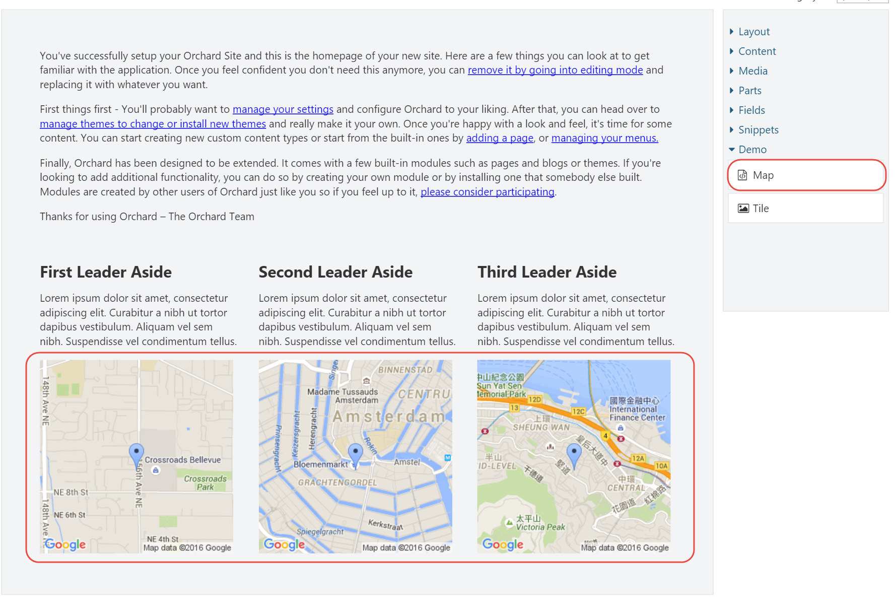

# Writing Custom Elements

Elements are at the heart of the Layouts module. Although Orchard comes with many useful elements out of the box, there will be times where you will want to write your own custom, specialized elements. In this chapter, we will see how we can do exactly that

Writing custom elements involves the following steps:

1. Create a class that derives from `Element` or any of its child classes. The only required member that needs to be implemented is the abstract `Category` property. 
2. Create a class that derives from `ElementDriver<T>`, where `T` is your element class. This class does not require any members, but needs to be there in order for your element type to be discoverable by the `TypedElementHarvester`. We'll look into element harvesters in chapter 14.
3. Although not strictly required, create a Razor shape template for your element for the “Detail” display type. If you don't provide a template, a default one will be used which simply displays the name of the element.
4. Also not strictly required, create a design-time view for your element for the “Design” display type. If you don't provide a design-time view, the view for the “Detail” display type will be used. This view is used when your element is rendered by the layout editor.

## The Element Class

Elements are instances of .NET types that ultimately inherit from the `Element` abstract base class which lives in the `Orchard.Layouts.Framework.Elements` namespace. Sub-classes can add properties to their type definition, and of course override inherited properties such as `Category`.

When implementing properties on a custom element, you need implement them in a certain way so that the values will be persisted. This works much the same way like custom content parts, as you’ll see shortly.

## Element Drivers

While element classes provide information about the element, element drivers provide an element’s behavior. This is similar in concept to the way content part drivers and content field drivers work. Drivers handle things such displaying and editing.

The following table lists all of the protected and virtual members of the base element driver `ElementDriver<T>` that you can override in your own implementation:

| Member | Description |
| --- | --- | --- | --- | --- | --- | --- | --- | --- | --- | --- | --- | --- | --- | --- |
| Priority | A way for drivers to influence the order in which they are executed. This is useful in rare cases where you implement additional drivers for the same element type. |
| OnBuildEditor | Override this method when your element has an editor UI. |
| OnUpdateEditor |  Override this method to handle post-backs of your editor UI created by OnBuildEditor. |
| OnCreatingDisplay | Override this method to cancel the display of your element based on certain conditions. An example using this method is the NotificationsElementDriver, which prevents its element from being rendered when there are no notifications. |
| OnDisplaying | Override this method to provide additional information to the ElementShape that has been created for your element. Typical use cases are drivers that query or calculate additional information and add that to the ElementShape, which is provided by the context argument. |
|  OnDisplayed | Override this method to provide additional information to the ElementShape after the Displaying event has been invoked. A good example of a use case for this is the RowElementDriver, which needs to determine whether or not it should be collapsed based on its child Column elements. |
|  OnLayoutSaving | Override this method to perform some additional actions just before the element is being serialized. |
|  OnRemoving | Override this method if you need to perform cleanup when your element is being removed. A good example are elements that create content items and are in charge of managing their lifetime. If the element is removed, you probably also want to remove the content item. The Removing event is invoked whenever an element was removed from the layout and the Layout Part is being saved, but also when a content item with the Layout Part is being removed. |
| OnExporting | Override this method if you need to add additional data when your element is being exported. A common example is the case where your element references a content item. In such cases, you'll need to export the identity of the content item, since you cannot rely on the content item ID itself remaining the same when the content item is being imported again. |
| OnExported | This method is triggered right after the Exporting method is triggered, so in practice there is no difference between the two. However, this may change in the future. |
| OnImporting | Override this method when you have additional data to process when your element is being imported. For example, if you exported a content item's identity value, here is where you read back that information and get your hands on the content item in question, get its ID value and update your reference to that content item. A good example is the `ContentItemElementDriver`, which exports and imports a list of referenced content items. |
| OnImported | The Imported event is triggered right after the Importing event is triggered, so in practice there is no difference between the two. However, this may change in the future. |
| OnImportCompleted | This event is triggered after the `Importing`/`Imported` events have been invoked on all content items and elements. Override this method when you need to update your element with additional referenced data, which may be available only after all other content items have been imported. A good example is the `ProjectionElementDriver`, which relies on the Query content items to be fully imported, since Query content items need to have their Layout records imported first before they are available to projections referencing those layout records. |
| Editor | Use the `Editor` method from `OnBuildEditor`/`OnUpdateEditor` to create an `EditorResult`. An `EditorResult` provides a list of `Editor` shapes to be rendered. Although you could construct an `EditorResult` yourself, the advantage of using the `Editor` method is that it takes care of setting the `Metadata.Position` property on each editor shape, which is required for your editor shapes to become visible in the element editor dialog.
 |

You can write more than one element driver for a given element type. As we'll see later in this book, this is key to extending existing elements with additional settings and behavior.

## Element Data Storage

When implementing properties on your custom Element class, you'll probably want the information to be persisted when the element instance itself is persisted. To do so, all you need to do is store that information into the `Data` dictionary that each element inherits from the base `Element` class.

The following is an example implementation of a property:

```text
public string MyProperty {
    get { return Data.ContainsKey("MyProperty") ? Data["MyProperty"] : null; }
    set { Data["MyProperty"] = value; }
}
```

The Data dictionary only stores string values, so if your property uses any other type, you’ll have to convert it to and from a string value. 

Fortunately, there is a helper class called `XmlHelper` in the `Orchard.ContentManagement` namespace that can help with that. For example, when implementing a property of type `Int32`:

```text
public int MyProperty {
    get { return Data.ContainsKey("MyProperty") ? XmlConvert.Parse<int>(Data["MyProperty"]) : 0; }
    set { Data["MyProperty"] = value.ToString(); }
}
```

Although pretty straightforward, let's see if we can simplify the property implementation a bit. For example, the check for the existence of a dictionary key in each and every property getter is pretty repetitive. As it turns out, there is a nice little extension method called Get in the `Orchard.Layouts.Helpers` namespace, which we can use as follows:

```text
public int MyProperty {
    get { return XmlConvert.Parse<int>(Data.Get("MyProperty")); }
    set { Data["MyProperty"] = value.ToString(); }
}
```

The `XmlHelper.Parse<T>` returns a `default(T)` in case we pass in a null string, so we don't have to worry about null checking ourselves.

But we can do even better. Instead of working with magic string values as the dictionary keys, we can implement our properties using strongly-typed expressions using the `Retrieve` and `Store` extension methods, which also reside in the `Orchard.Layouts.Helpers` namespace. This is how to use them:

```text
public int MyProperty {
    get { return this.Retrieve(x => x.MyProperty); }
    set { this.Store(x => x.MyProperty, value); }
}
```

Much better! The extension methods take care of null-checking as well as the string parsing.

So far we have seen how to store primitive types such as integers and strings. But what if you wanted to store complex objects? The `Store` and `Retrieve` methods don't support that.
 However, since the Data property is of type `ElementDataDictionary`, we can take advantage of its `GetModel` method, which uses model binding under the cover.

For example, let's say we have the following complex type:

```text
public class MyElementSettings {
    public int MyNumber { get; set; }
    public string MyAddress { get; set; }
}
```

Implementing an element property of that type would look like this:

```text
public MyElementSettings MyProperty {
    get { return Data.GetModel<MyElementSettings>(""); }
    set {
        Data["MyNumber"] = value?.MyNumber;
        Data["MyAddress"] = value?.MyAddress; 
    }
} 
```


There's currently no convenient method we can use to serialize the complex type back into a string, so you’ll have to do that manually as shown above.

## Try it out: Creating a Map Element

If you ever browsed through the online Orchard Documentation, you’ve undoubtedly run across the “Writing a content part” tutorial \( [http://docs.orchardproject.net/Documentation/Writing-a-content-part](http://docs.orchardproject.net/Documentation/Writing-a-content-part)\). 

In that tutorial, the author demonstrates writing a custom content part called `MapPart`. It is the first tutorial I followed when learning Orchard, and I thought it would be kind of cool if I could write a similar tutorial for writing a custom element.

So that’s exactly what we will do next. We will write a custom element called `Map`. I won’t go through the process of generating a new module, of which I’m sure you’ve done that many times before. If not, the “Writing a content part” tutorial explains that process in detail.

The goal of the Map element is to allow the user to provide a **latitude** and a **longitude**, which the element will use to render a map image.

### The Map Element

First, create a directory in your module called **Elements** and add a class called `Map` as follows:

```text
using Orchard.Layouts.Framework.Elements;
using Orchard.Layouts.Helpers;

namespace OffTheGrid.Demos.Layouts.Elements {
    public class Map : Element {

        public override string Category => "Demo";

        public double Latitude {
            get { return this.Retrieve(x => x.Latitude); }
            set { this.Store(x => x.Latitude, value); }
        }

        public double Longitude {
            get { return this.Retrieve(x => x.Longitude); }
            set { this.Store(x => x.Longitude, value); }
        }
    }
}
```

### The Map Element Driver

Next, we need to create a driver for the Map element. The driver will be responsible for displaying the element editor and updating the element with values provided by the user. Create a directory called **Drivers** and create the following driver class:

```text
using OffTheGrid.Demos.Layouts.Elements;
using Orchard.Layouts.Framework.Drivers;

namespace OffTheGrid.Demos.Layouts.Drivers {
    public class MapDriver : ElementDriver<Map> {
        
        protected override EditorResult OnBuildEditor(Map element, ElementEditorContext context) {
            
            // If an Updater is specified, it means the element editor form is being submitted
            // and we need to store the submitted data.
            context.Updater?.TryUpdateModel(element, context.Prefix, null, null);

            // Create the EditorTemplate shape.
            var editor = context.ShapeFactory.EditorTemplate(
                TemplateName: "Elements/Map",
                Model: element,
                Prefix: context.Prefix);

            return Editor(context, editor);
        }
    }
}
```

When the user hits **Save** on the element editor dialog screen, the driver’s `OnUpdateEditor` method will be invoked. However, you don’t need to implement that method yourself, because the `ElementDriver` base class does that for you by simply invoking the `OnBuildEditor` method, which we did implement. In that method we use the `Updater` provided by the context argument to bind the submitted form values against our model \(the Map element\). In this example we're using the element directly as the model, but in more advanced scenarios you may choose to work with view models instead. We'll see how that works later on. 

### The Map Element Editor Template

Since the driver returns an `EditorTemplate` shape that is configured to use a Razor view called `“Elements/Map.cshtml”`, we’ll need to create that file in the Views/EditorTemplates folder with the following contents:

```text
@model OffTheGrid.Demos.Layouts.Elements.Map
<fieldset>
    <div class="form-group">
        @Html.LabelFor(m => m.Latitude, T("Latitude"))
        @Html.TextBoxFor(m => m.Latitude, new {@class = "text medium"})
        @Html.Hint(T("The Latitude of the location to show on the map."))
    </div>
    <div class="form-group">
        @Html.LabelFor(m => m.Longitude, T("Longitude"))
        @Html.TextBoxFor(m => m.Longitude, new { @class = "text medium" })
        @Html.Hint(T("The Longitude of the location to show on the map."))
    </div>
</fieldset>

```

Nothing too fancy going on there. All it does is render a few labels and input fields for the Map element. 

### The Map Element Template

Finally, we need to actually provide a shape template for the Map element shape that will actually render the specified lat/lon location on a map. To do so, create another Razor file in the **Views/Elements** folder called `“Map.cshtml”` with the following contents:

```text
@using OffTheGrid.Demos.Layouts.Elements
@{
    var element = (Map) Model.Element;
}

```

With that in place, you can now add the Map element to the canvas. Contrary to the Map Part in the online documentation, you can add as many maps as you like!
 



## Element Editors & the Forms API

In the Maps tutorial, I showed you how to implement an element editor using the `EditorTemplate` shape and a corresponding Razor template. However, there’s another way to write editors that doesn’t involve Razor views. The **Orchard.Forms** module provides an API to programmatically create forms.

To simplify working with this API, the Layouts module comes with a base driver class called `FormsElementDriver`. When you derive your element driver from this base class, all you have to do is provide one or more form names that you want to rendered.

Let's see what it takes to refactor the Map driver to use the forms API.

### Try it out: Using the Forms API 

The first thing to do is to replace the base class of the `MapDriver` class with `FormsElementDriver`, remove the `OnBuildEditor` method and the editor view template \(`EditorTemplates/Elements/Map.cshtml`\).

Next, we need to:

1. Override the `DescribeForm` method to programmatically create our editor \(or create a separate class that implements the `IFormProvider` interface from `Orchard.Forms`\).
2. Override the `FormNames` property to tell the driver which form to render when editing the Map element.

The following code listing shows the updated version of the `MapDriver` class:

```text
using System.Collections.Generic;
using OffTheGrid.Demos.Layouts.Elements;
using Orchard.Forms.Services;
using Orchard.Layouts.Framework.Drivers;
using Orchard.Layouts.Services;

namespace OffTheGrid.Demos.Layouts.Drivers {
    public class MapDriver : FormsElementDriver<Map> {
        public MapDriver(IFormsBasedElementServices formsServices) : base(formsServices) { }
        protected override IEnumerable<string> FormNames {
            get { yield return "MapEditor"; }
        }

        protected override void DescribeForm(DescribeContext context) {
            context.Form("MapEditor", shapeFactory => {
                var shape = (dynamic)shapeFactory;
                var form = shape.Fieldset(
                    Id: "Map",
                    _Latitude: shape.Textbox(
                        Id: "Latitude",
                        Name: "Latitude", // -> This name needs to match the name of the Latitude property of the Map class.
                        Title: T("Latitude"),
                        Classes: new[] { "text", "medium" },
                        Description: T("The latitude of the location to show on the map.")),
                    _Longitude: shape.Textbox(
                        Id: "Longitude",
                        Name: "Longitude", // -> This name needs to match the name of the Longitude property of the Map class.
                        Title: T("Longitude"),
                        Classes: new[] { "text", "medium" },
                        Description: T("The longitude of the location to show on the map.")));

                return form;
            });
        }
    }
}
```

There are a few things to keep in mind when using the Forms API with element editors:

1. The form name being returned by the `FormNames` property needs to match the name of the form that is provided when describing the form in the `DescribeForm` method.
2. The `FormsElementDriver` base class implementation stores the form field values in the `Data` dictionary of the Element class. Since the Map class reads and writes from and to this dictionary, we need to make sure the `Name` values of the “\_Latitude” and “\_Longitude” text box elements match exactly with the keys into the Data dictionary.
3. Notice that the root shape being returned is not a **Form** shape, but a **Fieldset** shape instead. This is important, because the element editor dialog already renders a form element.

With these changes in place, the editor experience looks exactly the same, but without the need for a Razor view for the editor template.

## Providing Additional Display Data

When writing custom elements, there will be times when you need to provide additional information for the display shape template. For example, data coming from an external service that you retrieve from the `OnDisplaying` method of the driver. The Map element example didn't have that requirement, since all the necessary information was provided by the element itself \(Latitude and Longitude\), but if you wanted to provide additional data, you can do so by setting that data directly onto the Element shape as follows:

```text
protected override void OnDisplaying(Map element, ElementDisplayingContext context) {
    context.ElementShape.MyAdditionalData = “Some additional data”;
}
```

You can then access that additional data from your view like this:

```text
Views/Elements.Map.cshtml:
@{
   Additional data: @Model.AdditionalData
}
```

## Descriptions and Toolbox Icons

When writing custom elements, it is a good practice to provide a description for your element. The description is displayed as a tooltip when hovering over the element in the toolbox. You can provide a description by overriding the Description property. You can also specify a custom toolbox icon by overriding the `ToolboxIcon` property on your element class and setting a valid **Font Awesome **icon identifier to be returned.

For example:

```text
public override LocalizedString Description => T("Renders a map with a specified location.");
public override string ToolboxIcon => "\uf041;";
```

## Summary

In this chapter, we have seen how we can extend the list of available elements by implementing our own element classes. We learned about the `Element` class itself as well as the `ElementDriver<T>` class to implement the element’s behavior and handle events pertaining that element.

We also learned about implementing element editors using the Forms API provided by the Orchard.Forms module, which is great for basic element editors where there is no need for more advanced editor UIs.

With this knowledge in our arsenal, we have all we need to be able to write any kind of elements, whether they are simple or more complex. It all boils down to implementing an element class and driver, and implementing the various methods on the driver.


